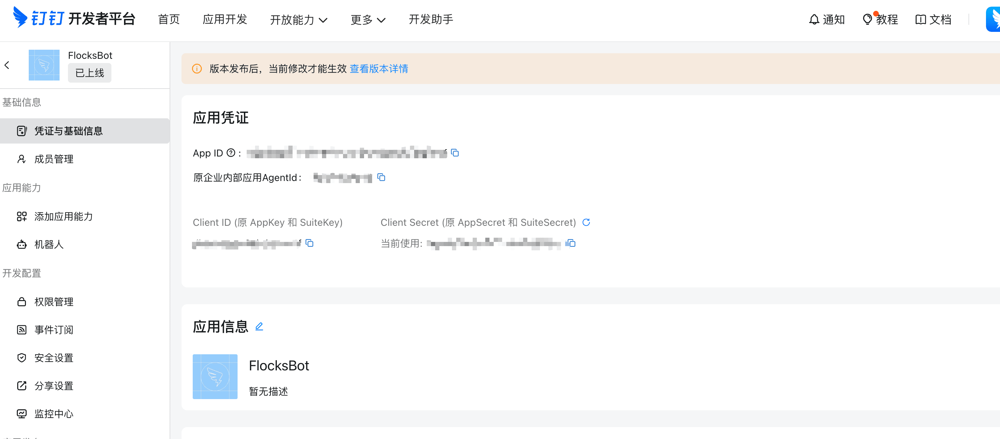
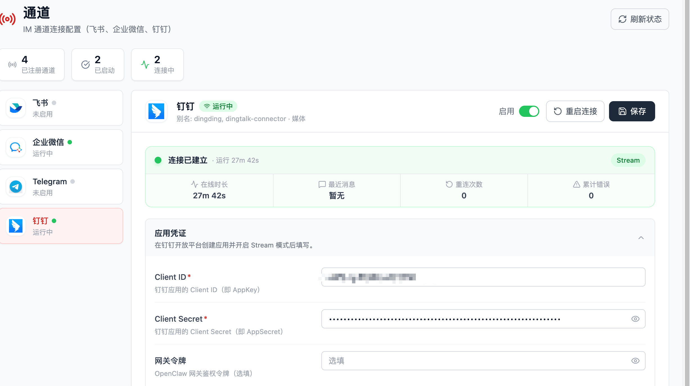

# 钉钉通道配置

本文介绍如何在钉钉开发者后台创建企业内部应用与机器人，并在 Flocks 中完成钉钉通道的连接与验证。

## 前提条件

开始前请确认以下条件已满足：

- 已有钉钉企业组织
- 当前账号为该企业的管理员或子管理员
- 已具备钉钉开发者身份
- 如果机器人采用 `HTTP` 接收模式，需准备一个公网可访问的 `HTTPS` 地址
- 如果应用需要调用服务端接口，建议提前准备服务器出口 IP

## 一、创建企业内部应用

### 步骤 1：创建应用

1. 登录 [钉钉开发者后台](https://open-dev.dingtalk.com/)。
2. 单击 **应用开发** > **企业内部应用** > **钉钉应用** > **创建应用**。
3. 填写应用信息。

   | 配置项 | 是否必选 | 配置说明 |
   | --- | --- | --- |
   | 应用名称 | 是 | 输入应用名称，应用名称最小长度为 2 个字符。 |
   | 应用描述 | 是 | 简要描述应用提供的产品或服务，应用描述最小长度为 4 个字符。 |
   | 应用图标 | 否 | 上传应用图标，图标要求 JPG/PNG 格式、240 px × 240 px 以上、1:1 、2 MB 以内的无圆角图标。 |

4. 单击 **保存**，进入应用详情页。

创建完成后，可单击 **基础信息** > **凭证与基础信息**，查看应用凭证与基础信息。

如果之前已经完成创建应用操作，需要查找之前创建的应用，可以根据应用名称、创建人等信息进行查询。

### 步骤 2：获取应用基础凭证

创建完成后，在应用详情页可查看：

- `AppKey`
- `AppSecret`

这两个参数通常用于服务端调用钉钉接口、免登或其他开放能力接入。

## 二、在企业内部应用中创建机器人

1. 登录 [开发者后台](https://open-dev.dingtalk.com/#/)，单击目标应用，进入应用详情页。
2. 单击 **应用能力** > **机器人**，开启机器人配置。
3. 配置机器人信息。
4. 单击发布（保存）机器人。

## 三、发布应用

机器人发布后，还需要发布所属应用，否则员工无法正常搜索和使用。

进入：`部署与发布` → `版本管理与发布`

点击：`确认发布`

注意事项：

- 如果没有设置可使用范围，默认通常只有应用创建者可见
- 建议在发布前明确配置应用可见范围
- 机器人可见范围会与应用可见范围保持一致

## 四、将机器人添加到企业内部群

### 步骤 1：准备内部群

在钉钉客户端中创建或选择一个现有群聊，并确保：

- 群场景为 `内部群`
- 群所属企业与该应用所属企业一致

### 步骤 2：添加机器人

进入目标群，依次点击：

`群设置` → `群管理` → `机器人` → `添加机器人`

在企业机器人列表中找到刚发布的机器人，点击添加即可。

## 五、配置 Flocks 钉钉通道与验证

- 将第一步创建企业内部应用时获取的 `Client ID`（即 `AppKey`）和 `Client Secret`（即 `AppSecret`）填入 Flocks 的钉钉通道配置项，保存即可。
- 在群聊内部 `@` 机器人，或单聊机器人一条消息，收到消息回复即表示连接建立成功。

## 六、官方参考文档

本文主要参考以下钉钉官方文档：

- [开发流程介绍](https://developers.dingtalk.com/document/app/orgapp-development-process)
- [创建及发布第一个 H5 微应用](https://developers.dingtalk.com/document/org/microapplication-creation-and-release-process)
- [配置企业机器人](https://developers.dingtalk.com/document/dingstart/configure-the-robot-application)
- [添加机器人入群](https://developers.dingtalk.com/document/dingstart/add-robot-to-group)
- [企业内部开发机器人](https://developers.dingtalk.com/document/robots/enterprise-created-chatbot)

---

相关：[通道配置总览](/md/communication#通道配置) · [飞书通道配置](/md/channels/feishu) · [企业微信通道配置](/md/channels/wecom)
