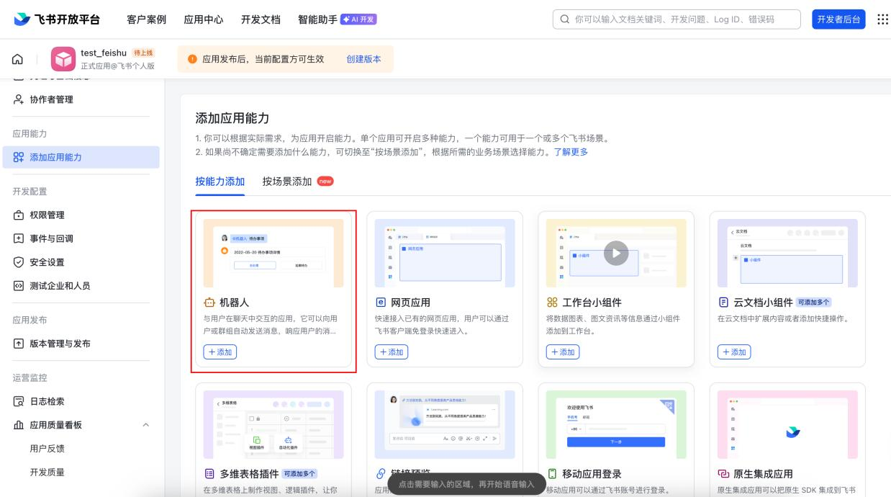
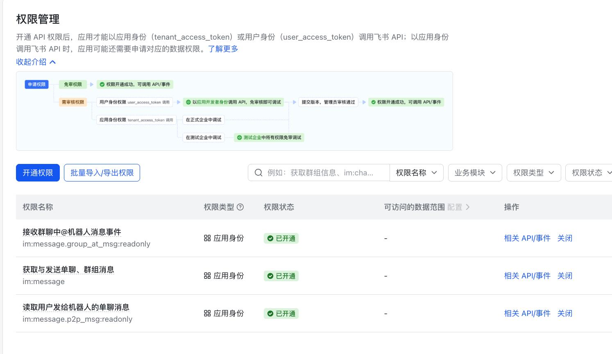
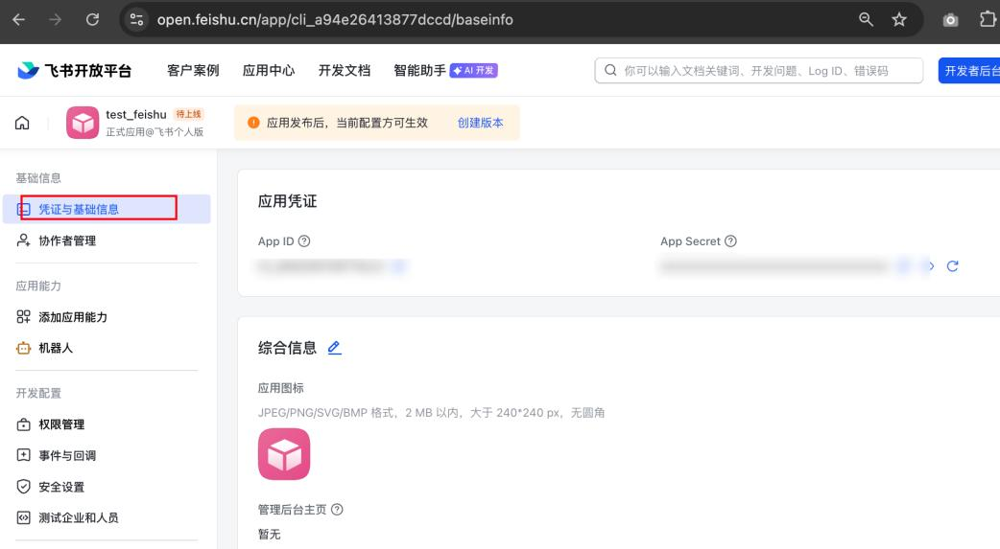
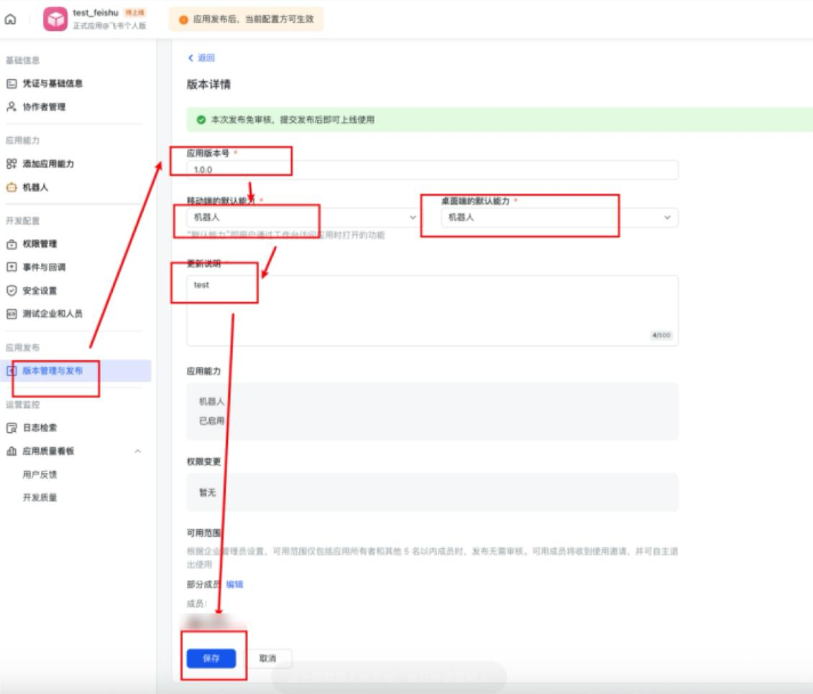
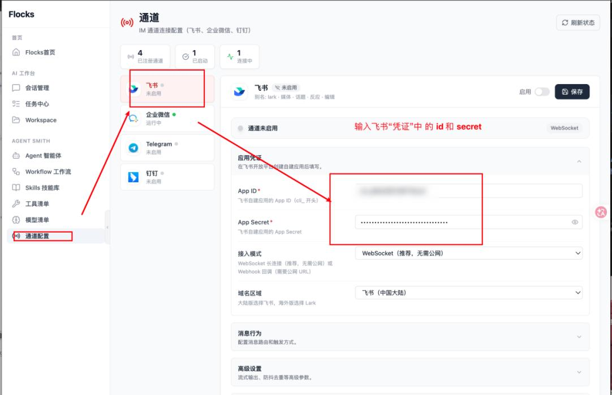

# 飞书通道配置

本文介绍如何在飞书开放平台创建自建应用与机器人，并在 Flocks 中完成飞书通道的连接与验证，打造专属 AI 机器人。

## 前提条件

- 已有飞书企业账号，且具备开发者后台访问权限
- 请确保 [飞书开放平台（开发者后台）](https://open.feishu.cn/app) 的登录账号，与飞书 PC 客户端 / 网页版（[https://www.feishu.cn/](https://www.feishu.cn/)）使用的是同一个账号

## 一、创建飞书自建应用

1. 打开飞书开放平台：[https://open.feishu.cn/app](https://open.feishu.cn/app)
2. 登录你的飞书账号。
3. 点击 **创建企业自建应用**。

   

4. 填写 **应用名称** 以及 **应用描述**，点击 **创建**。
5. 在 **添加应用能力** 侧边栏中，找到「机器人」一栏点击 **+ 添加**。

   添加成功后，应用能力列表中会新增「机器人」条目。

   

## 二、配置权限、事件与凭证

6. 在左侧菜单找到 **权限管理**，点击 **开通权限**，搜索并勾选以下与「Flocks 和飞书机器人对话」相关的 3 个关键权限：

   - 获取与发送单聊、群组消息
   - 以应用的身份发消息
   - 接收消息事件

   > 实际权限名以飞书开放平台的最新名称为准，搜索关键词包括「消息」「机器人」等。

   

7. 在左侧菜单找到 **事件与回调**，按需订阅机器人收到消息等事件（用于机器人接收群聊或单聊消息）。
8. 在左侧菜单选择 **凭证与基础信息**，从中获取应用的 `App ID` 和 `App Secret`。

   这两个凭证是 Flocks 连接飞书机器人应用的「钥匙」，请妥善保存。

   

## 三、启用并发布机器人

9. 进入机器人配置，启动 Bot，并设置机器人名称（建议与应用名称保持一致）。
10. 进入 **版本管理与发布**，点击 **保存** 弹出确认对话框后，点击 **确认发布**，即结束飞书机器人的配置。

   

## 四、在 Flocks 中连接飞书通道

1. 进入 Flocks WebUI 的「通道配置 → 飞书」。
2. 填写飞书机器人的 `App ID` 与 `App Secret`。
3. 点击 **启用**，然后点击 **保存**。
4. 当飞书通道状态正常后，即表示 Flocks 已支持与该飞书机器人交互。

完成后，只需在飞书 APP 或桌面端点击 **打开应用** 按钮，就可以和机器人开启对话。

## 五、补充说明

- 若 Flocks 中飞书通道连接失败，常见原因是权限未开通、事件未订阅、`App ID` / `App Secret` 填写有误或应用未正式发布。
- 本文配图选自随附资料 [data/feishu-bot-guide.pdf](../../../data/feishu-bot-guide.pdf)，如需更完整的截图流程可直接查阅原 PDF。

---

相关：[通道配置总览](/md/communication#通道配置) · [钉钉通道配置](/md/channels/dingtalk) · [企业微信通道配置](/md/channels/wecom)
