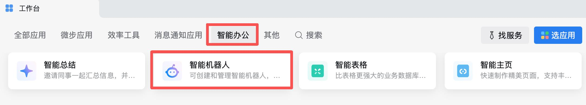
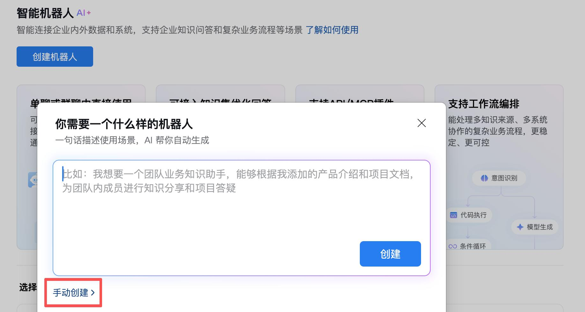
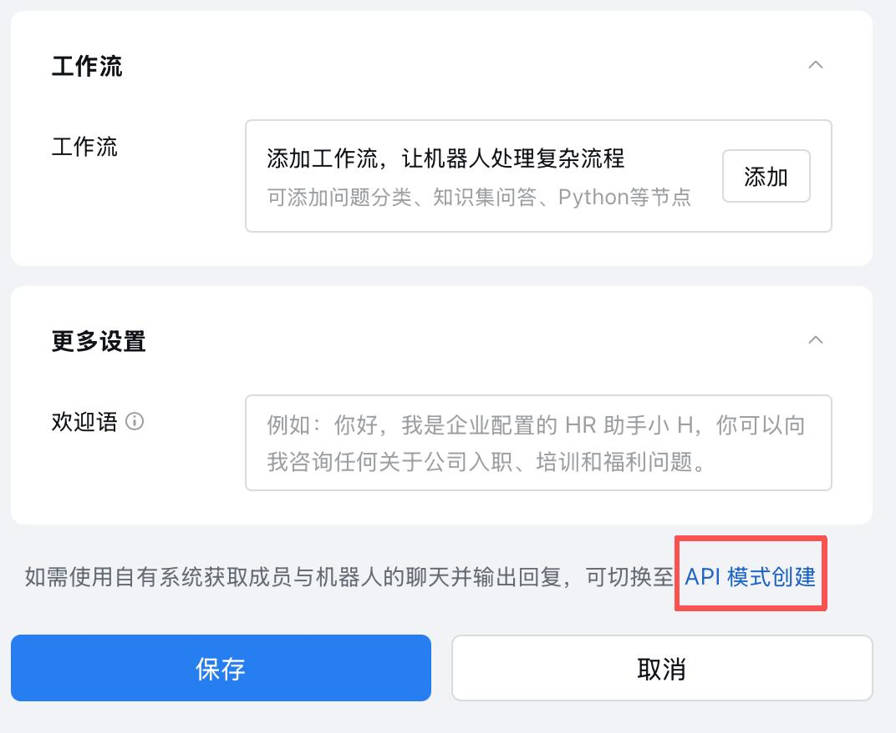
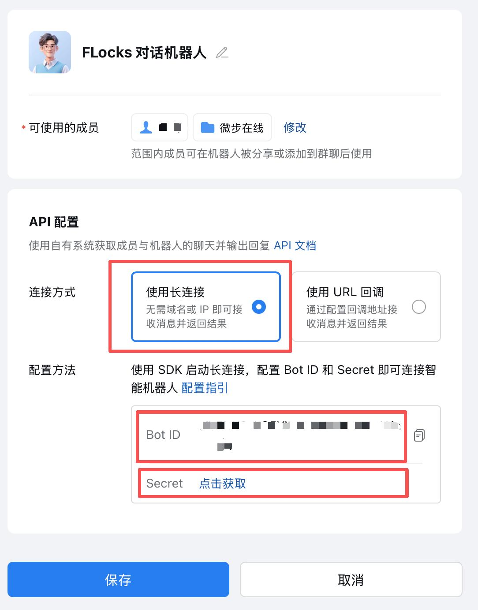

# 企业微信通道配置

本文介绍如何在企业微信管理后台创建智能机器人，并在 Flocks 中完成企业微信通道的连接。

## 适用场景

- 需要在企业微信中创建机器人，并接入 Flocks 进行消息收发。

## 前置准备

- 已开通并可登录企业微信管理后台（需具备创建机器人权限）。

## 操作步骤

### 1. 进入机器人创建入口

在企业微信工作台中，进入 **智能办公** → **智能机器人**。

### 2. 创建机器人

点击 **创建机器人**，在弹出页面中选择 **手动创建**。

### 3. 选择接入模式

- 进入后可先修改机器人名称（建议使用业务可识别命名，如「安全助手」）。
- 页面下滑到底部，找到 **API 模式创建**。

### 4. 生成并保存凭据

- 选择 **使用长连接**。
- 获取并复制以下信息：
  - `Bot ID`
  - `Secret`

请妥善保存这两项凭据，它们是 Flocks 连接企业微信机器人的「钥匙」。

### 5. 在 Flocks 中配置

- 在 Flocks WebUI 的「通道配置 → 企业微信」中，填入上一步获取的 `Bot ID` 与 `Secret`。
- 保存并启用通道，即可完成接入。

## 多群消息与 session ID

企微场景下一个常见问题是「我有多个群聊，消息到底发到哪里」。

- 如果你只有一个机器人和一个通道，直接告诉 Flocks「向企微发送」通常就足够。
- 如果你有多个群或多个会话，就应该显式指定 `session ID`。

`session ID` 的作用是告诉系统消息到底该投递到哪个具体会话里。对于 **定时任务** 尤其重要——任务自动运行时，系统需要一个稳定的目标位置来发送分析结果。

## 补充说明

- 本文配图选自随附资料 [data/wecom-bot-guide.pdf](../../../data/wecom-bot-guide.pdf)，如需更完整的截图流程可直接查阅原 PDF。

---

相关：[通道配置总览](/md/communication#通道配置) · [钉钉通道配置](/md/channels/dingtalk) · [飞书通道配置](/md/channels/feishu)
