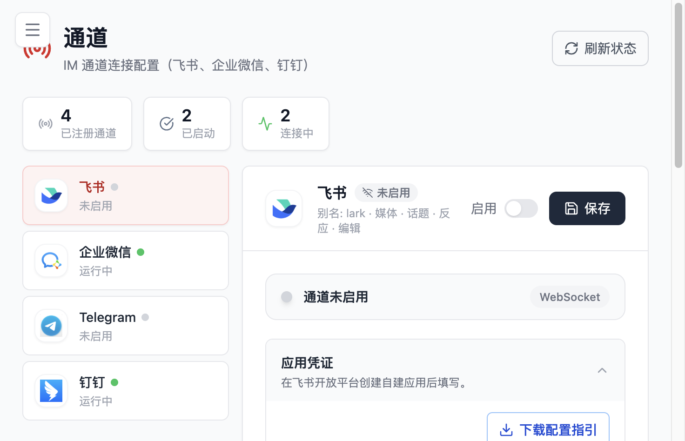

# 通信配置

本页用于说明 Flocks 如何被访问、如何在不同网络环境中部署，以及如何把分析结果接到企业常用通道。对于大多数用户来说，通信配置主要解决三类问题：页面怎么从别的机器访问、受限网络下怎么稳定安装、以及结果如何发到企微或钉钉这类外部触点。

## 远程部署

Flocks 默认更偏向本机使用。直接执行 `flocks start` 时，默认监听的是：

- WebUI：`127.0.0.1:5173`
- 后端 API：`127.0.0.1:8000`

这意味着默认只允许当前机器访问。如果你想让局域网、云主机或虚拟机外部浏览器访问页面，需要显式调整监听地址。

### 推荐方式：只开放 WebUI

最稳妥的远程部署方式通常是只开放 WebUI，而把后端 API 继续留在部署机本机访问：

```bash
flocks start --server-host 127.0.0.1 --webui-host 0.0.0.0
```

这样做的好处是：

- 外部浏览器可以访问 WebUI
- 后端 API 不会直接裸露在公网
- 相比同时开放前后端，整体暴露面更小

只有在确实需要外部系统直接调用 API 时，才考虑把后端也绑定到 `0.0.0.0`。即便如此，也更建议配合防火墙、安全组或反向代理做额外控制。

### Docker 远程访问

如果你用 Docker 部署，需要特别确认端口映射是否正确：

```bash
docker run -d \
  --name flocks \
  -e TZ=Asia/Shanghai \
  -p 8000:8000 \
  -p 5173:5173 \
  --shm-size 2gb \
  -v "${HOME}/.flocks:/home/flocks/.flocks" \
  ghcr.io/agentflocks/flocks:latest
```

其中 `-p` 端口映射是必须的。很多“容器启动了但浏览器打不开”的问题，本质上不是 Flocks 没起来，而是端口没映射、映射错了，或者访问时用了错误的宿主机端口。

### 虚拟机和云主机的常见误区

最常见的误区有两个：

1. 以为默认 `127.0.0.1` 也能让外部机器访问
2. 以为浏览器里的 `127.0.0.1:8000` 指的是服务器本身

第二个误区尤其常见。远程浏览器访问页面时，浏览器中的 `127.0.0.1` 指向的是访问者自己的机器，不是部署 Flocks 的服务器。因此当你看到 WebUI 仍然请求 `127.0.0.1:8000` 时，通常意味着前端请求路径没有按远程访问场景正确处理。

## 网络与离线安装

- 如果你使用 Windows x64，可以从 [GitHub Releases](https://github.com/AgentFlocks/flocks/releases) 下载 `FlocksSetup-<tag>.exe` 安装包，并按安装向导完成安装。

### 中国大陆环境建议

默认推荐使用 Gitee 上的 `install_zh` 一键安装脚本；如果你希望先审查仓库内容，也可以先从 Gitee 克隆源码后再安装，见[「选项 B：源码安装」](quick-start.md#推荐路径-1终端安装)。

docker 国内镜像地址：[ghcr.nju.edu.cn/agentflocks/flocks:latest](https://ghcr.nju.edu.cn/agentflocks/flocks:latest)

## WebUI / API 访问关系

Flocks 的浏览器界面和后端服务是两层不同能力：

- `5173`：WebUI，负责用户在浏览器中的交互
- `8000`：后端 API，负责会话、模型、工具、工作流、任务等实际能力

开发环境下，WebUI 默认会把 `/api/*` 和 `/event` 等请求代理到 `http://127.0.0.1:8000`。这也是为什么很多时候“页面能打开”并不代表“功能一定正常”: 你看到的只是前端已经加载成功，真正的模型调用、工具调用和会话执行仍然依赖后端 API 是否可用。

在本机部署时，这种关系通常不需要显式理解；但在远程部署时，它会直接影响访问是否成功：

- 如果只开放了 WebUI，前端必须仍能正确找到后端
- 如果浏览器请求的还是本地 `127.0.0.1:8000`，远程访问通常会失败
- 如果你自定义了 API 端口，还应同步确认 WebUI 的代理或环境变量配置

可以把它简单理解为：`5173` 是“门面”，`8000` 是“能力底座”。远程访问时，门面能打开只是第一步，关键是门面背后的请求路径也要可达。

如果你需要配置浏览器登录、API Token、反向代理鉴权或忘记密码恢复，请继续阅读 [账号管理](/md/account-management)。

## 通道配置

通道配置负责把 Flocks 的能力延伸到 IM 或外部触点。当前 WebUI 的通道页已经支持飞书、企业微信、Telegram 和钉钉等通道，并且允许分别查看启用状态和配置字段。



### 通道配置适合解决什么问题

典型场景包括：

- 把研判结果主动发到企业微信群、钉钉群或其他消息触点
- 让机器人在特定群或会话中接收消息
- 把定时任务的结果直接推送给值班人员或运营团队

通道能力和 Agent / Workflow / Task Center 是联动的：

- Agent 负责分析和执行
- Workflow 负责组织流程
- Task Center 负责定时执行
- 通道负责把结果送达外部触点

### 三大平台配置入口

不同 IM 平台的开发者后台流程差异较大，Flocks 将三大主流平台的完整接入指南拆成独立页面，按需查阅即可：

- [钉钉通道配置](/md/channels/dingtalk)：企业内部应用 + 机器人 + 群内验证
- [飞书通道配置](/md/channels/feishu)：飞书开放平台自建应用 + 权限 + App ID / App Secret
- [企业微信通道配置](/md/channels/wecom)：企业微信管理后台 + 智能机器人 + Bot ID / Secret

每个子页面都给出了从开发者后台到 Flocks 连接的完整步骤。多群投递与 `session ID` 的使用细节，放在 [企业微信通道配置](/md/channels/wecom#多群消息与-session-id) 中集中说明。

### 推荐使用方式

对于结果推送类场景，推荐优先使用下面这条链路：

1. 先让数据通过 API、日志或网页抓取进入 Flocks
2. 再由 Agent 或 Workflow 完成分析
3. 最后把结果通过企微、钉钉等通道发送出去

这种方式比单纯把通道当聊天入口更贴近真实运营场景，也更适合后续接入定时任务和持续巡检能力。
