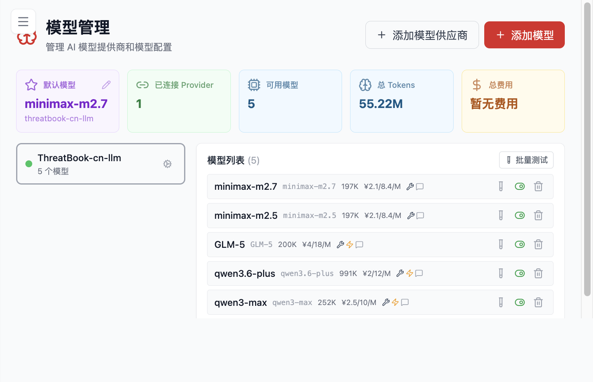

# 模型与接入

这一页集中说明 Flocks 的模型、兼容接口接入方式，以及运行时常见的模型侧问题。可以把它理解为“让平台真正能调用能力”的配置页：前半部分解决模型怎么接、怎么测，后半部分解决 Provider、API Services、MCP 和沙箱等运行时配置域如何理解。

## 模型配置

对于大多数用户来说，模型配置的最稳妥顺序始终是：

1. 添加模型供应商
2. 添加具体模型
3. 在模型清单中测试连接
4. 设置默认模型

在模型管理页里，你通常会同时看到：

- 已连接的 Provider
- 可用模型数量
- 默认模型
- 模型列表
- 测试连接、启用/禁用、删除等操作入口

这里最容易踩坑的地方有两个：

- 只添加了模型，但没有测试连接
- 只保存了模型，但没有设置默认模型

前者会导致你以为“配好了”，其实请求链路还没打通；后者会导致首页仍提示未完成配置，或者 `Rex` 看起来还在使用旧模型。

## 本地与第三方模型接入

如果你接入的是本地模型服务、自建网关或第三方兼容服务，最常见的主路径是 `OpenAI Compatible`。它适用于：

- 自建兼容 OpenAI API 的服务
- 第三方模型网关
- 某些本地模型服务

推荐顺序是：

1. 先创建 `OpenAI Compatible` Provider
2. 保存 Provider 信息
3. 再添加具体模型
4. 回到模型清单执行测试

### 接入时最关键的字段

通常需要重点确认：

- `Base URL`
- `API Key`
- 模型名称

这些字段只要有一个不匹配，就可能表现为：

- 看不到模型列表
- 测试时返回 `404`
- 端口看起来没有生效
- 简单对话能通，复杂任务不稳定

### “支持某个模型”应该怎么理解

在 Flocks 语境里，“支持某个模型”更准确的意思通常是：

- 它的接口或网关足够兼容
- 可以按照标准流程完成接入和调用

它并不自动意味着：

- 所有部署方式都完全兼容
- 一定能自动拉取模型列表
- 在复杂多轮任务里一定稳定

因此，对于本地模型或第三方兼容服务，最重要的不是“接上了”，而是“接上后在真实任务里稳定可用”。

## 模型报错排查

模型测试通过，但真实对话仍失败，是最常见的一类问题。原因在于测试通常只验证最基础的连通性，而真实任务还会叠加：

- 更长的上下文
- 更复杂的提示词
- 更大的输出
- 工具调用和会话状态

### 常见问题类型

#### 超时

通常优先怀疑：

- 模型平台负载高
- 网络链路不稳定
- 响应速度慢于系统预期

#### `empty content`

这类问题不一定来自 Flocks 本身，也可能来自模型平台或接口兼容层。

#### `peer closed connection`

更像连接中断、服务端异常断开或网络波动导致的问题。

### 推荐排障顺序

1. 回到模型清单重新测试
2. 查看后端日志，确认具体报错来源
3. 区分是所有模型都失败，还是只有某一个模型失败
4. 试着换一个已知稳定模型做对照
5. 如果问题只在长会话、群聊或复杂任务中出现，就要进一步考虑模型上下文能力或兼容性边界

对于本地模型尤其要注意：简单私聊正常，不代表复杂任务也能稳定执行。很多能力问题只有在多轮上下文、工具调用和长输出场景中才会真正暴露出来。

## Provider 与 API Services 配置

除了 WebUI 里的模型页，Flocks 还有一层运行时配置，主要体现在 `flocks.json` 这类配置文件中。现有示例里最值得优先理解的几个配置域如下。

### `provider`

`provider` 用来描述模型提供方及其模型集合。它回答的是“系统有哪些模型入口可以被统一管理和复用”。

典型信息包括：

- Provider 名称
- 对应适配器
- `apiKey`
- `baseURL`
- 该 Provider 下的模型定义

### `api_services`

`api_services` 用来控制外部安全服务的启用状态，例如：

- `greynoise`
- `onesec_api`
- `qingteng`
- `skyeye_api`
- `tdp_api`
- `threatbook-cn`
- `threatbook-io`

可以把它理解为“平台级外部能力开关”。它不直接等同于模型，也不等同于工具，而是平台对特定安全服务的统一接入配置。

### `mcp`

`mcp` 用于承载通过 Model Context Protocol 接入的外部服务。对于没有原生工具、但已经提供 MCP 能力的系统，MCP 是更统一的接入方式。

### `channels`

虽然通道配置会在通道页里做图形化管理，但配置文件层面仍有对应的 `channels` 域，用来承载消息通道的启用与连接信息。

### `sandbox`

`sandbox` 负责定义运行隔离策略，例如：

- 沙箱是否开启
- 作用范围是 `agent` 还是其他层级
- 工作区访问权限
- Docker 镜像、网络、内存和 CPU 限制

这部分更偏运行安全和执行环境控制。对大多数首次使用者来说，不一定要立刻改动，但在团队化或生产化场景中很重要。

### 一条更容易理解的主线

如果用一句话概括这些配置域的边界，可以这样理解：

- `provider` 解决“模型从哪里来”
- `api_services` 解决“平台还接了哪些外部安全能力”
- `mcp` 解决“如何统一接入外部上下文服务”
- `channels` 解决“结果往哪里发”
- `sandbox` 解决“执行时边界在哪里”

把这些边界分清，再去看 Flocks 的模型、工具、任务和通道能力，就会更容易理解整个平台是如何协同工作的。
