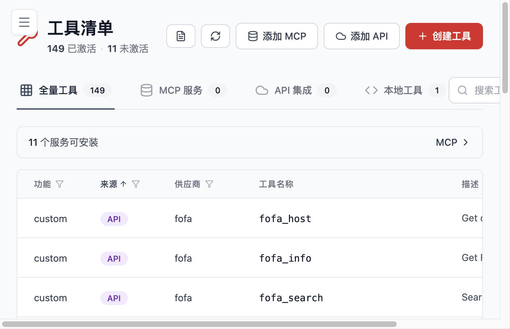

# 主模块

这一页按照当前 WebUI 的真实导航来介绍 Flocks 的核心模块。理解这些模块的最好方式，不是把它们当成彼此独立的页面，而是把它们看成同一套平台里的不同工作面：会话负责交互，工具负责执行，工作流负责编排，技能负责沉淀，任务中心负责长期运行，Workspace 负责项目级组织边界。

在当前 WebUI 中，主要导航可以分成三组：

- 首页
- AI 工作台：会话管理、任务中心、Workspace
- Agent 工作室：Agent 智能体、Workflow 工作流、Skills 技能库、工具清单、模型清单、通道配置

## 会话管理

会话管理是大多数用户最先进入、也最常驻留的页面。你可以把它理解为 Flocks 的主交互面：用户直接向 `Rex` 描述目标，平台在会话中理解上下文、决定是否调用工具、是否执行工作流、是否委派给专家 Agent，并把结果逐步组织成一个连续任务。

适合进入会话管理的场景包括：

- 你已经知道目标，但还没决定该调用哪个工具或哪个流程
- 任务需要边分析边追问，过程不是一次性固定输入
- 你希望让 `Rex` 先理解问题，再逐步协调其它能力

它和其它模块的关系非常紧密：

- 会话里可以触发工具调用
- 会话里可以让 `Rex` 生成或执行工作流
- 会话里的经验可以进一步沉淀成 Skills、Workflow 或专家 Agent

## Agent 智能体

Agent 页面用于管理平台中的主 Agent 和子 Agent。主 Agent `Rex` 是统一入口，负责理解目标、拆解任务和调度能力；子 Agent 则是面向特定问题域的专业执行者，例如情报分析、主机排查、漏洞分析或网页数据获取。

从使用方式看，Agent 适合这几类情况：

- 你希望把某类任务固定交给一个更专业的执行角色
- 你已经有比较成熟的调查套路，希望沉淀成可调度的数字员工
- 你希望把 `Rex` 的总控能力和专家执行能力分开组织

Agent 不是单独存在的。它通常和会话、工具、工作流一起使用：

- 会话里由 `Rex` 决定是否委派给子 Agent
- 子 Agent 会调用工具或读取上下文继续执行
- 成熟的 Agent 能力也可以反向推动 Skills 与工作流的形成

## Workflow 工作流

Workflow 页面承载的是“把动作组织成稳定流程”的能力。与一次性的对话不同，工作流更适合结构清晰、步骤稳定、需要重复执行或长期维护的任务。

常见使用场景包括：

- 固定类型告警的标准化研判和处置
- 周期巡检、报表生成、定时任务
- 多步流程需要明确节点、输入输出和校验逻辑的场景

在 Flocks 中，工作流不是只能展示的流程图，而是可创建、可校验、可测试、可运行的自动化剧本。它与任务中心的结合尤其重要，因为很多工作流的真正价值不在“能跑一次”，而在“能持续跑下去”。

## 任务中心

任务中心承载的是长期运行和调度能力。可以把它看成 Flocks 把一次性动作延伸成“持续运营动作”的地方。

适合进入任务中心的场景：

- 你希望某个工作流或 Agent 周期性运行
- 你需要查看任务队列、执行状态和历史记录
- 你希望把巡检、告警清洗、标准处置、报表生成这类动作长期稳定地跑起来

任务中心和工作流、Agent 的关系是：

- Workflow 解决“流程怎么定义”
- Agent 解决“谁来处理这个问题”
- 任务中心解决“这些能力如何按计划持续运行”

## Workspace

Workspace 更接近项目级组织边界。它不只是一个文件夹视图，而是用来承载插件、工作流、技能、配置、任务产出和项目上下文的组织空间。

对于团队使用来说，Workspace 的价值主要体现在：

- 不同项目、客户或环境可以有更清晰的能力边界
- 工作流、技能、工具等资产可以围绕项目沉淀
- 输出结果、运行产物和项目级上下文更容易统一管理

如果你希望让 Flocks 从“一个会对话的助手”进化为“围绕某个项目持续工作的数字员工”，Workspace 通常是很关键的一层。

## 工具清单 / MCP

工具清单页面展示的是平台可直接调用的执行能力，包括内置工具、API 工具、本地工具以及通过 MCP 接入的能力。对于很多安全团队来说，这一页非常关键，因为 Flocks 能否真正帮你执行任务，很大程度上取决于这里接入了哪些能力。

这页适合在这些场景下进入：

- 想查看平台当前有哪些可用工具
- 想添加 MCP 服务或 API 集成
- 想测试工具是否可用，或者查看工具详情
- 想把某个外部系统快速包装成统一能力

需要特别说明的是，当前 WebUI 中 `MCP` 已整合进工具清单页面，而不是单独作为一个独立一级页面存在。也就是说，当你想做 MCP 配置、认证和测试时，通常应该先进入工具清单，再继续后续操作。

## 模型清单

模型清单页面用于管理供应商、模型实例、默认模型和模型测试结果。对于首次接触 Flocks 的用户来说，这是必须先走通的一页；对于长期运行的团队来说，它又是模型资源治理的入口。

模型清单最常见的使用场景包括：

- 首次完成默认模型配置
- 接入新的模型厂商或兼容服务
- 测试某个模型是否真正可用
- 调整默认模型，以适配不同任务的质量、成本或速度要求

如果系统出现“模型已经配置但功能仍异常”的情况，优先回到这一页检查：

- 模型是否真的测试通过
- 是否已经设置默认模型
- Base URL、API Key 和模型名是否一致

## Skills 技能库

Skills 适合承载方法论、规范、任务模板和组织经验。你可以把它理解为“平台中可被加载和复用的经验层”。

适合进入 Skills 页面的时候通常有三类：

- 想查找已有技能，看看团队已有经验能否直接复用
- 想安装外部 Skill，扩展平台现成能力
- 想把一次成功的操作沉淀成可复用方法，而不是让它停留在聊天记录里

Skills 和 Agent、工作流的区别可以简单理解为：

- 工具关注动作
- 工作流关注流程
- Agent 关注角色
- Skills 关注经验和方法

## 权限与监控

虽然权限和监控不在当前侧栏主导航里直接突出展示，但它们仍然属于平台的重要治理能力。

这两类页面更偏向运行治理而不是日常交互：

- 权限：控制能力如何被调用、在什么范围内执行
- 监控：帮助你观察平台状态、执行情况和整体健康度

对于生产化或团队化使用，这两页很重要，因为它们决定了平台是否只是“能跑起来”，还是“能长期、可控地跑下去”。

除了权限和监控，路由中还存在配置类页面。你可以把这些页面理解为平台治理面的一部分，而不是单纯的业务功能页。

## 模块之间如何配合

如果你是第一次理解 Flocks，可以用下面这条主线来记忆模块关系：

1. 在模型清单完成默认模型配置
2. 在会话管理里向 `Rex` 提出目标
3. 让 `Rex` 按需调用工具、委派 Agent 或生成工作流
4. 在任务中心把一次性能力变成长期运行能力
5. 在 Skills 和 Workspace 中沉淀经验与项目资产

理解了这条链路，再回头看各个页面，就不会把它们误解成零散的功能入口，而会更容易看清 Flocks 的平台化价值。
