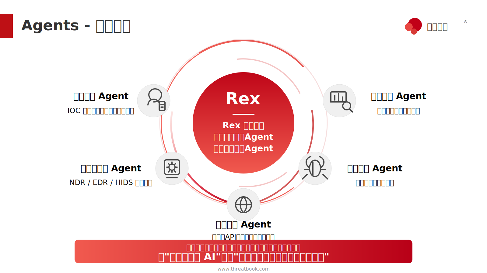

# Agent 智能体

Agent 是 Flocks 解决"谁来做这件事"的答案。工具回答"能做什么"，Workflow 回答"怎么编排"，Agent 回答"**哪个角色最适合处理这类任务**"。

平台里的主 Agent `Rex` 是统一入口，负责理解目标、拆解步骤、调度能力和汇总结果；专家 Agent 则面向特定问题域提供专业执行能力，例如情报分析、主机巡检、漏洞研判、Web 取数、设备巡检等。

## 1. 功能定位

### 1.1 Agent 的角色分工

- **主 Agent Rex**：面向用户的统一入口，负责理解目标、拆解任务、调度工具、委派专家 Agent，并把结果汇总给用户。
- **专家 Agent（子 Agent）**：面向某一类明确任务，通常包含一组工具、一段结构化 System Prompt 和一种执行模式，例如 ReAct。
- **能力关系**：Rex 不是一个"万能 Agent"。遇到专业问题域时，Rex 会主动把任务委派给合适的子 Agent；子 Agent 执行完成后，再把结果交还 Rex 做最终整理。



### 1.2 Agent 与其他模块的关系

| 模块 | 关系 |
| --- | --- |
| [工具清单](/md/modules/tools) | 每个 Agent 可以配置自己的工具白名单，决定它能调用哪些工具。 |
| [Workflow](/md/modules/workflow) | Agent 可以被 Workflow 作为节点调用，也可以在执行中触发子 Workflow。 |
| [Skills](/md/modules/skills) | Agent 可以加载 Skill 获得方法论、规范和任务模板。 |
| [任务中心](/md/modules/tasks) | Agent 可以被固化成周期运行或长期运行的任务。 |
| [模型清单](/md/llm_models) | 每个 Agent 可以使用系统默认模型，也可以单独绑定指定模型。 |

## 2. 适用场景

### 2.1 适合使用 Agent 的情况

- **把一类任务固定交给一个专业执行角色**，例如把设备巡检固定交给 `Security Inspection` Agent。
- **已有成熟调查套路，希望沉淀成可调度的数字员工**，例如情报研判、主机应急、告警初判、资产核查等。
- **希望拆分 Rex 的总控能力和专家执行能力**，让 Rex 专注理解与调度，让子 Agent 专注专业执行。
- **任务目标明确，但执行路径会随上下文变化**，例如登录不同 dashboard、根据页面结果继续取数、边观察边调整分析路径。

### 2.2 不适合单独创建 Agent 的情况

一次性、临时性的简单问题通常不需要创建 Agent，直接在会话里对 Rex 提出目标即可。

如果流程高度固定、步骤明确、对复现和审计要求很高，优先考虑使用 [Workflow 工作流](/md/modules/workflow)，而不是把固定流程全部写进 Agent。

## 3. 创建 Agent 的方式

Flocks 支持通过自然语言创建 Agent。你不需要手工填写复杂表单，也不需要拖拽节点；只要把目标、输入、输出、工具和约束描述清楚，Rex 就可以生成 Agent。

### 3.1 方式一：直接描述要创建的 Agent

在 Rex 会话中给出结构化需求，例如：

```text
帮我创建一个「设备巡检」子 Agent：

目标：对 TDP 和 OneSec 这两个设备做常规巡检
数据来源：从各自的 dashboard 拿数据和运行情况、健康情况
输出：一份结构化巡检报告，覆盖关键指标、威胁行为、威胁事件、健康评估

工具：读写文件、Bash、网络搜索、网页爬虫
执行模式：ReAct
```

Prompt 越结构化，Agent 生成效果越稳定。也可以先给出简单描述，让 Rex 生成第一版方案，再围绕工具、输出格式和执行边界继续迭代。

### 3.2 方式二：从一次成功任务中沉淀 Agent

另一个常用方式是：先和 Rex 完成一次真实任务，然后让 Rex 基于前面的执行过程创建 Agent。

例如，当 Rex 已经完成了一次设备巡检、告警研判或资产核查后，可以继续说：

```text
基于刚才的执行过程，帮我创建一个可复用的 Agent。
保留关键步骤、工具选择、输出格式和注意事项。
```

这种方式适合把一次已经跑通的经验沉淀下来。Rex 会参考前面的目标拆解、工具调用、观察结果和最终产出，把可复用部分整理成 Agent 的配置和 System Prompt。

## 4. WebUI 操作流程

### 4.1 进入 Agent 工作室

在侧栏进入 **Agent 工作室 → Agent 智能体**。页面会显示当前账号或工作区下的 Agent 列表，以及系统内置的 `Rex` 主 Agent。


### 4.2 触发 Rex 生成 Agent

在会话里提交创建需求后，Rex 通常会在几分钟内完成生成。背后主要包括：

1. 参考项目里现有 Agent 的目录结构和 Prompt 模板。
2. 生成新的 Agent 目录。
3. 写入 `agent.yaml` 配置文件。
4. 写入 `prompt.md`，作为 Agent 的 System Prompt。
5. 分配合适的工具集。
6. 选择执行模式，常见默认模式是 ReAct。

### 4.3 查看和调整 Agent

生成完成后，可以在 Agent 列表中看到新 Agent。点击 Agent 卡片后，可以查看或调整：

- Agent 名称。
- 执行模式，例如 ReAct、Plan&Execute 等。
- 分配的工具。
- 当前使用的模型。
- System Prompt。
- 其他配置项。

## 5. Agent 的模型选择

### 5.1 默认模型

每个 Agent 都可以选择模型。默认情况下，Agent 使用系统的"**默认模型**"。

系统默认模型由 [模型清单](/md/llm_models) 页面配置。如果 Agent 使用的是"默认模型"，那么当模型清单页里的默认模型发生变化时，这个 Agent 会自动跟随新的默认模型。

### 5.2 为单个 Agent 指定模型

在 Agent 页面点击某个 Agent 卡片，可以为这个 Agent 单独选择模型。

如果手动为 Agent 选择了某个具体模型，那么后续即使系统默认模型发生变化，也不会改变这个 Agent 的模型。这个 Agent 会继续使用你手动指定的模型，直到再次修改。

### 5.3 什么时候需要单独指定模型

建议在以下场景为 Agent 单独指定模型：

- 任务复杂度较高，需要更强推理能力。
- 任务量很大，希望使用成本更低或响应更快的模型。
- Agent 依赖特定模型的工具调用稳定性。
- 不希望系统默认模型调整影响某个关键 Agent 的表现。

一般情况下，子 Agent 可以选择 30B 左右的中小型模型，用于降低对超大模型的依赖。

如果没有明确需求，保持"默认模型"即可，这样便于统一管理模型配置。

## 6. Agent 的文件结构与安装

### 6.1 存储位置

Flocks 的 Agent 主要来自系统内置目录、项目级插件目录和用户级插件目录：

| 类型 | 存储位置 | 说明 |
| --- | --- | --- |
| 系统内置 Agent | Flocks 包内的 `flocks/agent/agents/<name>/` | 随 Flocks 安装包提供，属于内置能力。 |
| 项目级插件 Agent | 当前项目或 Workspace 下的 `.flocks/plugins/agents/<name>/` | 只在当前项目 / Workspace 中可见。 |
| 用户级插件 Agent | 用户目录下的 `~/.flocks/plugins/agents/<name>/` | 当前用户自定义的 Agent，可在用户环境中复用。 |

### 6.2 目录结构

每个 Agent 都是一个独立文件夹。典型结构如下：

```text
agents/
└── security-inspection/
    ├── agent.yaml
    ├── prompt.md
    ├── checklist.md
    └── helper.py
```

其中：

- `agent.yaml` 存储 Agent 的配置，例如名称、描述、工具、执行模式、模型选择等。
- `prompt.md` 存储 Agent 的 System Prompt，定义角色、目标、输入输出、执行规则和边界。
- 其他 `.md` 文件可以存储补充说明、检查清单、操作规范、案例模板等。
- 其他 `.py` 文件可以存储 Agent 需要使用的辅助脚本。

### 6.3 安装新的 Agent

把一个新的 Agent 文件夹放到项目目录下的 `.flocks/plugins/agents/`，即可完成项目级 Agent 安装。

系统会自动识别该目录中的 `agent.yaml` 和 `prompt.md` 文件，并在 Agent 列表或运行时加载这个 Agent。

如果希望作为当前用户的自定义 Agent 使用，可以放到 `~/.flocks/plugins/agents/`。

### 6.4 agent.yaml 常见配置字段

`agent.yaml` 是 Agent 的结构化配置文件。常见字段包括：

| 字段 | 说明 |
| --- | --- |
| `name` | Agent 名称，建议简短、可读、能体现专业领域。 |
| `description` / `description_cn` | Agent 描述，Rex 会参考描述判断是否委派任务。 |
| `mode` | Agent 模式，常见值包括 `primary`、`subagent`、`all`。 |
| `tools` | 工具白名单，决定该 Agent 可调用哪些工具。 |
| `model` | 单独指定模型；为空或默认时跟随系统默认模型。 |
| `temperature` / `topP` | 模型采样参数，影响输出稳定性和探索性。 |
| `tags` | 标签，用于分类、搜索或能力管理。 |
| `hidden` | 是否在页面中隐藏。 |
| `delegatable` | 是否允许 Rex 将任务委派给该 Agent。 |

Prompt 不在 `agent.yaml` 中用 `prompt` 字段声明。运行时会优先读取 Agent 目录下的 `prompt.md` 作为静态 System Prompt；如果没有 `prompt.md`，则可以通过 `prompt_builder.py` 提供动态 Prompt。`native` 也不是 `agent.yaml` 字段，而是系统根据加载目录自动判断：包内置 Agent 和项目级插件 Agent 视为 native，用户级插件 Agent 视为非 native。

`mode` 会影响 `delegatable` 的默认行为。主 Agent 通常不作为被委派对象；子 Agent 通常可以被 Rex 调度。对于关键 Agent，建议把 `description`、`tools` 和 `prompt.md` 写清楚，这会直接影响 Rex 是否能正确选择它。

## 7. 运行与验证

### 7.1 用自然语言触发

目前在 Session 对话中，默认选择的是主 Agent `Rex`。Agent 创建完成后，可以直接在会话里提出任务目标，例如：

> 运行一下设备巡检。

关键点是：**通常不必显式指定 Agent 名称**。直接说任务即可，Rex 会理解目标，并根据 Agent 的名称、描述、Prompt 和工具范围，找到最合适的子 Agent 去执行。

如果希望稳定选择某个 Agent，可以在任务描述中明确说明：

> 用 Security Inspection Agent 完成这次设备巡检。

用户也可以在会话中直接选择某个特定子 Agent 进行对话。适合调试 Agent、验证 Prompt 或希望绕过 Rex 自动匹配时使用。

### 7.2 会话中的 /agents 命令

在 WebUI 会话、TUI 或 CLI 会话中，可以使用 `/agents` 查看当前可被委派的 Agent：

```text
/agents
```

`/agents` 会列出可用 Agent 的名称、描述，以及部分元信息。它适合在不知道系统里有哪些专家 Agent 时快速查看。

在 TUI 中，还可以用 `@agent-name` 在输入中引用某个子 Agent，例如：

```text
@security-inspection 帮我检查这批设备巡检结果。
```

这种写法适合明确希望某个子 Agent 参与任务时使用。WebUI 中则通常通过 Agent 选择器或在自然语言里明确说明"用某某 Agent 完成任务"来稳定选择。

### 7.3 查看执行产出

执行结束后，可以查看：

- 会话里的结果摘要和关键指标。
- Agent 输出的完整报告。
- 产出的文件位置，通常在 [Workspace](/md/modules/workspace) 的 `outputs/` 目录下。

### 7.4 验证 Agent 是否符合预期

建议用 1 到 2 个真实任务进行验证，重点观察：

- Rex 是否能正确识别并委派给这个 Agent。
- Agent 是否选择了合适的工具。
- Agent 是否遵守 `prompt.md` 中定义的输出格式和边界。
- 产出结果是否稳定、可复用、可审计。

如果结果不稳定，优先调整 `prompt.md` 的目标、输入输出、工具使用规则和限制条件。

### 7.5 调整 Agent

如果发现 Agent 的执行结果不理想，可以回到 Rex 会话中明确说明要优化哪个 Agent，以及希望优化的具体功能点。

例如：

```text
帮我优化 Security Inspection Agent 的报告生成能力。
现在巡检报告里的健康评估太粗略，请补充关键指标解释、异常判断依据和整改建议。
```

Rex 会基于你的反馈调整 Agent 的配置、System Prompt 或相关辅助文件。建议把问题描述得尽量具体，例如"哪个 Agent"、"哪个功能点"、"当前结果哪里不好"、"希望调整成什么样"。

## 8. CLI 与 TUI 管理入口

### 8.1 TUI / Node CLI

TUI 侧提供 Agent 创建和查看命令：

| 命令 | 作用 |
| --- | --- |
| `flocks agent list` | 列出当前可用 Agent。 |
| `flocks agent create` | 交互式创建 Agent。 |
| `flocks agent create --description "<desc>" --mode subagent --tools bash,read,write` | 非交互式创建 Agent。 |
| `flocks agent create --model provider/model` | 创建时指定用于生成 Agent 的模型。 |

创建时可以选择 Agent 存放位置、描述、模式、工具集和模型。TUI 也支持在会话中切换 primary Agent，并用 `@agent-name` 引用子 Agent。

### 8.2 Agent 工具调试

TUI debug 命令可以查看某个 Agent 的完整配置和工具开关，也可以直接测试某个工具是否能在该 Agent 上运行：

```bash
flocks debug agent <agent-name>
flocks debug agent <agent-name> --tool <tool-id> --params '{"key":"value"}'
```

这个入口适合排查：

- Agent 是否能看到某个工具。
- Agent 工具白名单是否禁用了某个工具。
- 工具参数是否能被正确执行。

### 8.3 Python CLI 状态

`../flocks/flocks/cli/commands/agent.py` 中已有 Agent CLI 实现，包括 `list`、`show`、`permissions` 等命令，用于查看 Agent、模型、Prompt 和权限规则。不过当前 Python CLI 主入口主要注册了 `skills`、`mcp`、`task`、`session` 等命令组；如果你在某个安装版本中看不到 `flocks agent ...`，以 `flocks --help` 的实际输出为准。

## 9. 核心概念

### 9.1 ReAct 模式

多数子 Agent 默认走 ReAct（Reason + Act）循环：

```text
[思考] 当前需要拿什么数据 → [行动] 调用工具 → [观察] 结果是否可用
       ↑                                                    ↓
       ←———————————————— 继续迭代 ←—————————————————————————
```

这意味着 Agent 不会一次性把计划固定下来，而是根据中途结果灵活调整。这在 dashboard 登录、页面取数、接口返回不稳定、需要多次试探的真实场景里尤其重要。

### 9.2 Agent 与 Rex 的委派关系

Rex 在会话里判断是否委派子 Agent，常见判据包括：

- 任务是否命中某个已知专业问题域。
- 子 Agent 的工具集是否足以完成任务。
- 子 Agent 的 Prompt 声明的能力范围是否匹配。
- 子 Agent 当前模型是否适合执行该任务。

即便不命中任何子 Agent，Rex 也可以用自身工具链直接处理。子 Agent 是更专业的可选执行角色，不是强制路径。

### 9.3 动态子 Agent：Rex-junior

除了委派给某个已经创建好的专家 Agent，Rex 还可以把一个 Skill 委派给 `Rex-junior` Agent 来执行。

这种模式可以理解为"动态子 Agent"：Rex 会把指定 Skill 作为 `Rex-junior` 的 System Prompt，在一个独立的子 Agent 执行空间中运行。这样既可以复用 Skill 中沉淀的方法论、规则和任务模板，又能让执行过程与主会话保持适度隔离，适合处理需要临时专家角色但还没有必要固化成长期 Agent 的任务。

典型使用方式：

```text
用漏洞研判 Skill 分析这条 CVE，并让 Rex-junior 独立完成初步影响评估。
```

如果某个 Skill 被反复通过 `Rex-junior` 执行，且执行边界、工具集和输出格式已经比较稳定，就可以考虑进一步沉淀为正式的专家 Agent。

### 9.4 子 Agent 的嵌套调用

在子 Agent 执行过程中，子 Agent 可以根据任务需要继续调用 [Skills](/md/modules/skills)、[Workflow](/md/modules/workflow)，也可以委派给其他子 Agent。

不过实践中不建议设计多层嵌套调用。嵌套层级过深会增加调试难度、上下文损耗和结果不确定性。一般建议让 Rex 负责统一调度，子 Agent 保持清晰职责；只有在边界明确、收益明显时，再让子 Agent 调用其他能力。

### 9.5 Agent 能力边界

当前 Flocks 的 Agent 能力偏向"**可组织 + 可扩展**"，不追求抽象的"通用智能"。实践中建议单个 Agent 保持：

- 职责清晰，一个 Agent 负责一类问题域。
- 工具集精简，避免过多工具增加误选概率。
- Prompt 结构化，明确目标、输入、输出、工具和约束。
- 模型选择稳定，关键 Agent 可单独绑定模型。

## 10. 真实案例：设备巡检 Agent

### 10.1 案例背景

需要创建一个"机器巡检 / 设备巡检"Agent，针对 TDP 和 OneSec 两台设备，从 dashboard 拿数据并生成常规巡检报告。

### 10.2 创建过程

在 Rex 会话里给出需求和基本信息：

1. 要巡检哪两个设备。
2. 从哪里拿数据。
3. 输出成什么格式。
4. 需要哪些工具。
5. 希望采用什么执行模式。

Rex 运行几分钟后生成子 Agent，例如：

- 名称：`Security Inspection`。
- 执行模式：ReAct。
- 工具：Bash、Write、Read、网络搜索、网络爬虫。
- Prompt：围绕网页信息获取、指标分析和巡检报告生成进行组织。

### 10.3 运行过程

在会话里发出模糊指令：

> 运行这个巡检。

Rex 即使没有被显式告知巡检 Agent 名称，也会根据任务目标选择合适的子 Agent。子 Agent 执行过程可能包括：

- 登录 TDP / OneSec 的 dashboard。
- 抓取关键指标。
- 解析威胁行为和威胁事件。
- 评估系统健康状况。
- 整理结构化报告。

### 10.4 产出结果

典型产出包括：

- **TDP Inspection** 报告：机器数量、关键指标、功能状态、系统运行情况、组件状态、CPU 占用等。
- **OneSec Inspection** 报告：接入设备数量、在线离线状态、威胁行为、威胁事件清单、健康评估、数据采集说明等。

一开始的 Prompt 不一定需要非常详细。Agent 会围绕目标补足取数粒度和报告结构；但如果要长期复用，仍建议在 `prompt.md` 中把输出格式、边界条件和成功标准写清楚。

## 11. 常见问题

### 11.1 Agent 没有按预期被调用怎么办？

先把任务目标和希望使用的 Agent 写得更明确。如果仍不触发，再检查 Agent 的名称、描述和 `prompt.md` 是否能被 Rex 匹配到。

### 11.2 想把一次成功操作沉淀回 Agent，应该怎么描述？

可以让 Rex 基于刚才的执行过程创建 Agent，并要求保留目标系统、输入输出、关键步骤、工具选择、约束条件和成功标准。描述越结构化，生成的 Agent 越可复用。

### 11.3 Agent 和 Skill 有什么区别？

| 维度 | Agent | Skill |
| --- | --- | --- |
| 是什么 | 角色 + 工具集 + Prompt + 执行模式 | 规范 / 方法 / 任务模板 |
| 能独立执行吗 | 能，可以有自己的 ReAct 循环 | 不能，需要被 Agent 加载 |
| 何时用 | 要固定一类任务的处理方式 | 要让一个或多个 Agent 按同一套方法做事 |

### 11.4 创建完 Agent 后在哪里查看源文件？

系统内置 Agent 位于 Flocks 包内的 `flocks/agent/agents/<name>/`；项目级插件 Agent 位于当前项目或 Workspace 下的 `.flocks/plugins/agents/<name>/`；用户级插件 Agent 位于 `~/.flocks/plugins/agents/<name>/`。每个 Agent 是一个独立文件夹，核心文件是 `agent.yaml`，通常还会包含 `prompt.md`。

### 11.5 一定要用 ReAct 模式吗？

不一定。ReAct 是多数动态任务的默认选择，但 Flocks 允许定义更专业的执行模式。如果业务流程足够固定，优先考虑 [Workflow 工作流](/md/modules/workflow)。

### 11.6 Agent 使用默认模型还是指定模型更好？

大多数 Agent 使用"默认模型"即可，便于统一管理。对于关键任务、复杂任务、成本敏感任务或需要稳定模型表现的 Agent，可以在 Agent 卡片里单独指定模型。

## 12. 相关模块

- [Workflow 工作流](/md/modules/workflow)：当流程足够固定、步骤明确时优先用 Workflow。
- [Skills 技能库](/md/modules/skills)：把 Agent 的经验沉淀为可被其他 Agent 加载的方法。
- [工具清单](/md/modules/tools)：Agent 分配工具的来源。
- [模型清单](/md/llm_models)：配置系统默认模型，并为 Agent 选择可用模型。
- [任务中心](/md/modules/tasks)：把 Agent 固化成周期运行的数字员工。
- [场景实践 · 告警研判](/md/scenarios/alert-triage)：告警分析 Agent 的典型落地。
- [场景实践 · 主机巡检](/md/scenarios/host-forensics)：主机巡检 Agent 在真实环境的走读。

<!-- TODO: 嵌入 create_sub_agent.mp4 操作演示视频 -->
