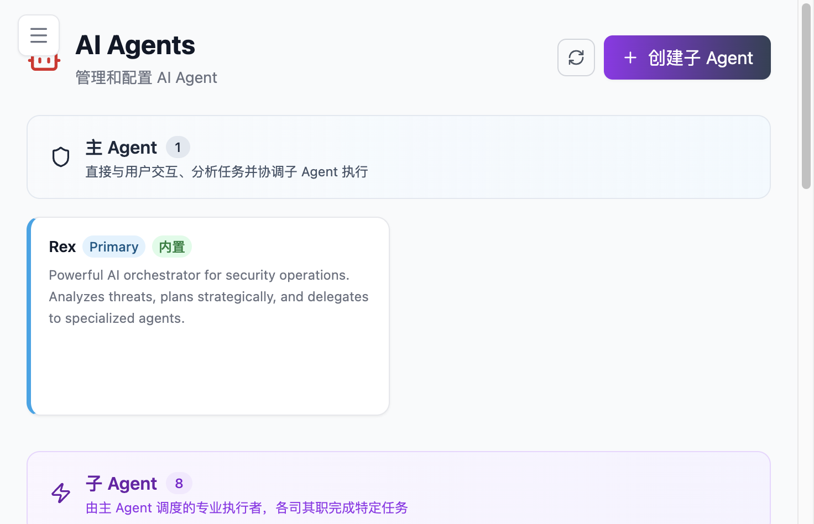

# Agent 智能体

Agent 是 Flocks 解决"谁来做这件事"的答案。工具回答"能做什么"、Workflow 回答"怎么编排"、Agent 回答"**哪个角色最适合处理这类任务**"。平台里主 Agent `Rex` 作为统一入口；专家 Agent 则是面向特定问题域的专业执行体，例如情报分析、主机巡检、漏洞研判、Web 取数等。

## 功能定位

- **主 Agent Rex**：面向用户的统一入口，负责理解目标、拆解步骤、调度能力、回收结果
- **专家 Agent（子 Agent）**：在特定场景里提供深度能力，通常内置一组工具集 + 一段结构化 Prompt + 一种执行模式（如 ReAct）
- **能力关系**：Rex 不是一个"万能 Agent"，在遇到专业问题域时会主动把任务委派给子 Agent；子 Agent 执行完把结果交还 Rex 做汇总

和模块之间的关系：

| 模块 | 关系 |
| --- | --- |
| [工具清单](/md/modules/tools) | 每个 Agent 被分配一组可调用工具（Bash / Write / Read / Web 搜索等） |
| [Workflow](/md/modules/workflow) | Agent 可被 Workflow 作为节点调用，也可以在执行中触发一条子 Workflow |
| [Skills](/md/modules/skills) | Agent 可以加载 Skill 获得方法论；Skill 的创建本身也是 Agent 生成 |
| [任务中心](/md/modules/tasks) | 把 Agent 固化成定时运行对象 |
| [模型清单](/md/integrations#模型配置) | 不同 Agent 可绑定不同默认模型，按任务平衡成本和能力 |

## 适用场景

进入 Agent 页面通常有三类动机：

- **把一类任务固定交给一个更专业的执行角色**（例如"设备巡检"就固定给 `Security Inspection` Agent）
- **已有成熟调查套路，想沉淀成可调度的数字员工**（情报研判、主机应急、告警初判等）
- **希望把 `Rex` 的总控能力和专家执行能力拆开组织**（主 Agent 专注理解与调度，子 Agent 专注执行）

**不适合**的典型情况：一次性、临时性问题。直接在会话里对 Rex 说即可，不需要单独建一个 Agent。

## 操作步骤（WebUI）

### 步骤 1：进入 Agent 工作室

侧栏 **Agent 工作室 → Agent 智能体**。页面显示当前账号/工作区下所有 Agent，以及系统内置的 `Rex` 主 Agent。



### 步骤 2：用自然语言触发创建

和创建 Skill / Workflow 一样，Flocks 的 Agent 创建走"**语言生成**"路径——不用手工填表、不用拖节点，直接在会话中给 Rex 一段结构化描述即可。以下是一个实际可用的 Prompt 模板：

```text
帮我创建一个「设备巡检」子 Agent：

目标：对 TDP 和 OneSec 这两个设备做常规巡检
数据来源：从各自的 dashboard 拿数据和运行情况、健康情况
输出：一份结构化巡检报告，覆盖关键指标、威胁行为、威胁事件、健康评估

工具：读写文件、Bash、网络搜索、网页爬虫
执行模式：ReAct
```

Prompt 越结构化，Agent 生成效果越稳定。但"**不说这么详细大模型也知道**"，可以从简单描述开始让它先出一版方案，再迭代。

### 步骤 3：Rex 生成 Agent（约 2~3 分钟）

Rex 在背后会做这几件事：

1. 参考项目里现有 Agent 的格式（读其他 Agent 的目录结构 / Prompt 模板）
2. 生成 Agent 目录和 Prompt 文件（`.md` 文档形式）
3. 分配合适的工具集
4. 选定执行模式（默认 ReAct）

生成完成后可以在列表看到新 Agent。点开可以查看：

- **Agent 名称**（如 `Security Inspection`）
- **执行模式**（ReAct / Plan&Execute 等）
- **分配的工具**（Bash、Write、Read、Web 搜索、网络爬虫等）
- **Prompt**（结构化的任务说明文档）

### 步骤 4：运行验证

回到会话里，直接用模糊目标触发：

> 「运行一下设备巡检」

> 关键点：**你不必显式指定 Agent 名称**。Rex 会理解任务、选择合适的子 Agent 去执行。子 Agent 会启动自己的对话循环，可能包含登录、取数、分析、生成报告等多个阶段。

### 步骤 5：查看产出

执行结束后查看：

- 会话里的结果摘要和关键指标
- Agent 输出的完整报告（如 `OneSec Inspection` + `TDP Inspection` 两份巡检报告）
- 产出的文件位置（通常落在 [Workspace](/md/modules/workspace) 的 `artifacts/` 下）

## 核心概念

### ReAct 模式

多数子 Agent 默认走 ReAct（Reason + Act）循环：

```text
[思考] 当前需要拿什么数据 → [行动] 调用工具 → [观察] 结果是否可用
       ↑                                                    ↓
       ←———————————————— 继续迭代 ←—————————————————————————
```

这意味着 Agent 不会一次性把计划固定下来，而是根据中途结果灵活调整——这在"dashboard 登录过程中格式不确定、需要多次试探"这类真实场景里尤其重要。

### Agent 与 Rex 的委派关系

Rex 在会话里判断是否委派子 Agent，判据包括：

- 任务是否命中某个已知专业问题域
- 子 Agent 的工具集是否足以完成任务
- 子 Agent 的 Prompt 声明的能力范围是否匹配

即便不命中任何子 Agent，Rex 也会用自身工具链直接处理。子 Agent 是"更专业的可选项"，不是强制路径。

### Agent 能力边界

当前 Flocks 的 Agent 能力偏向"**可组织 + 可扩展**"，不追求抽象的"通用智能"。实践中单个 Agent 建议：

- 职责清晰（一个 Agent 负责一类问题域）
- 工具集精简（过多工具会增加误选）
- Prompt 结构化（目标 / 输入 / 输出 / 工具 / 约束）

## 真实案例走读

### 案例背景

要做一个"机器巡检 / 设备巡检"的 Agent，针对手头的 TDP 和 OneSec 两台设备，从 dashboard 拿数据做常规巡检。

### 创建过程

1. 在 Rex 会话里给出需求 + 基本信息（要巡检哪两个设备、从哪里拿数据、输出成什么格式）
2. 使用"一段标准的、文档形式的 Prompt"作为创建指令
3. Rex 运行约几分钟生成子 Agent：
   - 名称 `Security Inspection`
   - 执行模式 ReAct
   - 工具：Bash、Write、Read、网络搜索、网络爬虫
   - Prompt：主要是"网页信息获取"类的任务说明

### 运行过程

在会话里发出模糊指令"运行这个巡检"。Rex **没有显式被告知巡检名称**，但它会自己选择合适的子 Agent。子 Agent 执行过程包括：

- 登录 TDP / OneSec 的 dashboard
- 抓取关键指标
- 解析威胁行为、威胁事件数据
- 做系统健康状况评估
- 整理成结构化报告

### 产出结果

- **TDP Inspection** 报告：机器数量、关键指标、功能状况、系统运行、各组件状态、CPU 占用等
- **OneSec Inspection** 报告：已接入 222 台（在线 115、离线若干）、威胁行为 6 台（包括疑似反连等）、威胁事件清单、设备健康评估、数据采集说明

> 值得注意的是：**一开始的 Prompt 描述并不详细，但 Agent 会做大量扩展**。这是 Flocks Agent 能力的典型体现——它不是只按死指令执行，而是围绕目标自主决定取数粒度和报告结构。

## 常见问题

### Agent 没有按预期被调用

先把任务目标和希望使用的 Agent / Skill / 工具写得更明确；如果仍不触发，再检查 Agent 的 Prompt 声明是否能被 Rex 匹配到。（FAQ：安装了 skill 但 Agent 没按预期调用怎么办）

### 想把一次成功操作沉淀回 Agent，应该怎么组织需求？

最好把目标系统、输入输出、关键步骤、约束条件、成功标准都整理清楚。描述越结构化，生成的 Agent 越可复用。这个模式对 Skill 同样适用——见 [Skills 技能库](/md/modules/skills)。

### Agent 和 Skill 有什么区别？

| 维度 | Agent | Skill |
| --- | --- | --- |
| 是什么 | 角色 + 工具集 + Prompt | 规范 / 方法 / 任务模板 |
| 能独立执行吗 | 能（有自己的 ReAct 循环） | 不能（需要被 Agent 加载） |
| 何时用 | 要固定一类任务的处理方式 | 要让任何 Agent 都能按这套方法做 |

### 创建完 Agent 后在哪里查看源文件？

Agent 以目录 + `.md` 文件形式存放。具体位置见 [Workspace](/md/modules/workspace) 的目录约定——"生成的就会自动加载进来"。

### 一定要用 ReAct 模式吗？

不一定。ReAct 是多数场景的默认选择，但 Flocks 允许定义更专业的执行模式。如果业务流程足够固定，优先考虑 [Workflow](/md/modules/workflow) 而不是 Agent。

## 相关模块

- [Workflow 工作流](/md/modules/workflow) — 当流程足够固定、步骤明确时优先用 Workflow
- [Skills 技能库](/md/modules/skills) — 把 Agent 的经验沉淀为可被其他 Agent 加载的方法
- [工具清单 / MCP](/md/modules/tools) — Agent 分配工具的来源
- [任务中心](/md/modules/tasks) — 把 Agent 固化成周期运行的数字员工
- [场景案例 · 告警研判](/md/scenarios/alert-triage) — 告警分析子 Agent 的典型落地
- [场景案例 · 主机巡检](/md/scenarios/host-forensics) — 主机巡检 Agent 在真实环境的走读

<!-- TODO: 嵌入 create_sub_agent.mp4 操作演示视频 -->
