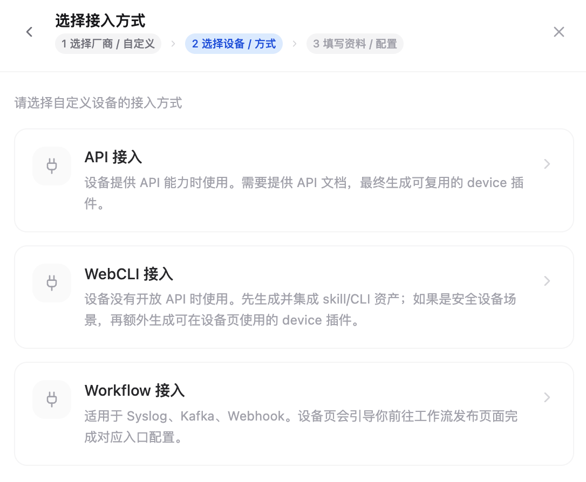
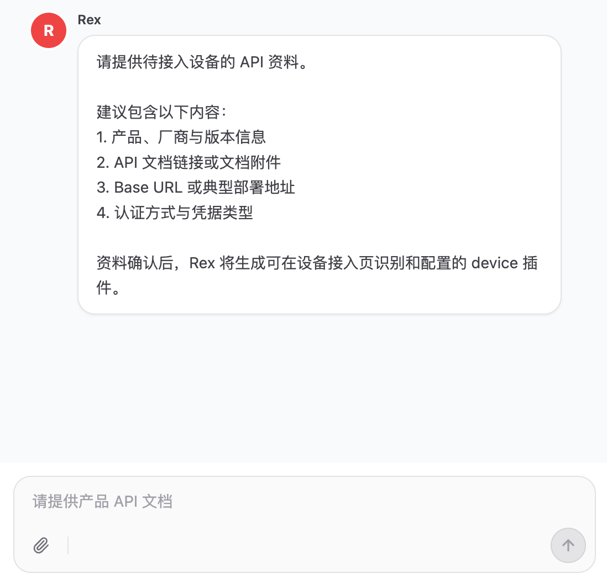
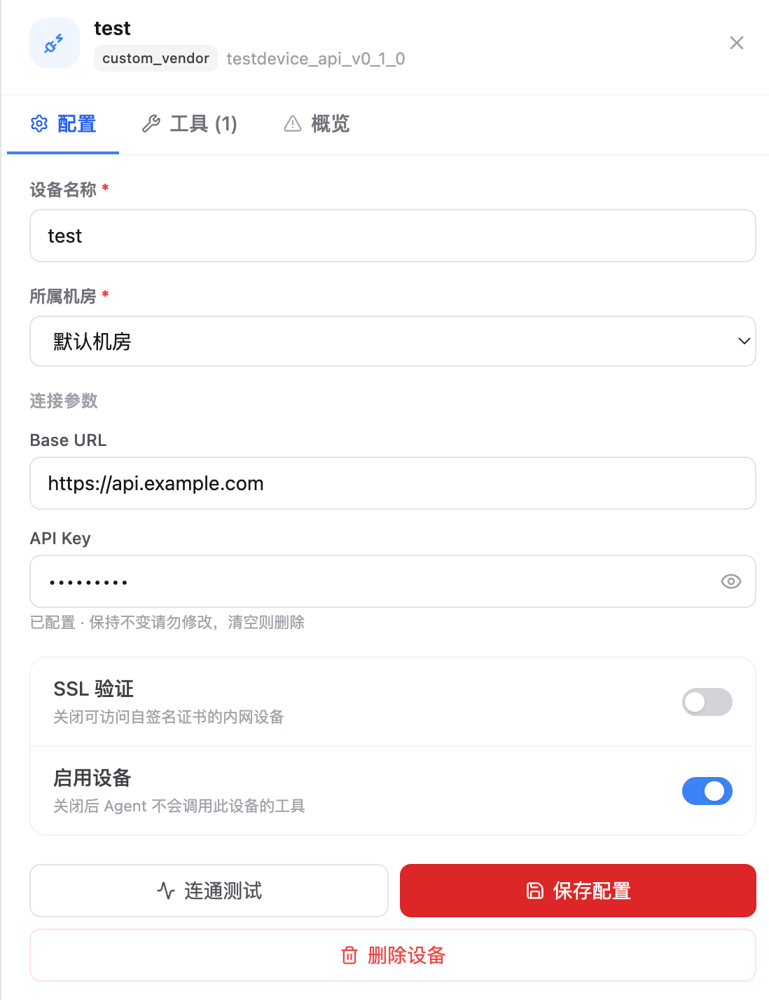
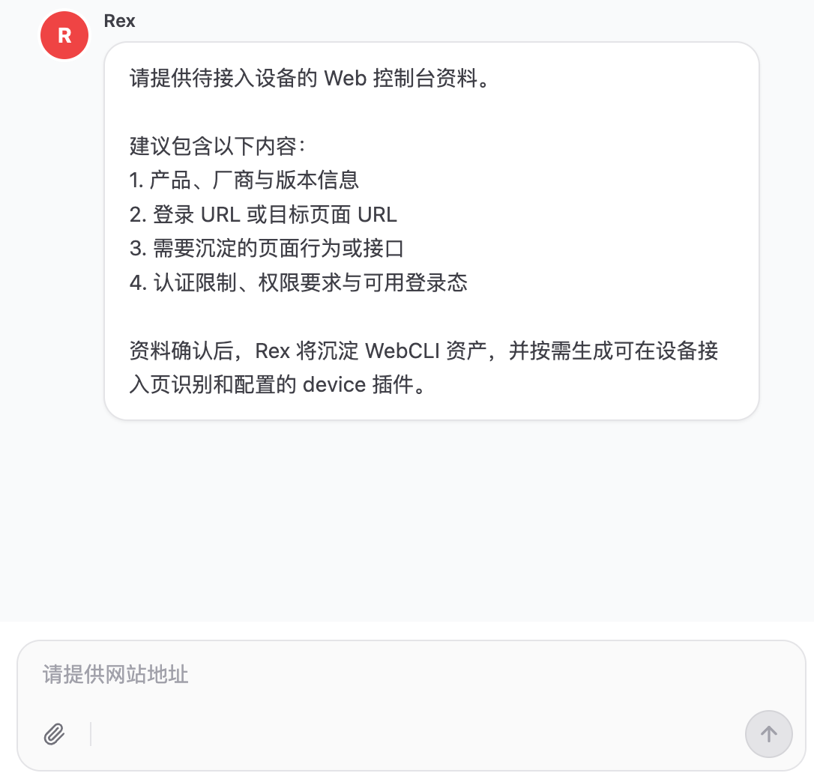
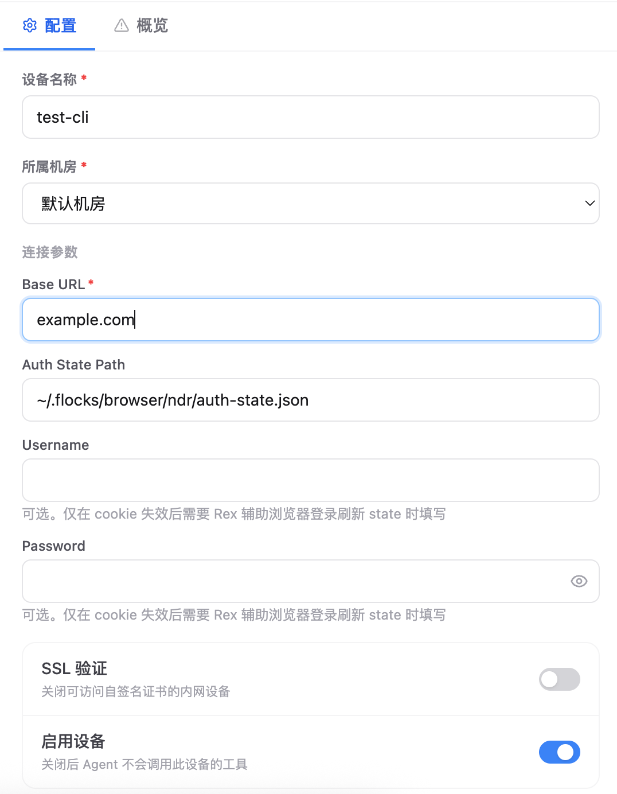
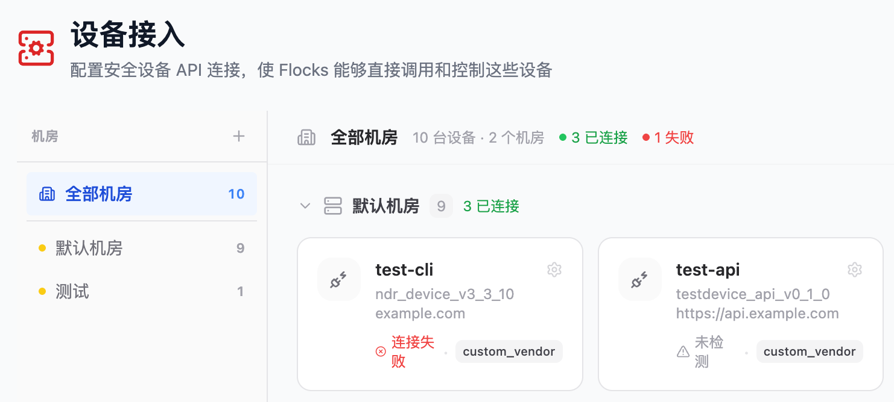

# 4.8.1 自定义设备接入

自定义设备接入用于把未预置的安全设备纳入 **设备接入** 页面。它的目标不是只生成一个普通 API 工具，而是生成设备页可识别、可配置、可按实例启停和测试的 **device 插件**。

适合接入的对象包括 NDR、WAF、防火墙、HIDS、EDR、态势感知平台、资产平台、告警平台、堡垒机，以及企业内部只有私有接口或 Web 控制台的系统。

## 1. 接入入口

进入 **设备接入** 后，选择 **添加设备**，在厂商选择中进入 **自定义设备**。自定义设备当前主要支持 API 接入、WebCLI 接入和 Workflow 接入三条路径。

<figure class="device-doc-shot device-doc-shot--medium">
  
  <figcaption>从设备接入页面选择自定义设备，并按设备条件选择 API、WebCLI 或 Workflow。</figcaption>
</figure>

| 接入方式 | 适用场景 | 生成结果 |
| --- | --- | --- |
| API 接入 | 设备提供官方 API、私有 API、OpenAPI 文档或可整理出的 HTTP 接口。 | Rex 使用 `tool-builder` 生成可复用的 device 插件。 |
| WebCLI 接入 | 设备没有开放 API，或关键能力只能从 Web 控制台完成。 | Rex 使用 `web2cli` 沉淀页面行为和隐藏接口，并按需生成 WebCLI device 插件。 |
| Workflow 接入 | 设备数据以 Syslog、Kafka、Webhook 等形式持续推送。 | 前往 Workflow 发布 / 集成页面配置输入源，把设备事件流接入指定工作流。 |

如果设备支持 Syslog、Kafka 或 Webhook 推送，优先选择 **Workflow 接入**，把这类事件流接到 [Workflow 工作流](/md/modules/workflow#3-4-正式运行) 的发布 / 集成入口，而不是在这里创建 device 插件。可以前往 Workflow 页面的任意工作流，进入 **发布 / 集成** 页面查看并配置对应入口。

## 2. API 接入流程

API 接入适合长期运行、定时任务、批量查询和需要稳定审计记录的场景。你需要向 Rex 提供 API 文档或接口说明，Rex 会先澄清缺失信息，再生成设备页可识别的 device 插件。

### 2.1 提供接口资料

<figure class="device-doc-shot device-doc-shot--wide">
  
  <figcaption>把产品信息、接口文档、认证方式和期望能力范围交给 Rex。</figcaption>
</figure>

建议至少准备：

- 产品、厂商和版本信息。
- API 文档链接、OpenAPI 文件、PDF/Word 文档或接口样例。
- Base URL 或典型部署地址。
- 认证方式和凭据类型，例如 API Key、Token、AK/SK、用户名密码、签名规则。
- 希望接入的能力范围；如果只接部分接口，要明确接口名或路径。

### 2.2 配置设备实例

生成插件后，返回设备接入页刷新模板，选择新生成的设备模板并填写实例配置。配置表单来自插件 `_provider.yaml` 的 `credential_fields`，所以不同设备会展示不同字段。

<figure class="device-doc-shot device-doc-shot--narrow">
  
  <figcaption>API 设备实例配置表单，密钥类字段由设备实例配置保存。</figcaption>
</figure>

常见字段含义：

- **设备名称**：当前实例名称，例如总部 WAF、上海 NDR。
- **所属机房**：设备实例归属的机房分组。
- **Base URL**：设备 API 根地址。
- **API Key / Token / Secret**：鉴权凭据。密钥字段会按 secret 方式保存，编辑时默认只显示已配置状态。
- **SSL 验证**：内网设备使用自签名证书时，可以关闭。
- **启用设备**：关闭后 Agent 不会调用此设备的工具。
- **连通测试**：对当前设备实例发起测试，并把成功、失败和延迟写回设备状态。

## 3. WebCLI 接入流程

WebCLI 接入适合没有稳定 API、API 覆盖不足，或必须通过 Web 控制台才能完成查询和操作的设备。它不是把浏览器点击流程直接作为长期运行主路径，而是优先从页面行为和浏览器请求中沉淀稳定接口，再封装为 device 插件。

### 3.1 提供页面资料

<figure class="device-doc-shot device-doc-shot--wide">
  
  <figcaption>提供登录入口、目标页面、操作目标和认证限制，便于 Rex 沉淀稳定动作。</figcaption>
</figure>

建议至少准备：

- 产品、厂商和版本信息。
- 登录 URL 或目标页面 URL。
- 需要沉淀的页面行为或接口，例如告警列表、资产详情、封禁 IP、导出报表。
- 认证限制、权限要求和可用登录态。
- 是否需要人工扫码、验证码、堡垒机跳转或只读账号。

### 3.2 配置登录态

WebCLI 设备插件默认使用 `cookie/auth-state` 思路：优先复用浏览器保存的登录态文件，并在需要时通过用户名、密码辅助刷新登录态。不要把 Cookie、Token 或 auth state JSON 直接写进插件文件。

<figure class="device-doc-shot device-doc-shot--narrow">
  
  <figcaption>WebCLI 设备实例通常配置 Base URL 和浏览器登录态文件路径。</figcaption>
</figure>

常见字段含义：

- **Base URL**：Web 控制台或隐藏接口的根地址。
- **Auth State Path**：浏览器登录态文件路径，常见格式是 `~/.flocks/browser/<name>/auth-state.json`。
- **Username / Password**：可选；通常只在 Cookie 失效后，需要 Rex 辅助浏览器重新登录刷新 state 时使用。
- **SSL 验证** 和 **启用设备**：与 API 接入一致。

WebCLI 的最终产物应当是设备页可识别的 device 插件。CLI 可以作为调试或回归入口保留，但不应作为设备运行时的主路径。

## 4. Workflow 接入说明

Workflow 接入用于持续接收设备数据，适合设备已经能通过 Syslog、Kafka 或 Webhook 推送日志、告警、资产变更事件等数据的场景。它不生成 device 插件，而是把设备事件流配置为某个 Workflow 的输入源，由 Workflow 负责后续解析、研判、通知或处置。

配置入口不在自定义设备插件表单中。请前往 [Workflow 工作流](/md/modules/workflow#3-4-正式运行) 页面，打开任意一个需要接收设备数据的 Workflow，在 **发布 / 集成** 页面查看并配置 Syslog、Kafka 等入口。

## 5. device 插件识别规则

设备页不会手工维护自定义设备清单，而是从插件元数据中发现模板。一个自定义 device 插件至少需要包含：

```text
~/.flocks/plugins/tools/device/<plugin_id>/
├── _provider.yaml
├── <tool>.yaml
└── <name>.handler.py
```

其中 `_provider.yaml` 必须声明：

```yaml
name: Custom Device
vendor: custom_vendor
service_id: custom_device
version: "1.0.0"
integration_type: device
credential_fields:
  - key: base_url
    label: Base URL
    storage: config
    input_type: url
    required: true
```

关键规则：

- `integration_type: device` 决定它是否会出现在设备接入页。
- `service_id` 是工具运行时读取配置的稳定标识。
- `version` 会参与生成设备模板的 `storage_key`，页面上会显示类似 `testdevice_api_v0_1_0` 的标识。
- `credential_fields` 决定实例配置表单展示哪些字段，以及哪些字段按 secret 保存。
- 工具 YAML 的 `provider` 必须与 `_provider.yaml.service_id` 一致。
- 高风险写操作应在工具 YAML 中开启确认，不要把删除、封禁、隔离类动作做成无确认默认动作。

## 6. 接入后的设备列表

配置保存后，设备会回到主列表。列表会显示机房、设备数量、连接状态、模板标识、厂商和最近测试结果。

<figure class="device-doc-shot device-doc-shot--wide">
  
  <figcaption>自定义设备保存后会回到设备列表，并展示连接状态和模板标识。</figcaption>
</figure>

状态含义：

- **已连接**：最近一次连通测试成功。
- **连接失败**：最近一次测试失败，详情通常来自测试接口返回信息。
- **未检测**：尚未执行连通测试，或插件刚生成后还没有保存实例测试结果。
- **已禁用**：设备实例关闭后，Agent 不会调用这个设备的工具。

在设备详情里还可以查看 **工具** 标签。设备工具支持按单个设备实例启停；如果同一个插件接入了多台设备，可以只关闭某一台设备上的特定工具，不影响其他实例。

## 7. 常见问题

| 问题 | 处理方式 |
| --- | --- |
| 生成了普通 API 工具，但设备页看不到 | 确认插件位于 `tools/device/<plugin_id>/`，且 `_provider.yaml` 包含 `integration_type: device`。 |
| API 文档不完整 | 先让 Rex 澄清认证、Base URL、接口输入输出和错误码；只接入已确认的接口。 |
| WebCLI 登录态失效 | 重新用浏览器登录并刷新 `auth-state.json`，再测试设备。 |
| 内网自签名证书导致测试失败 | 在设备配置里关闭 **SSL 验证** 后重新测试。 |
| 字段里有密码、Token、Cookie | 放在 `credential_fields` 的 secret 字段中，由设备实例配置保存，不要写入插件代码或文档。 |

## 8. 相关文档

- [设备管理](/md/modules/devices)：查看设备管理主页面说明。
- [工具清单](/md/modules/tools)：维护 API 工具、MCP 能力和设备工具。
- [Workflow 工作流](/md/modules/workflow)：接入 Syslog、Kafka、Webhook 等事件流。
- [内网安全产品接入](/md/scenarios/network-integration)：查看 API 接入主路径。
- [浏览器自动化与网页登录](/md/scenarios/browser-automation)：查看浏览器和 WebCLI 场景边界。

<style>
.device-doc-shot {
  margin: 24px auto 28px;
  text-align: center;
}

.device-doc-shot img {
  display: block;
  width: 100%;
  margin: 0 auto;
  border: 1px solid var(--vp-c-divider);
  border-radius: 10px;
  box-shadow: 0 8px 28px rgb(0 0 0 / 8%);
}

.device-doc-shot figcaption {
  margin-top: 10px;
  color: var(--vp-c-text-2);
  font-size: 14px;
  line-height: 1.6;
}

.device-doc-shot--wide {
  max-width: 920px;
}

.device-doc-shot--medium {
  max-width: 760px;
}

.device-doc-shot--narrow {
  max-width: 620px;
}

@media (max-width: 640px) {
  .device-doc-shot {
    margin: 18px auto 22px;
  }

  .device-doc-shot img {
    border-radius: 8px;
  }
}
</style>
