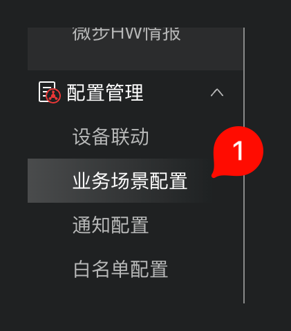
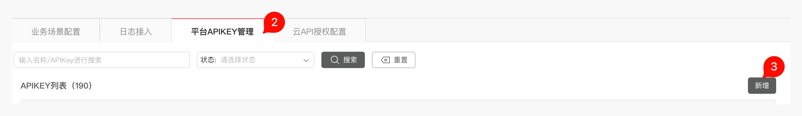
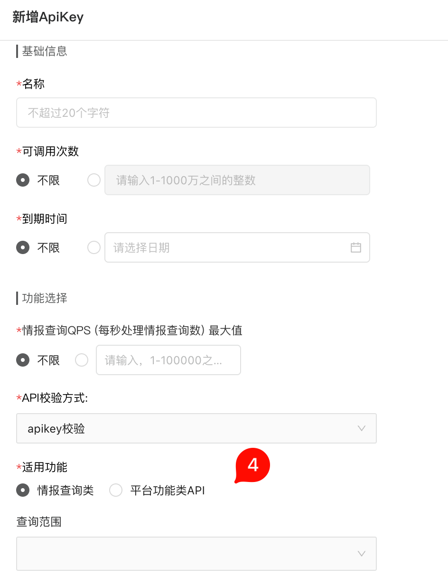
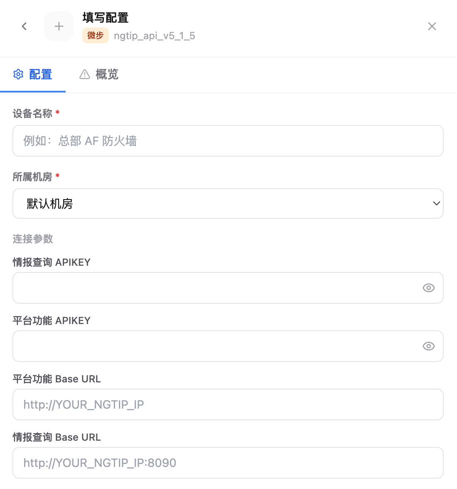

# 4.8.5 NGTIP 接入

NGTIP 接入用于把微步 HVV 情报平台的情报查询和平台功能 API 接入 Flocks 设备管理。接入前需要在 NGTIP 控制台创建 API Key，并按功能类型分别配置到 Flocks。

## 进入 API Key 管理

登录 NGTIP 控制台后，进入 **配置管理 > 业务场景配置**。

在业务场景配置页面中，切换到 **平台 APIKEY 管理**，然后点击 **新增**。

## 新增 API Key

在 **新增ApiKey** 页面填写基础信息和功能选择。Flocks 通常需要至少准备情报查询类 API Key；如果还要调用平台功能接口，再准备平台功能类 API Key。

建议填写：

- **名称**：填写便于识别的名称，例如 `flocks`。
- **可调用次数**：按安全策略选择不限或固定次数。
- **到期时间**：按安全策略选择不限或固定到期日。
- **API 校验方式**：选择 `apikey 校验`。
- **适用功能**：情报查询接口选择 **情报查询类**；平台功能接口选择 **平台功能类 API**。
- **查询范围**：按实际授权范围选择。

保存后复制生成的 API Key。不同功能类型的 API Key 要分开保存，避免把情报查询 Key 填到平台功能字段中。

## 在 Flocks 中填写配置

进入 **设备接入**，选择微步 NGTIP 模板后填写实例配置。

关键字段：

- **设备名称**：当前 NGTIP 实例名称。
- **所属机房**：设备归属的机房或区域。
- **情报查询 APIKEY**：填写 NGTIP 中适用功能为 **情报查询类** 的 API Key。
- **平台功能 APIKEY**：填写 NGTIP 中适用功能为 **平台功能类 API** 的 API Key；如果当前只接入情报查询能力，可以先留空。
- **平台功能 Base URL**：填写平台功能接口地址，通常为 `http://YOUR_NGTIP_IP`。
- **情报查询 Base URL**：填写情报查询接口地址，通常为 `http://YOUR_NGTIP_IP:8090`。

保存后执行连通测试，确认两个 Base URL 均可从 Flocks 所在环境访问。

## 常见问题

| 问题 | 处理方式 |
| --- | --- |
| 情报查询失败 | 确认 **情报查询 APIKEY** 的适用功能选择了 **情报查询类**，并检查情报查询 Base URL 是否包含正确端口。 |
| 平台功能接口失败 | 确认 **平台功能 APIKEY** 的适用功能选择了 **平台功能类 API**，并检查平台功能 Base URL。 |
| 连通测试超时 | 确认 Flocks 所在环境能访问 NGTIP 的平台端口和情报查询端口。 |

## 相关文档

- [设备管理](/md/modules/devices)
- [自定义设备接入](/md/modules/devices/custom-device-integration)
