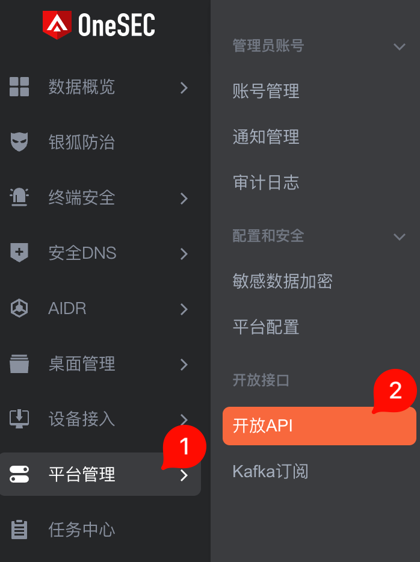
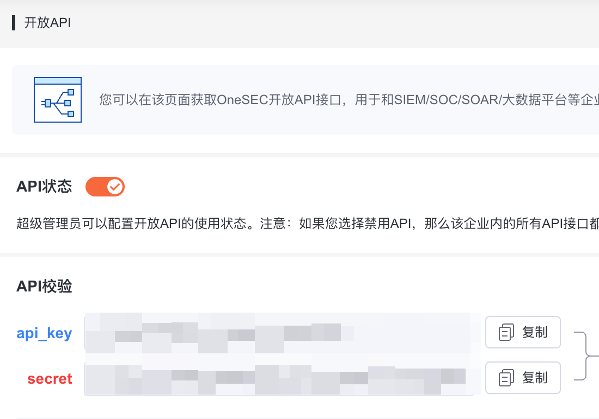
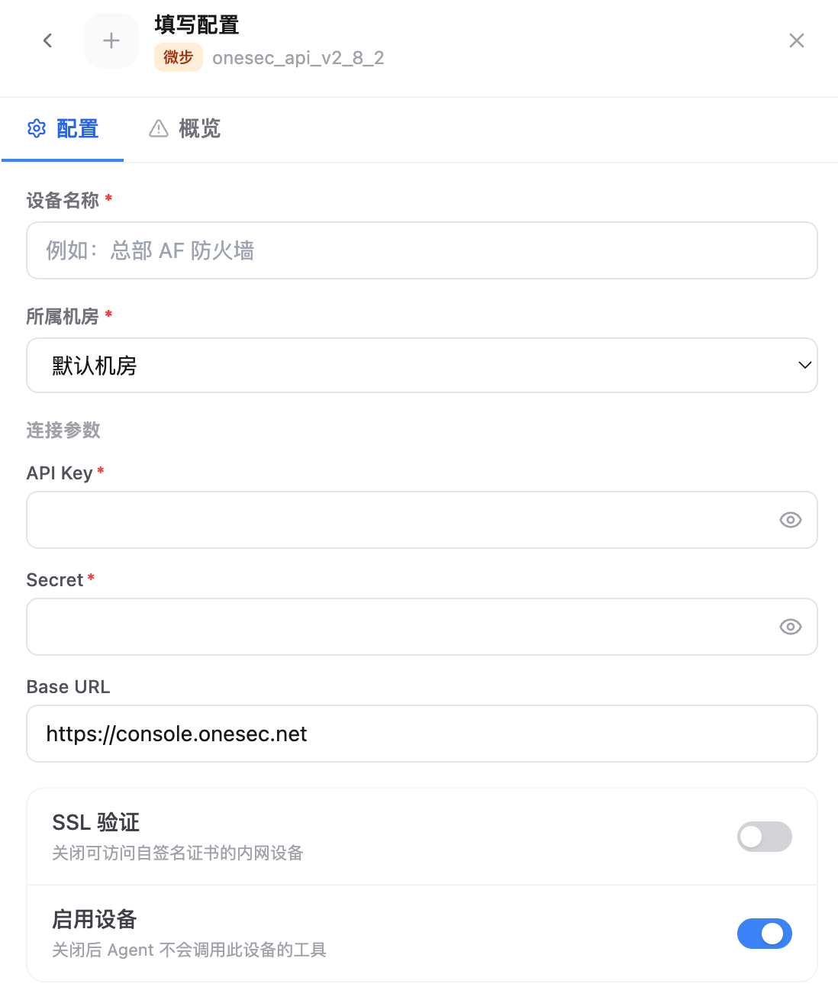

# 4.8.3 OneSEC 接入

OneSEC 接入用于把 OneSEC 平台的开放 API 能力接入 Flocks 设备管理。接入前需要在 OneSEC 控制台中开启开放 API，并复制 `api_key`、`secret`，再回到 Flocks 填写设备实例配置。

## 在 OneSEC 中开启开放 API

登录 OneSEC 控制台后，进入左侧 **平台管理**，在二级菜单中选择 **开放 API**。

在 **开放 API** 页面确认 **API 状态** 已开启。页面下方的 **API 校验** 区域会展示 `api_key` 和 `secret`，点击复制后保存到安全位置。

需要准备：

- **API Key**：OneSEC 页面中的 `api_key`。
- **Secret**：OneSEC 页面中的 `secret`。
- **Base URL**：OneSEC 控制台地址，常见为 `https://console.onesec.net`；私有化部署按实际访问地址填写。

## 在 Flocks 中填写配置

进入 **设备接入**，选择 OneSEC 模板后填写实例配置。

关键字段：

- **设备名称**：当前 OneSEC 实例名称。
- **所属机房**：设备归属的机房或区域。
- **API Key**：填写 OneSEC 开放 API 页面中的 `api_key`。
- **Secret**：填写 OneSEC 开放 API 页面中的 `secret`。
- **Base URL**：SaaS 环境通常填写 `https://console.onesec.net`，私有化环境填写实际控制台地址。
- **SSL 验证**：内网自签名证书导致连通测试失败时，可以关闭。
- **启用设备**：保持开启后，Agent 才会调用该设备工具。

保存后执行连通测试。测试成功后，该 OneSEC 实例会出现在设备列表中，并可被 Agent 或 Workflow 调用。

## 常见问题

| 问题 | 处理方式 |
| --- | --- |
| 找不到开放 API 入口 | 确认当前账号是否具备平台管理权限。 |
| 连通测试鉴权失败 | 重新复制 `api_key` 和 `secret`，避免复制到空格或使用了旧密钥。 |
| 私有化地址不通 | 确认 Flocks 所在环境能访问该 OneSEC 控制台或 API 地址。 |

## 相关文档

- [设备管理](/md/modules/devices)
- [自定义设备接入](/md/modules/devices/custom-device-integration)
