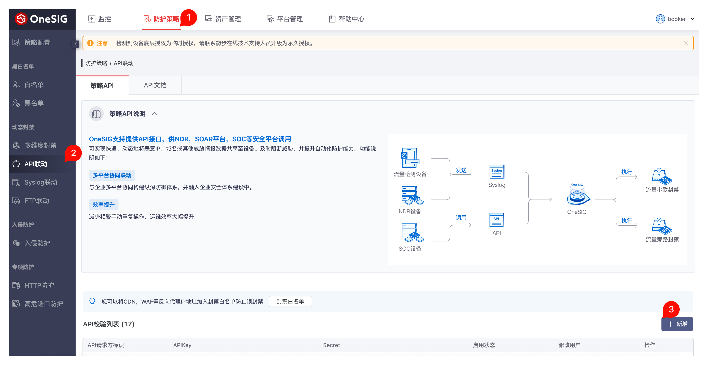
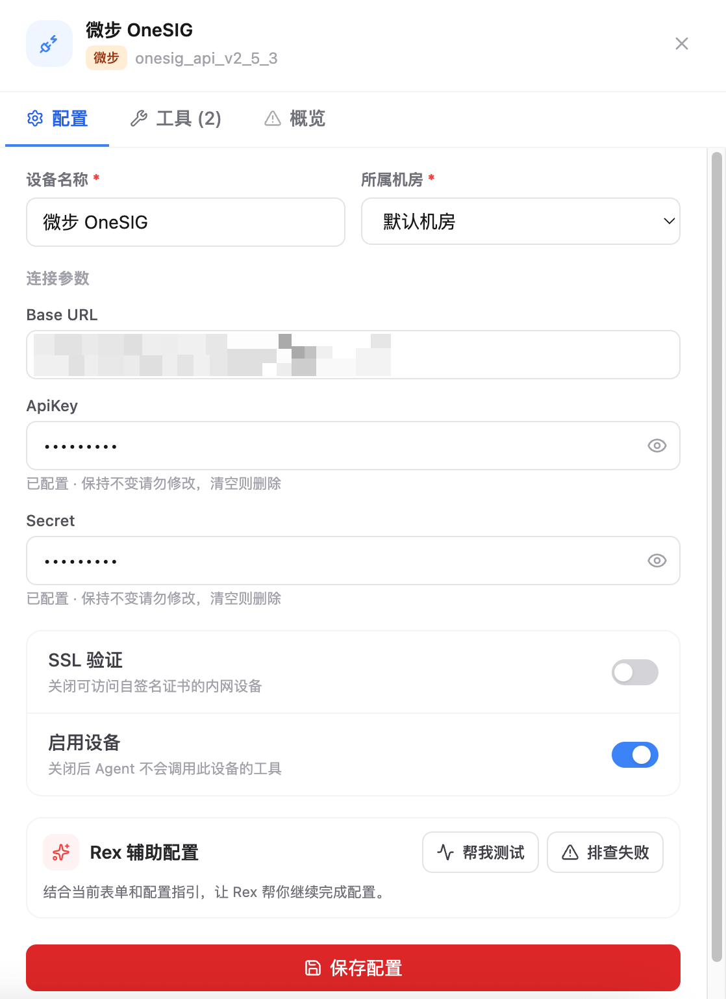

# 4.8.4 OneSIG 接入

OneSIG 接入用于把 OneSIG 第三方策略 API 接入 Flocks 设备管理。接入前需要先在 OneSIG 控制台中新增 API 校验配置，获取 `ApiKey` 和 `Secret`，再回到 Flocks 填写设备实例配置。

本页对应 OneSIG 策略 API 模板，适用于设备状态、资产、策略、白名单、黑名单、封禁白名单、HTTP 防护等接口。该模板使用 `ApiKey + Secret` 的 HMAC-SHA1 签名机制。

## 在 OneSIG 中新增 API 校验

登录 OneSIG 控制台后，进入顶部 **防护策略**，在左侧菜单选择 **API联动**，然后点击右侧 **新增**。

新增 API 校验配置后，复制页面生成的 `ApiKey` 和 `Secret`，并保存到安全位置。

需要准备：

- **ApiKey**：OneSIG API 联动页面中新增的 API 请求方标识。
- **Secret**：与该 `ApiKey` 配套生成的签名密钥。
- **Base URL**：OneSIG 控制台或设备 API 地址，例如 `https://onesig.example.com`。

如果生产环境中有多个调用方，建议为 Flocks 单独新增一组 API 校验配置，便于后续审计、禁用和轮换密钥。

## 在 Flocks 中填写配置

进入 **设备接入**，选择 OneSIG 策略 API 模板后填写实例配置。

关键字段：

- **设备名称**：当前 OneSIG 实例名称。
- **所属机房**：设备归属的机房或区域。
- **Base URL**：填写 OneSIG 控制台或设备 API 地址，通常不需要追加接口路径。
- **ApiKey**：填写 OneSIG API 联动页面中生成的 `ApiKey`。
- **Secret**：填写与 `ApiKey` 配套的 `Secret`。
- **SSL 验证**：内网自签名证书导致连通测试失败时，可以关闭。
- **启用设备**：保持开启后，Agent 才会调用该设备工具。

保存后执行连通测试。测试成功后，该 OneSIG 实例会出现在设备列表中，并可被 Agent 或 Workflow 调用。

## 常见问题

| 问题 | 处理方式 |
| --- | --- |
| 找不到 API 联动入口 | 确认当前账号是否具备防护策略或策略配置管理权限。 |
| 连通测试鉴权失败 | 重新核对 `ApiKey` 和 `Secret` 是否来自同一条 API 校验配置，避免复制到空格或使用旧密钥。 |
| 接口返回签名错误 | 确认系统时间准确。OneSIG 策略 API 签名会使用当前 Unix 时间戳。 |
| 页面能访问但 API 不通 | 检查 `Base URL` 是否为 Flocks 所在环境可访问的 OneSIG 地址，并确认网络策略允许访问。 |
| HTTPS 证书失败 | 内网自签名证书场景可关闭 **SSL 验证** 后重试。 |

## 相关文档

- [设备管理](/md/modules/devices)
- [自定义设备接入](/md/modules/devices/custom-device-integration)
