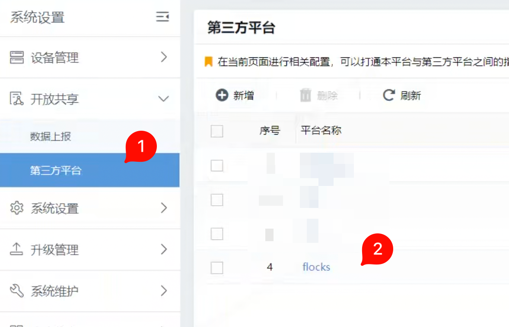
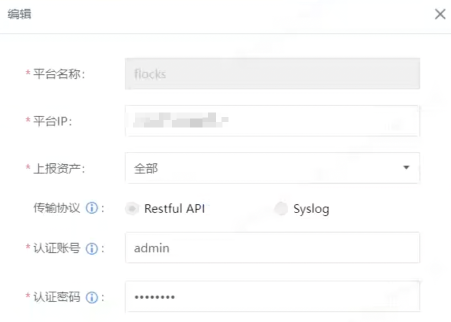
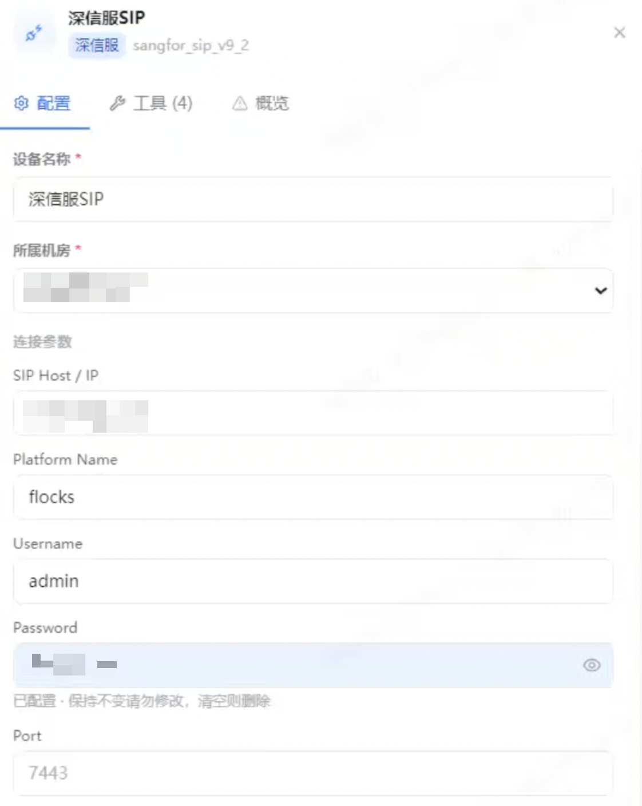

# 4.8.7 深信服 SIP 接入

深信服 SIP 接入用于把 SIP 的资产、告警或安全事件能力接入 Flocks 设备管理。接入前需要先在 SIP 控制台配置第三方平台，再回到 Flocks 填写 SIP 连接参数。

## 在 SIP 中配置第三方平台

登录深信服 SIP 控制台后，进入 **系统设置 > 开放共享 > 第三方平台**。如果列表中已有 Flocks 平台配置，可以直接编辑；如果没有，点击 **新增** 创建一条平台配置。

编辑或新增平台时，填写平台名称、平台 IP、上报资产范围和认证账号密码。

关键字段：

- **平台名称**：建议填写 `flocks`，便于在 SIP 控制台中识别。
- **平台 IP**：填写 **Flocks 服务所在机器的 IP**，不是 SIP 的 IP。
- **上报资产**：按实际需求选择，通常可以先选择全部。
- **传输协议**：选择 `Restful API`。
- **认证账号 / 认证密码**：用于 Flocks 侧连接 SIP 时填写。

保存后，确认平台配置在列表中处于可用状态。

## 在 Flocks 中填写配置

进入 **设备接入**，选择深信服 SIP 模板后填写实例配置。

关键字段：

- **设备名称**：当前 SIP 实例名称，例如 `深信服SIP`。
- **所属机房**：设备归属的机房或区域。
- **SIP Host / IP**：填写 **深信服 SIP 的 IP 地址**。
- **Platform Name**：填写在 SIP 第三方平台中配置的平台名称，通常为 `flocks`。
- **Username**：填写 SIP 第三方平台配置中的认证账号。
- **Password**：填写 SIP 第三方平台配置中的认证密码。
- **Port**：可以默认不填。只有当 SIP 使用非默认端口或页面明确要求端口时再填写。

保存后执行连通测试，确认 Flocks 所在机器可以访问 SIP Host / IP，并且 SIP 控制台中配置的平台 IP 指向 Flocks 服务所在机器。

## 常见问题

| 问题 | 处理方式 |
| --- | --- |
| SIP 侧平台配置无法回连 | 检查 SIP 中的 **平台 IP** 是否填写为 Flocks 服务所在机器的 IP。 |
| Flocks 连通测试失败 | 检查 **SIP Host / IP** 是否填写为深信服 SIP 的 IP 地址，而不是 Flocks 的 IP。 |
| 认证失败 | 确认 Flocks 中的 `Username`、`Password` 与 SIP 第三方平台配置中的认证账号、认证密码一致。 |
| 端口不确定 | 先保持 **Port** 为空；只有非默认端口场景再填写。 |

## 相关文档

- [设备管理](/md/modules/devices)
- [自定义设备接入](/md/modules/devices/custom-device-integration)
