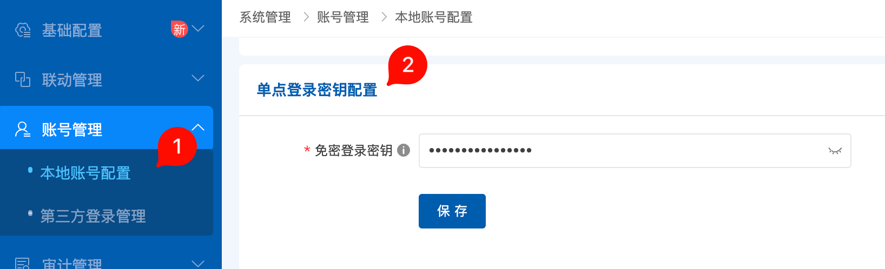
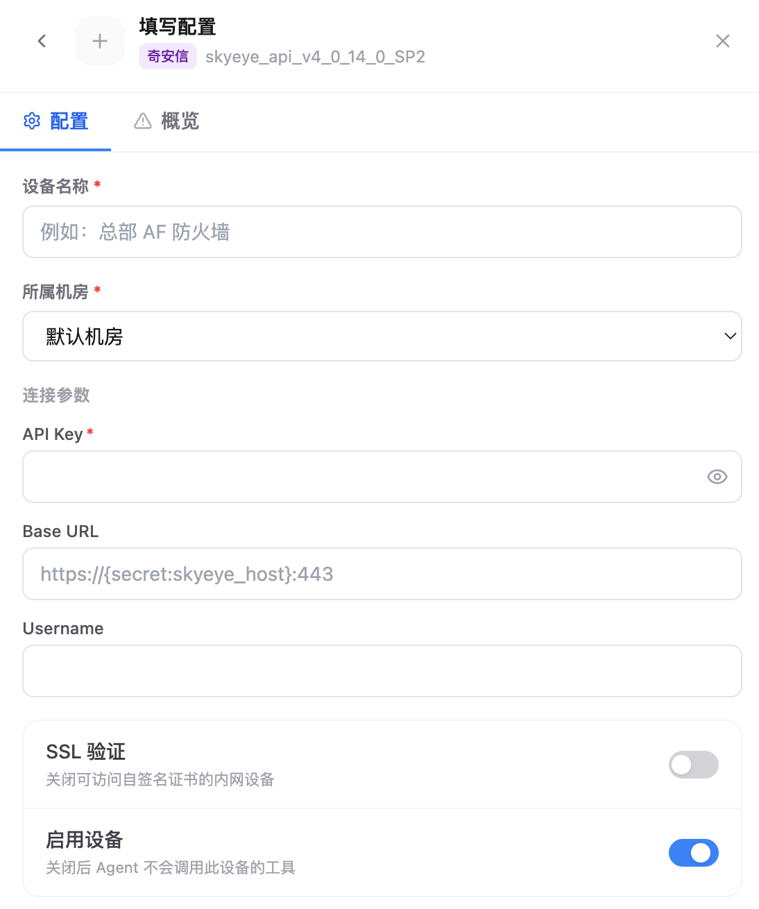

# 4.8.5 天眼接入

天眼接入用于把奇安信天眼的告警、资产或事件查询能力接入 Flocks 设备管理。接入前需要在天眼控制台准备免密登录密钥，并在 Flocks 中填写 `API Key`、`Base URL` 和 `Username`。

::: warning Base URL 必须带 `/skyeye`
天眼设备的 **Base URL 必须以 `/skyeye` 结尾**，例如 `https://example.com/skyeye` 或 `https://example.com:443/skyeye`。如果只填写域名或 IP，连通测试和后续接口调用可能会找不到正确的天眼 API 路径。
:::

## 准备天眼密钥

登录天眼控制台后，进入 **账号管理 > 本地账号配置**，在 **单点登录密钥配置** 中获取或设置免密登录密钥。

需要准备：

- **API Key**：填写天眼单点登录密钥配置中的免密登录密钥。
- **Base URL**：天眼控制台地址，并追加 `/skyeye` 后缀。
- **Username**：用于访问天眼的本地账号用户名。

## 在 Flocks 中填写配置

进入 **设备接入**，选择奇安信天眼模板后填写实例配置。

关键字段：

- **设备名称**：当前天眼实例名称。
- **所属机房**：设备归属的机房或区域。
- **API Key**：填写天眼免密登录密钥。
- **Base URL**：填写天眼访问地址，并且必须带 `/skyeye` 后缀，例如 `https://10.0.0.10:443/skyeye`。
- **Username**：填写可用于天眼访问的本地账号用户名。
- **SSL 验证**：内网自签名证书导致连通测试失败时，可以关闭。
- **启用设备**：保持开启后，Agent 才会调用该设备工具。

保存后执行连通测试。如果测试失败，先检查 `Base URL` 是否遗漏 `/skyeye`，再检查账号和免密登录密钥是否匹配。

## 常见问题

| 问题 | 处理方式 |
| --- | --- |
| 连通测试 404 或路径不存在 | 优先检查 `Base URL` 是否带 `/skyeye` 后缀。 |
| 鉴权失败 | 确认 `API Key` 使用的是单点登录密钥配置中的免密登录密钥，并核对 `Username`。 |
| HTTPS 证书失败 | 内网自签名证书场景可关闭 **SSL 验证** 后重试。 |

## 相关文档

- [设备管理](/md/modules/devices)
- [自定义设备接入](/md/modules/devices/custom-device-integration)
