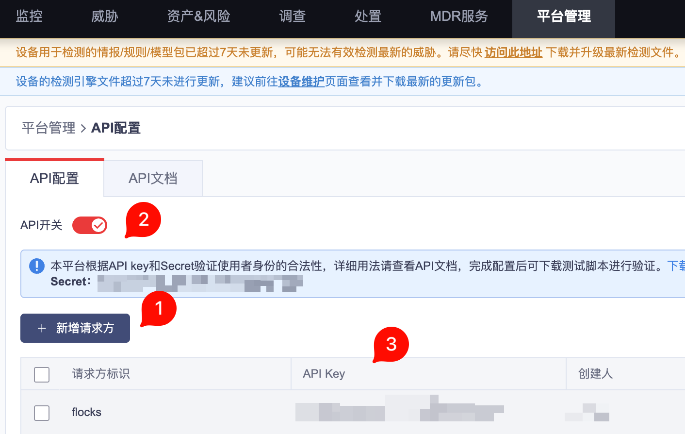
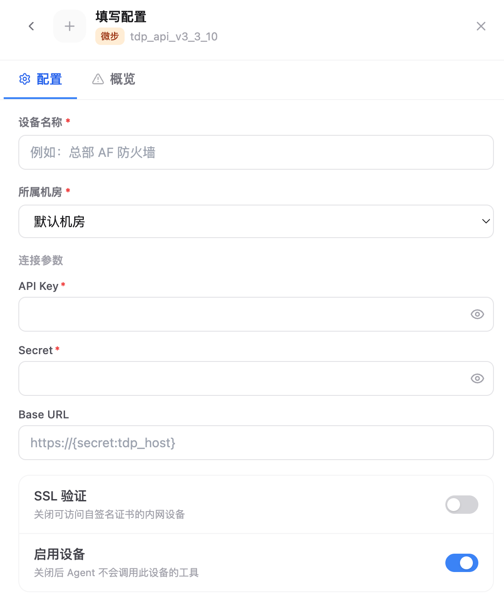

# 4.8.2 TDP 接入

TDP 接入用于把微步 TDP 的告警、事件、资产或情报查询能力接入 Flocks 设备管理。接入前需要先在 TDP 管理后台启用 API，并获取 `API Key`、`Secret` 和可访问的 `Base URL`。

## 准备 API 凭据

进入 TDP 管理后台的 **平台管理 > API 配置** 页面，确认 **API 开关** 已启用。页面会展示当前可用的 `Secret`，下方请求方列表中可以查看或新增请求方，并获取对应的 `API Key`。

需要准备：

- **API Key**：请求方列表中的 `API Key`。
- **Secret**：API 配置提示区展示的 `Secret`。
- **Base URL**：TDP 控制台或 API 服务地址，按实际部署填写。

如果生产环境有多个请求方，建议为 Flocks 单独新增一个请求方，便于后续审计、禁用和轮换密钥。

## 在 Flocks 中填写配置

进入 **设备接入**，选择微步 TDP 模板后填写实例信息。设备名称建议使用可识别的业务名称，例如 `总部 TDP`、`北京 TDP`。

关键字段：

- **设备名称**：当前 TDP 实例名称。
- **所属机房**：设备归属的机房或区域。
- **API Key**：填写 TDP 后台请求方列表中的 `API Key`。
- **Secret**：填写 TDP 后台 API 配置页面展示的 `Secret`。
- **Base URL**：填写 TDP API 服务地址。默认占位符可能使用 `https://{secret:tdp_host}`，实际接入时应替换为当前环境可访问的地址。
- **SSL 验证**：内网自签名证书导致连通测试失败时，可以关闭。
- **启用设备**：保持开启后，Agent 才会调用该设备工具。

保存后执行连通测试，确认凭据、网络和接口路径都可用。

## 常见问题

| 问题 | 处理方式 |
| --- | --- |
| 连通测试返回鉴权失败 | 重新核对 `API Key` 和 `Secret` 是否来自同一个请求方或同一套 TDP 环境。 |
| 页面能访问但 API 不通 | 检查 `Base URL` 是否为 API 服务入口，而不是仅供浏览器访问的跳转地址。 |
| 证书错误 | 内网自签名证书场景可关闭 **SSL 验证** 后重试。 |

## 相关文档

- [设备管理](/md/modules/devices)
- [自定义设备接入](/md/modules/devices/custom-device-integration)
