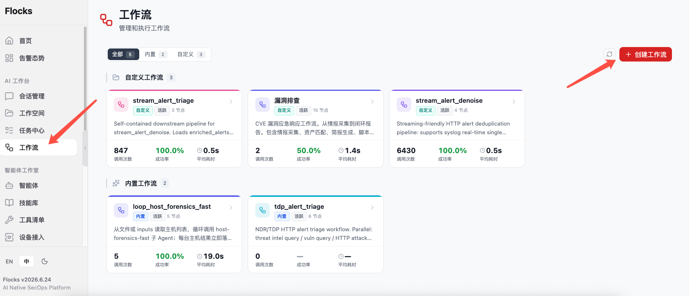
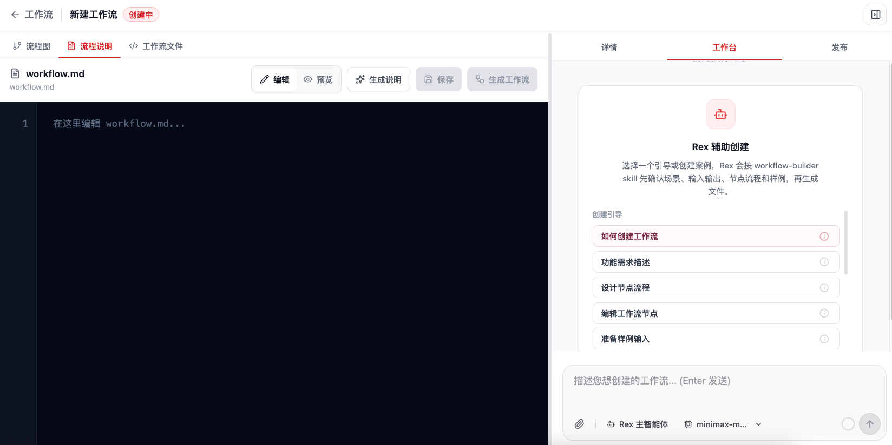
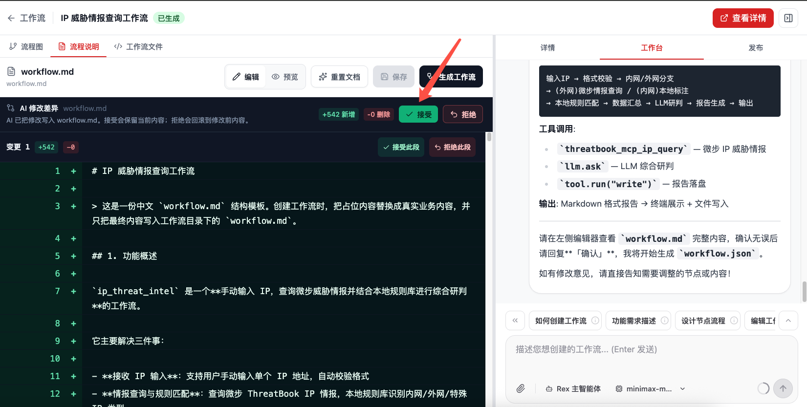
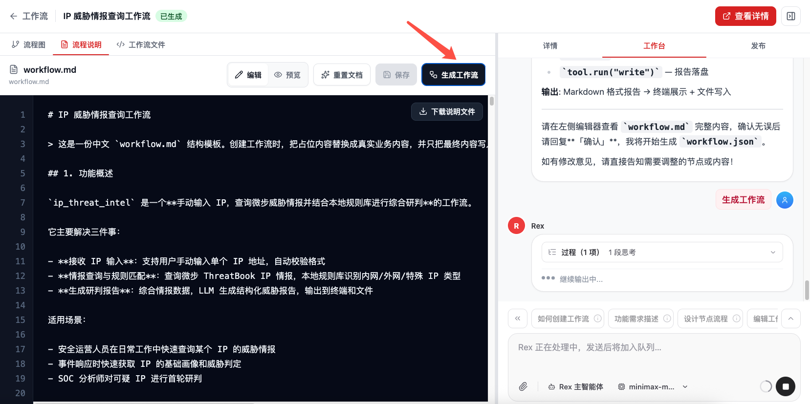
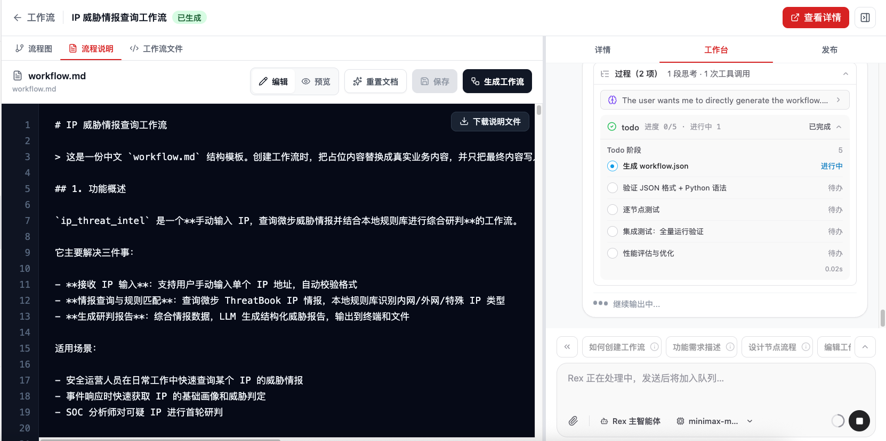
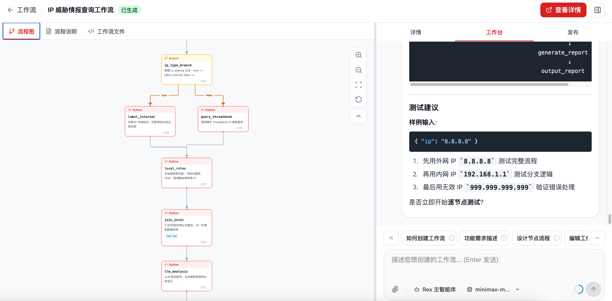
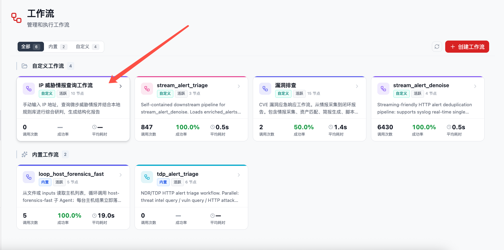
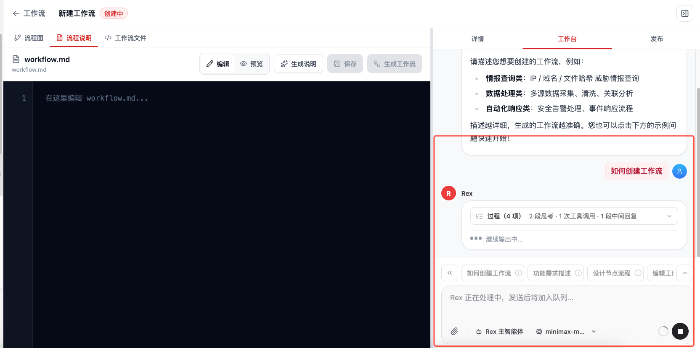

# 创建工作流

创建 Workflow 的目标，是把一个稳定、可复用、可测试的安全运营流程沉淀成 `workflow.md` 和 `workflow.json`。创建时建议先把人类可读的 `workflow.md` 复核清楚，再让 Rex 生成机器可执行的 `workflow.json`。

## 1. 创建入口

在侧栏进入 **Agent 工作室 → Workflow 工作流**，点击 **创建工作流**。



创建页采用"左侧文档 / 画布，右侧 Rex 工作台"的结构：

- 左侧有 **流程图 / 流程说明 / 工作流文件** 三个视图。创建初期通常先停留在 **流程说明**，编辑或审阅 `workflow.md`。
- 右侧有 **详情 / 工作台 / 发布** 三个标签页。创建初期主要使用 **工作台**，由 Rex 辅助生成文件。
- 如果还没有工作流，流程图区域会提示在右侧对话框中描述需求，AI 会自动生成工作流并可视化。



## 2. 创建方式

### 2.1 直接描述要创建的 Workflow

在会话或 Workflow 创建页中向 Rex 描述目标，例如：

```text
帮我创建一个研判 NDR 告警的工作流。

输入：一条或一批 NDR 告警原文
步骤：
- 解析告警字段
- 补充情报、资产和历史告警上下文
- 委派告警研判 Agent 给出结论
- 生成结构化 JSON 和 Markdown 报告
- 通过通道外发高危结果

要求：
- 每个节点都要有输入输出 schema
- 生成后执行单节点测试和全流程集成测试
- 测试数据和报告落到 Workspace outputs 目录
```

需求描述越清晰，生成的 Workflow 越贴近实际业务。建议同时说明输入数据、关键判断逻辑、输出格式、失败处理方式和外发规则。

### 2.2 先讨论方案，再生成 Workflow

针对一个还没有完全想清楚的任务，可以先和 Rex 讨论方案，让 Rex 分析最佳流程，再基于建议生成 Workflow。

```text
我想把漏洞资产排查做成一个 Workflow。
请先帮我分析这个任务应该拆成哪些步骤、每一步需要什么输入输出、是否需要调用 Agent 或工具。
确认方案后，再帮我生成工作流并执行测试。
```

### 2.3 从一次成功任务中沉淀 Workflow

如果 Rex 已经在会话里跑通了一次完整流程，可以继续让 Rex 把这次过程沉淀为 Workflow：

```text
基于刚才的告警研判过程，帮我创建一个可复用的 Workflow。
请保留关键步骤、节点输入输出、工具选择、Agent 委派和最终报告格式。
```

这种方式适合把一次已经验证过的流程变成可测试、可复用、可定时运行的自动化剧本。

### 2.4 导入已有 workflow.json 或外部剧本

Workflow 的结构化定义可以导入导出。团队成员可以把已经验证过的 `workflow.json` 分享给其他 Workspace 使用；导入后建议立即执行一次单节点测试和集成测试，确认工具、模型和数据源在当前环境中可用。

如果已有 Dify 或 n8n 的剧本配置文件，也可以直接交给 Rex。Rex 会读取原始剧本的节点、连线、输入输出和工具调用逻辑，并尽量生成一套等价的 Flocks Workflow。

## 3. 推荐创建流程

1. 在 **工作台** 中描述工作流目标，或选择一个创建引导 / 创建案例。
2. 先让 Rex 生成或补齐 `workflow.md`。这一步面向人审阅，说明功能、适用场景、输入输出、节点流程、可修改点、样例和验收方式。
3. 在左侧 **流程说明** 中审阅 `workflow.md`，必要时直接编辑或继续让 Rex 修改。
4. 点击 **生成工作流**，让 Rex 基于当前 `workflow.md` 生成或更新 `workflow.json`。
5. 生成后查看 **流程图** 和 **工作流文件**，确认节点、边、schema 和触发配置符合预期。

`workflow.md` 是创建过程中的需求契约；`workflow.json` 是机器可执行定义。实践中应先确认 `workflow.md`，再生成 `workflow.json`，不要跳过人工复核。

经 Flocks 辅助创建后，左侧会先展示 `workflow.md` 的 AI 修改差异。此时需要人工审阅新增内容是否覆盖真实业务目标、输入输出、节点流程、工具调用和验收标准；确认满足需求后，可以点击 **接受** 保留修改。



审阅完成并确认 `workflow.md` 无误后，点击顶部 **生成工作流** 按钮，进入生成 `workflow.json` 和节点定义的步骤。



生成过程中，Rex 会根据已确认的 `workflow.md` 规划生成任务，例如生成 `workflow.json`、验证 JSON 格式和 Python 语法、逐节点测试、集成测试以及性能评估。工作台会展示当前步骤和执行状态。



生成完成后，切到 **流程图** 查看结果。流程图会展示触发器、分支、节点和连线；如果右侧工作台继续给出测试建议，可以按建议补充样例输入并执行逐节点测试。



新生成的工作流会被归类为 **自定义工作流**，并在工作流页面首页以卡片形式展示。后续可以从这里进入详情页继续运行、修改、发布或查看执行指标。



## 4. AI 引导

创建页的工作台会提供 **Rex 辅助创建**。这些入口不会只是把一段固定模板塞给模型，而是要求 Rex 按 `workflow-builder` skill 先确认场景、输入输出、节点流程和样例，再生成文件。

点击 **如何创建工作流** 后，Flocks 会先通过询问用户意图的方式辅助创建。Rex 会围绕业务场景、触发方式、输入输出、需要调用的工具 / API、节点步骤、分支条件、样例数据和验收标准逐步确认；信息不足时会继续追问，确认清楚后再生成 `workflow.md` 和 `workflow.json`。



创建引导包括：

| 引导 | 适合解决的问题 |
| --- | --- |
| 如何创建工作流 | 从零梳理业务目标、触发方式、输入输出、工具 / API、节点步骤、分支条件、样例数据和验收标准。 |
| 功能需求描述 | 把一句模糊需求整理成可生成 `workflow.md` 和 `workflow.json` 的结构化需求。 |
| 设计节点流程 | 把需求拆成节点、边、分支、循环、异常处理和样例数据确认清单。 |
| 编辑工作流节点 | 面向已有草稿或刚生成的工作流，调整节点职责、输入输出、代码或连接关系。 |
| 准备样例输入 | 根据场景生成或校验一条最小可用输入，用于后续逐节点测试和集成测试。 |

当点击 **生成说明** 时，Rex 会按 `workflow-builder` skill 推进：先询问 `workflow.md` 使用中文还是英文，再收集业务场景、输入、输出、触发方式、节点流程、样例和验收标准。写入前会先展示 diff，等待确认后再写入 `workflow.md`。

当点击 **生成工作流** 时，Rex 会把当前左侧编辑器里的 `workflow.md` 作为主要意图来源，生成或更新 `workflow.json`。这一步的目标是生成机器定义，不是重写 `workflow.md`；写入前也应展示 diff 并等待确认。

## 5. 内置创建案例

创建页提供一组内置创建案例，用于快速开始常见安全运营工作流：

| 案例 | 典型输入与产出 |
| --- | --- |
| IP 威胁情报查询工作流 | 输入 IP 地址，查询多个情报源并汇总报告。 |
| 域名分析工作流 | 对域名做 WHOIS 查询、DNS 解析和历史记录交叉分析。 |
| 文件哈希检测工作流 | 通过多个威胁情报平台交叉验证文件哈希。 |
| 钓鱼网站检测工作流 | 分析 URL 特征、页面内容和 SSL 证书信息。 |
| 安全事件响应工作流 | 自动收集、关联并分析安全告警，生成处置建议。 |

案例只是启动问题，不是固定成品。点击案例后，Rex 仍会继续追问关键参数，例如数据源、字段格式、输出报告样式、外发规则、失败处理和验收方式。

## 6. 生成、校验与测试

在创建过程中，Rex 通常会完成这些动作：

1. 解析需求，识别需要的节点类型。
2. 设计节点顺序和分支逻辑。
3. 生成 Workflow 描述文档。
4. 生成 `workflow.json` 结构化定义。
5. 配置节点输入输出 schema。
6. 生成或准备测试数据。
7. 在页面中呈现可视化节点图。

生成后还需要继续验证：

1. **结构校验**：检查节点、边、起始节点、schema 和必要字段是否完整。
2. **单节点测试**：每个节点使用测试数据独立运行，确认输入输出格式和工具调用可用。
3. **全流程集成测试**：用完整测试数据走一遍端到端流程。
4. **失败自动调试**：如果测试失败，Rex 会根据错误信息修改节点配置、数据映射或提示词，并重新测试。

最好给 Rex 提供一条样例数据。这样在生成 Workflow 后，Rex 可以立刻使用样例数据进行单节点测试和全流程集成测试。

相关：[Workflow 工作流](/md/modules/workflow) · [修改工作流](/md/modules/workflow-edit) · [调用工作流](/md/modules/workflow-invoke)
