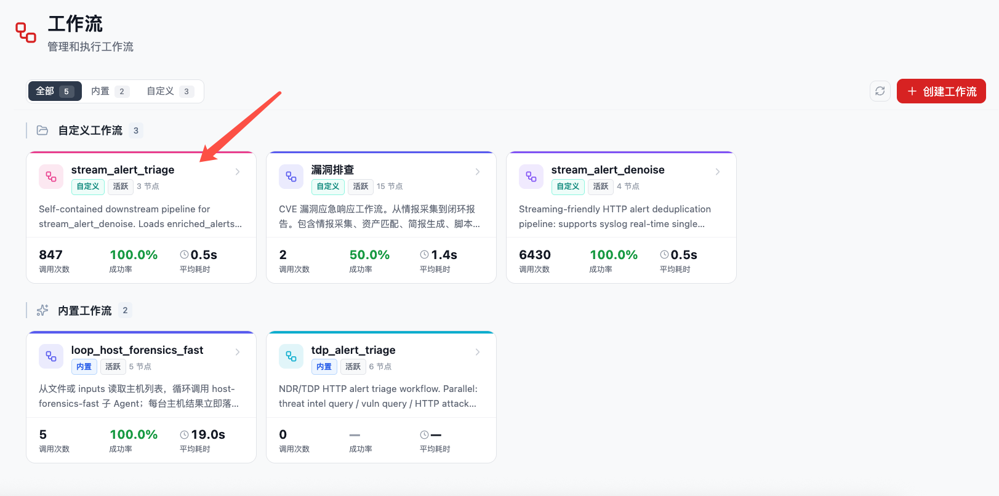
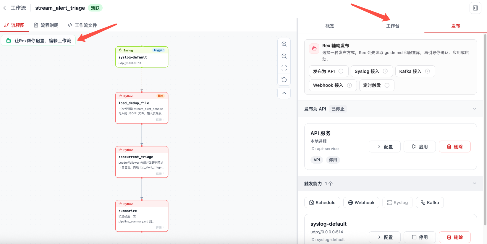
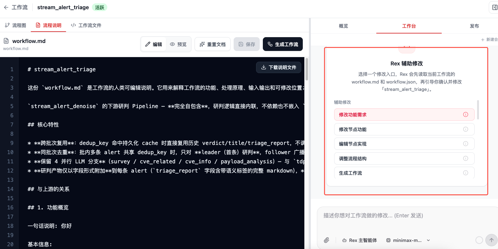
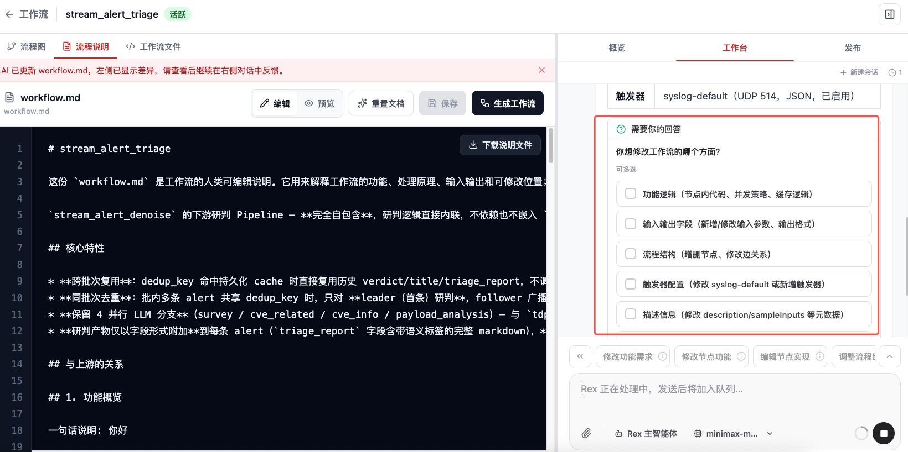
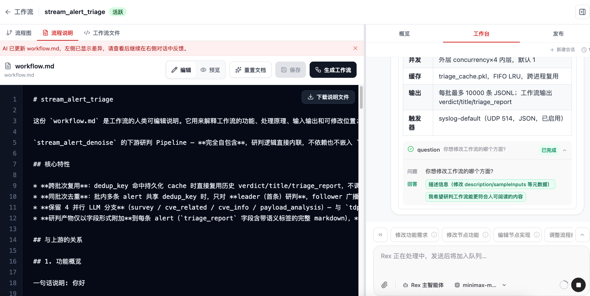
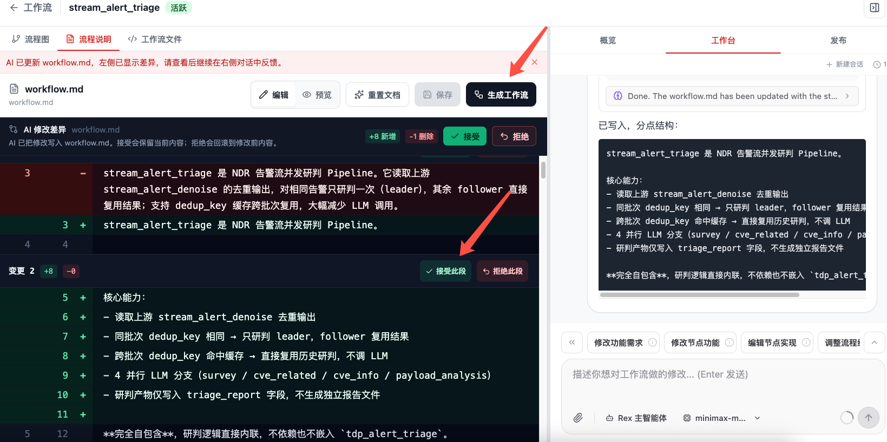
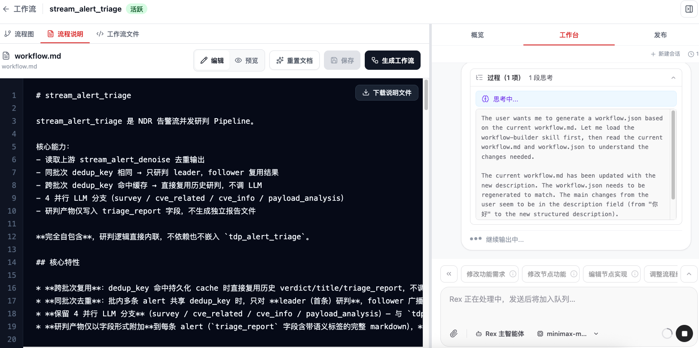
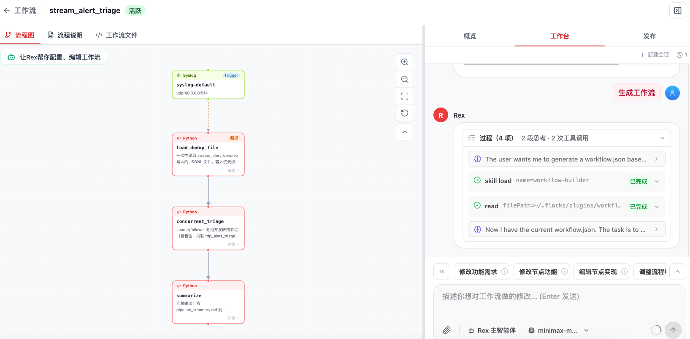

# 修改工作流

修改 Workflow 时，重点不是直接改某个节点，而是先复核 `workflow.md` 是否准确表达了需求，再让 Rex 基于已确认的说明同步 `workflow.json`、节点实现和发布配置。

## 1. 修改入口

在工作流列表中点击具体工作流卡片，可以进入该工作流的详情页。详情页同时承载流程查看、运行发布和修改入口。

进入某个工作流详情页后，左侧是 **流程图 / 流程说明 / 工作流文件**，右侧是 **概览 / 工作台 / 发布**。修改工作流时有两条常用入口：

1. **从流程图点击 Rex 引导**：在流程图左上角点击 **让Rex帮你配置、编辑工作流**。页面会切到 `workflow.md` 编辑视图，并打开右侧 **工作台**。
2. **直接进入工作台**：在右侧切到 **工作台**，用自然语言描述修改需求，例如"把情报补充节点增加信誉评分字段"或"新增一个低危告警忽略分支"。

如果你已经知道要改哪个节点，也可以先点击流程图里的节点查看节点信息，再在右侧工作台里提出修改要求。

## 2. 工作台上下文

详情页的工作台会把当前工作流上下文交给 Rex，包括：

- 工作流 ID、名称和分类。
- 工作流目录。
- `workflow.md` 流程说明文件。
- `workflow.json` 机器定义文件。
- `guide.md` 配置引导文件。
- 发布、触发和配置相关 API。

这样 Rex 修改时可以先读取文件，再判断该改需求说明、机器定义、配置引导，还是运行发布设置。

## 3. 修改引导

详情页工作台中的引导主要分三类。

| 类型 | 入口 | 适合处理的问题 |
| --- | --- | --- |
| 辅助修改 | 修改功能需求、修改节点功能、编辑节点实现、调整流程结构、生成工作流 | 变更业务目标、节点职责、代码、字段映射、边关系或整体流程。 |
| 辅助配置 | 智能配置、检查当前配置、配置输入方式、确认来源数据、设置输出去向、调整过滤规则、验证样例数据、应用配置方案 | 梳理输入输出、过滤规则、样例验证和配置模板。 |
| 辅助发布 | 发布为 API、Syslog 接入、Kafka 接入、Webhook 接入、定时触发 | 配置工作流如何被外部系统调用或持续触发。 |

点击引导按钮后，Rex 会自动带上对应意图；直接在工作台输入自然语言需求时，也可以明确说明修改目标、影响范围和验收标准。

点击 **修改功能需求**、**修改节点功能**、**编辑节点实现**、**调整流程结构** 等辅助修改入口后，Flocks 不会直接改写文件，而是通过询问用户意图的方式辅助修改工作流。Rex 会结合当前 `workflow.md`、`workflow.json` 和工作流上下文，先确认要修改的方面，例如功能逻辑、输入输出字段、流程结构、触发器配置或描述信息。

用户回答问题后，Rex 会把回答作为后续修改依据，继续分析当前工作流，并在工作台中展示处理过程。这样可以先把修改范围和验收方向确认清楚，再进入文件更新。

## 4. 推荐修改流程

1. 先在左侧 **流程说明** 审阅 `workflow.md`，确认当前目标、输入输出、节点流程和验收标准。
2. 在右侧 **工作台** 描述要改什么；如果是点击引导按钮进入，Rex 会自动带上对应意图。
3. Rex 应先读取 `workflow.md` 和 `workflow.json`，总结当前实现，再用 question 工具确认修改范围、影响的节点、上下游 schema、样例和验收标准。
4. 需要修改时，优先更新 `workflow.md` 中的人类可读需求说明，并展示 diff。用户可以接受全部 diff，也可以按块接受或拒绝。
5. `workflow.md` 确认无误后，点击顶部 **生成工作流** 按钮，Flocks 会基于已确认的说明生成新的工作流代码文件，包括 `workflow.json`、节点实现和相关配置。
6. 生成完成后，工作流引擎会加载最新修改的代码文件，使后续运行基于新版本执行。
7. 最后重新执行单节点测试和集成测试，确认流程图、JSON 定义和运行结果一致。

Flocks 辅助修改 `workflow.md` 后，左侧会显示 AI 修改差异。建议先审阅每一处新增、删除和改写内容，确认需求说明已经可读、完整且符合预期；确认后再点击 **生成工作流**，把说明文件同步为可执行的工作流定义和节点代码。

点击 **生成工作流** 后，Rex 会读取当前 `workflow.md`，调用 workflow-builder 能力，并结合现有 `workflow.json` 判断需要重建或更新的内容。右侧工作台会展示生成过程，包括思考、读取文件和工具调用状态。

生成完成后，可以切回 **流程图** 查看结果。流程图会展示最新的触发器、节点和连线；工作流引擎也会加载最新生成的代码文件，后续运行会基于这次生成后的版本执行。

## 5. 用 workflow.md 复核需求

`workflow.md` 是最适合人工审阅的文件。创建和修改工作流时，建议按下面清单复核：

- **业务目标**：工作流解决什么问题，什么情况应该执行，什么情况不应该执行。
- **输入契约**：触发方式、输入 JSON 字段、样例数据、必填 / 可选字段、来源系统。
- **输出契约**：最终返回 JSON、Markdown 报告、外发通道、文件产物或下游工作流输入。
- **节点流程**：每个节点的职责、输入、输出、工具 / API / Agent 依赖，以及分支、循环、汇合逻辑。
- **异常路径**：字段缺失、外部接口失败、模型输出不稳定、低置信度结论、人工确认等情况如何处理。
- **配置与发布影响**：修改是否影响 API、Syslog、Kafka、Webhook、定时任务或配置引导 `guide.md`。
- **验收方式**：最小样例、边界样例、单节点测试、全流程测试，以及结果是否满足团队格式。

如果需求没有写进 `workflow.md`，后续生成的 `workflow.json` 很容易遗漏；如果 `workflow.md` 与 `workflow.json` 不一致，优先把 `workflow.md` 改清楚，再基于它重新生成或修复 `workflow.json`。

## 6. 修改后的验证

修改完成后，应至少做三件事：

1. 查看 **流程图**，确认节点新增、删除、移动、分支、循环和汇合关系符合预期。
2. 查看 **工作流文件**，确认 `workflow.json` 是合法 JSON，且节点和边组成完整流程。
3. 用样例数据重新运行单节点测试和全流程测试，确认输入输出、异常路径和最终报告没有偏离。

如果修改影响发布方式，还需要回到 **发布** 标签页检查 API、Syslog、Kafka、Webhook 或定时触发配置是否仍然有效。

相关：[Workflow 工作流](/md/modules/workflow) · [创建工作流](/md/modules/workflow-create) · [调用工作流](/md/modules/workflow-invoke)
