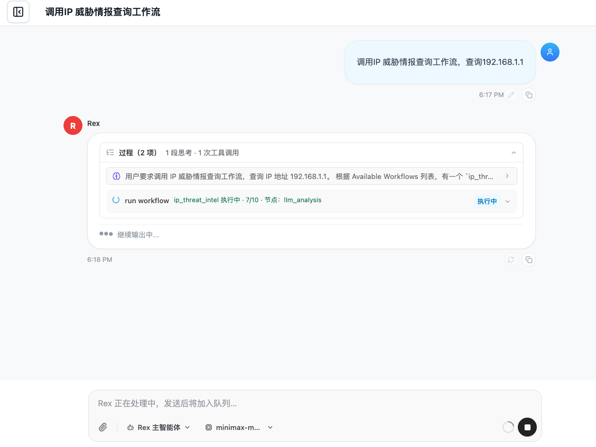
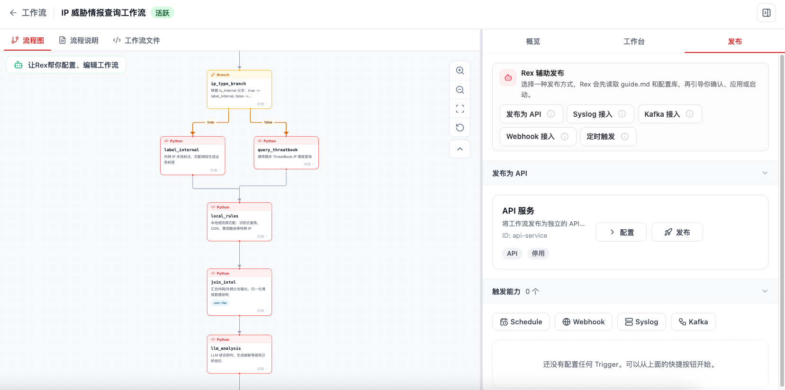
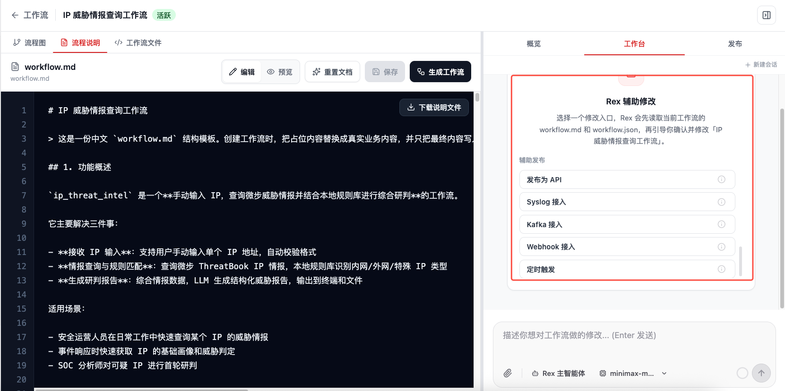
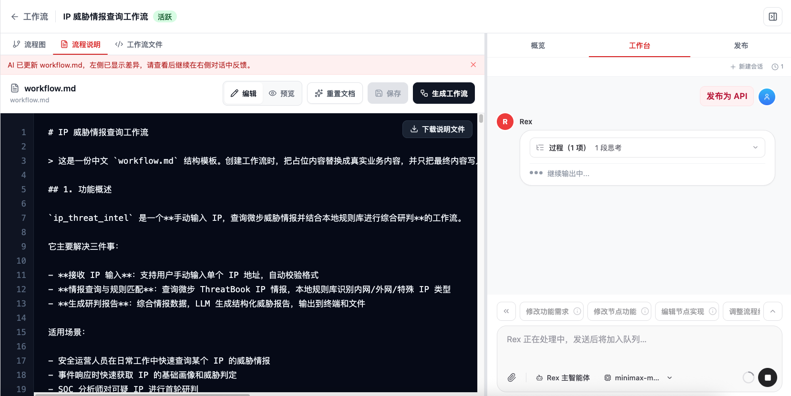
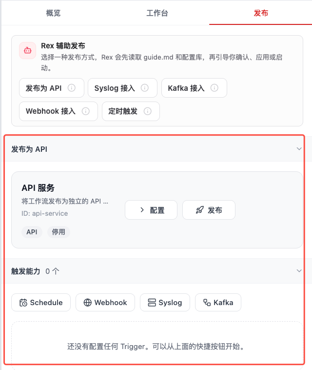
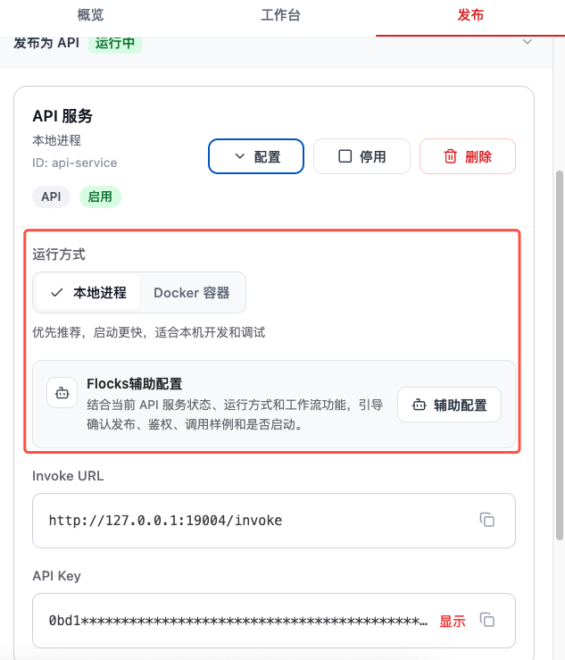
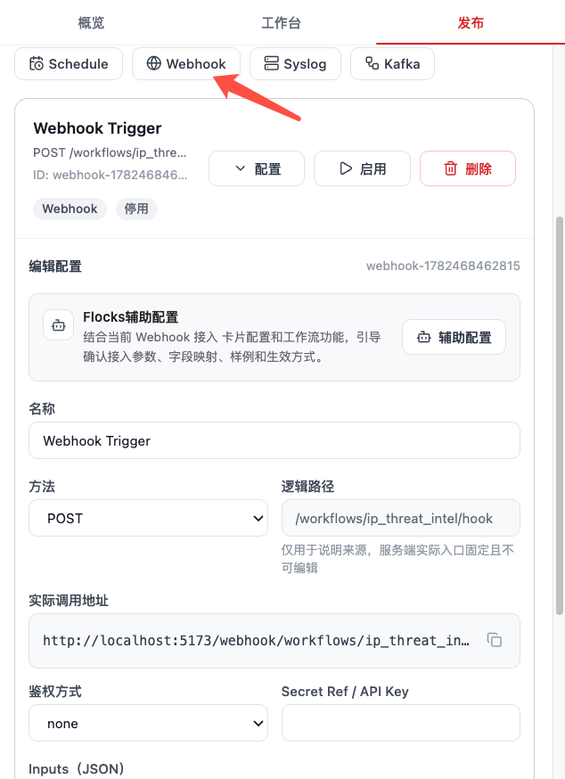
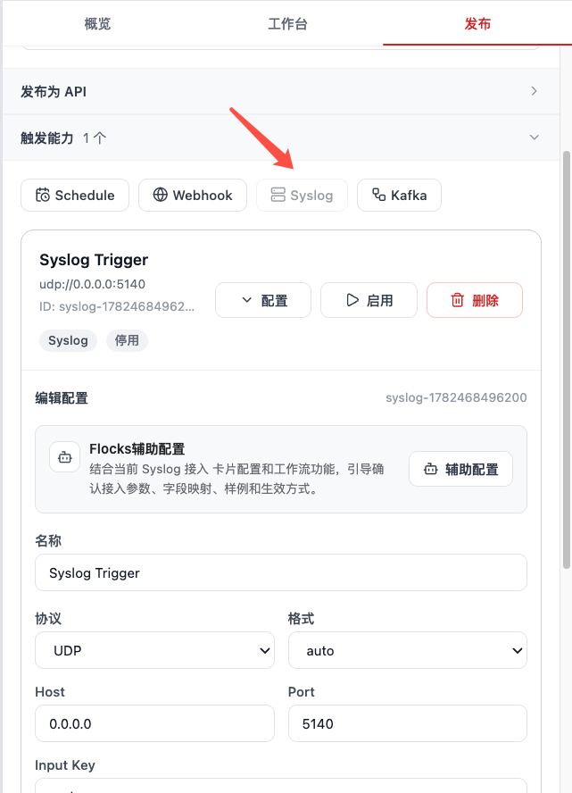
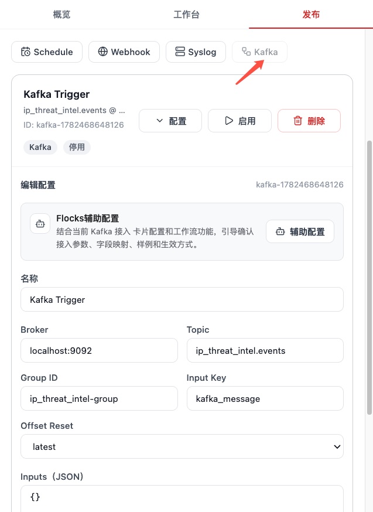
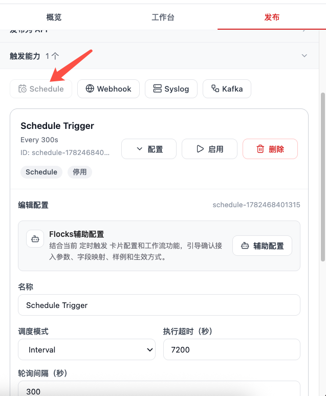

# 调用工作流

创建或修改完成的工作流，不只可以在工作流详情页里运行，也可以被 Flocks 的 **会话** 和 **智能体** 调用。用户在会话中用自然语言说明要调用哪个工作流、输入什么参数后，Rex 会从可用工作流列表中匹配目标工作流，并发起一次工作流运行；智能体在执行任务时，也可以把工作流作为稳定的工具化流程来调用。

例如，在会话中输入"调用 IP 威胁情报查询工作流，查询 192.168.1.1"，Rex 会识别对应工作流并执行。

工作流生成并验证通过后，还可以通过发布能力让外部系统、消息源或定时任务触发执行。发布调用入口集中在工作流详情页右侧的 **发布** 子页面。

在 **发布** 子页面中，Flocks 提供 **Rex 辅助发布** 和触发能力配置。常用方式包括 **发布为 API**、**Webhook 接入**、**Syslog 接入**、**Kafka 接入** 和 **定时触发**。

## 1. 发布配置方式

调用配置有两种方式：可以让 Flocks 在工作台里辅助完成，也可以直接在 **发布** 子页面手动配置。

### 1.1 Flocks 辅助配置

在右侧 **工作台** 中，点击 **发布为 API**、**Syslog 接入**、**Kafka 接入**、**Webhook 接入** 或 **定时触发**，即可进入对应的辅助发布流程。以上五种调用方式都支持 Flocks 辅助配置。Flocks 会读取当前工作流的 `guide.md`、`workflow.md`、`workflow.json` 和已有发布配置，再通过对话询问的方式交互式确认调用方式、鉴权策略、字段映射、输入样例、运行方式和是否立即启用。

进入辅助配置后，Rex 会在工作台中展示处理过程。用户可以根据问题补充配置要求，例如"发布为本地 API 服务"、"Webhook payload 中的 alert 字段作为工作流输入"或"Kafka 消费 topic security-alerts"。确认后，Flocks 会生成或修改发布配置。

### 1.2 手动发布配置

如果不需要 Flocks 辅助，也可以直接在 **发布** 子页面点击对应按钮进行配置。点击 **发布为 API** 会展开 API 服务的手动配置区域；点击 **Schedule**、**Webhook**、**Syslog** 或 **Kafka** 会展开对应触发器的手动配置区域。

手动方式适合已经明确服务名称、鉴权、监听地址、topic、字段映射或定时表达式的场景。配置完成后，再按页面按钮发布、启用或保存触发器。

## 2. 发布为 API 调用

将工作流发布为 API 后，外部系统可以通过 HTTP 请求主动调用工作流。适合被 SOAR、工单系统、告警平台、脚本工具或内部业务系统按需触发。

发布为 API 支持 Flocks 辅助配置。Rex 会通过问答确认服务名称、运行方式、鉴权策略、输入字段、返回格式和是否立即启用。

典型流程：

1. 在 **发布** 子页面点击 **发布为 API**，或在 **工作台** 中选择 **发布为 API** 让 Flocks 辅助配置。
2. 配置 API 服务名称、鉴权方式、请求输入字段和返回结果格式。
3. 发布并启用 API 服务。
4. 外部系统按页面提供的调用地址、鉴权信息和 JSON 输入发起请求。
5. Flocks 接收请求后，把请求体映射为工作流 inputs，并启动一次工作流运行。

适合场景：

- 外部平台需要同步调用一个稳定的安全运营流程。
- 脚本或自动化平台需要把 IP、域名、文件哈希、告警原文等结构化数据提交给工作流处理。
- 需要统一入口、统一鉴权、统一返回格式。

发布为 API 时，可以选择运行方式：

- **本地进程**：推荐优先使用。启动快、配置少、调试方便，适合本机开发、单机部署、快速验证和大多数常规工作流。
- **Docker 容器**：适合需要隔离依赖、固定运行环境或避免本地 Python / 系统依赖冲突的场景。选择容器进程前，需要确认 Docker 可用，并规划镜像、端口、环境变量、挂载目录和资源限制。它的启动和维护成本通常高于本地进程，但隔离性更好。

如果没有特殊隔离需求，建议使用 **本地进程**；如果工作流依赖复杂、与本机环境冲突，或希望将服务运行环境与 Flocks 主进程隔离，可以选择 **Docker 容器**。API 发布后，页面会展示服务卡片，可继续 **配置**、**启动**、**停止** 或 **删除**。

## 3. 发布为 Webhook 调用

Webhook 接入适合接收第三方系统主动推送的事件。与 API 调用类似，Webhook 也是由外部 HTTP 请求触发，但更偏向事件回调、告警推送和系统通知。

Webhook 接入支持 Flocks 辅助配置。Rex 会通过问答确认请求方法、路径、鉴权方式、payload 字段映射和样例数据。

典型流程：

1. 在 **发布** 子页面点击 **Webhook 接入**，或在 **工作台** 中选择 **Webhook 接入** 让 Flocks 辅助配置。
2. 配置 Webhook 地址、鉴权策略、请求方法和 payload 字段映射。
3. 将生成的 Webhook 地址配置到外部系统中。
4. 外部系统产生事件后向 Webhook 地址推送数据。
5. Flocks 解析 payload，将字段写入工作流 inputs，并自动触发工作流。

适合场景：

- 告警系统、扫描器、CI/CD、资产平台向 Flocks 推送事件。
- 事件到达后立即启动研判、富化、通知或处置流程。
- 外部系统只负责推送，后续处理逻辑由工作流承接。

Webhook 触发器的配置参数通常包括：

- **名称**：用于在发布页中识别这个 Webhook 触发器。
- **方法**：外部系统调用 Webhook 时使用的 HTTP 方法，常见为 `POST`。
- **逻辑路径**：用于标识来源的路径片段，服务端实际入口会固定生成，不建议随意改动。
- **实际调用地址**：外部系统最终需要配置的 Webhook URL。
- **鉴权方式**：可按实际需求选择无鉴权、API Key 或 Secret 引用等方式。
- **Inputs JSON**：定义请求体字段如何映射到工作流 inputs。

## 4. 获取 Syslog 数据自动调用工作流

Syslog 接入适合持续接收安全设备、日志平台或网关设备发送的日志。配置完成后，Flocks 会监听指定 Syslog 输入，并在日志到达时按配置触发工作流。

Syslog 接入支持 Flocks 辅助配置。Rex 会通过问答确认协议、格式、监听地址、端口、输入字段和样例日志。

典型流程：

1. 在 **发布** 子页面点击 **Syslog 接入**，或在 **工作台** 中选择 **Syslog 接入** 让 Flocks 辅助配置。
2. 配置监听协议、地址、端口和解析格式。
3. 配置字段映射，把 Syslog 内容写入工作流 inputs。
4. 在设备或日志平台中把 Syslog 发送目标设置为 Flocks 的监听地址。
5. Flocks 接收到日志后自动解析，并触发对应工作流。

适合场景：

- NDR、IDS、WAF、防火墙、EDR 等设备持续发送告警或日志。
- 日志到达即触发告警研判、去重、富化、分级或报告生成。
- 希望工作流长期监听数据源，不需要人工逐次启动。

Syslog 触发器的配置参数通常包括：

- **名称**：用于在发布页中识别这个 Syslog 触发器。
- **协议**：可选 `TCP` 或 `UDP`，需要与发送端设备或日志平台保持一致。
- **格式**：可选 `rfc5424`、`rfc3614` 和 `auto`。不确定设备格式时，可以先选择 `auto` 自动识别。
- **Host**：监听地址。`0.0.0.0` 表示监听本机所有网卡。
- **Port**：监听端口，需要与发送端配置的目标端口一致。
- **Input Key**：指定把 Syslog 原文或解析后的内容写入哪个工作流输入字段。

## 5. 消费 Kafka 数据自动调用工作流

Kafka 接入适合从消息队列中持续消费告警、日志、资产变更或其他事件流。Flocks 作为消费者读取消息，并把消息内容映射成工作流输入。

Kafka 接入支持 Flocks 辅助配置。Rex 会通过问答确认 broker、topic、消费组、offset 策略、输入字段和消息样例。

典型流程：

1. 在 **发布** 子页面点击 **Kafka 接入**，或在 **工作台** 中选择 **Kafka 接入** 让 Flocks 辅助配置。
2. 配置 broker、topic、consumer group 和认证信息。
3. 配置消息解析方式，以及 key、headers、value 到工作流 inputs 的映射。
4. 启用 Kafka 触发能力。
5. Kafka topic 中有新消息时，Flocks 消费消息并自动触发工作流。

适合场景：

- 安全数据已经汇入 Kafka，工作流需要按 topic 持续消费。
- 需要削峰、异步处理或承接高频事件流。
- 多个系统通过 Kafka 解耦，Flocks 只负责消费并执行安全运营流程。

Kafka 触发器的配置参数通常包括：

- **名称**：用于在发布页中识别这个 Kafka 触发器。
- **Broker**：Kafka broker 地址，例如 `localhost:9092`。
- **Topic**：需要消费的 topic 名称。
- **Group ID**：消费者组 ID，用于控制消费位点和多实例协同。
- **Input Key**：指定把 Kafka 消息写入哪个工作流输入字段。
- **Offset Reset**：没有已提交位点时从哪里开始消费，常见为 `latest` 或 `earliest`。
- **Inputs JSON**：定义固定输入或补充字段，触发时会和消息内容一起进入工作流。

## 6. 定时任务主动触发工作流

定时触发适合不依赖外部事件、按固定时间主动运行的工作流。它通常用于巡检、日报、周期拉取、批量核查和重复性运营任务。

定时触发支持 Flocks 辅助配置。Rex 会通过问答确认调度模式、执行周期、超时时间、默认输入和是否启用。

典型流程：

1. 在 **发布** 子页面点击 **定时触发**，或在 **工作台** 中选择 **定时触发** 让 Flocks 辅助配置。
2. 配置执行周期，例如固定间隔、每天某个时间或 cron 表达式。
3. 配置默认输入，例如查询范围、资产列表、时间窗口或报告参数。
4. 启用定时任务。
5. 到达执行时间后，Flocks 自动启动工作流。

适合场景：

- 每天生成安全日报、每周生成巡检报告。
- 定期拉取漏洞、资产、告警或情报数据。
- 周期性检查设备状态、服务连通性或风险暴露面。

定时触发器的配置参数通常包括：

- **名称**：用于在发布页中识别这个定时触发器。
- **调度模式**：决定触发策略，例如按固定间隔执行的 `Interval`，或按表达式执行的定时策略。
- **执行超时（秒）**：单次工作流运行允许的最长时间，超过后应视为超时并停止或标记失败。
- **轮询间隔（秒）**：在 `Interval` 模式下，每隔多少秒触发一次工作流。
- **默认输入**：如果工作流需要固定参数，可以在配置中补充默认 inputs，触发时自动带入。

## 7. 调用前检查

发布前建议先确认：

- `workflow.md` 已说明输入、输出、节点流程和异常处理。
- `workflow.json` 已生成，并且流程图节点、连线和触发器符合预期。
- 至少完成一次样例运行，确认输入输出格式稳定。
- 已明确鉴权、字段映射、启停状态和失败处理方式。
- 已选择合适运行方式：一般优先本地进程，存在依赖隔离或环境固定需求时再选择 Docker 容器。
- 对长期运行的 Syslog、Kafka 和定时触发，已规划日志、告警和运行指标查看方式。

相关：[Workflow 工作流](/md/modules/workflow) · [创建工作流](/md/modules/workflow-create) · [修改工作流](/md/modules/workflow-edit)
