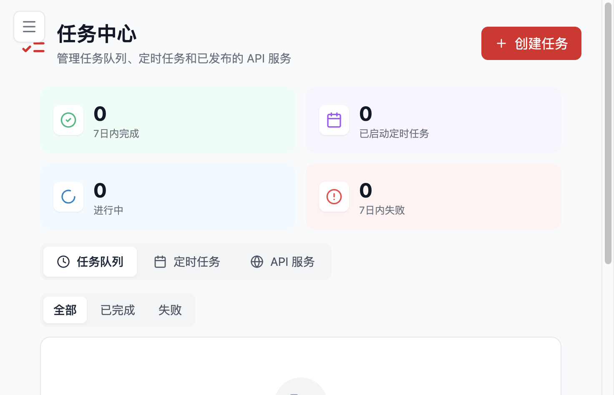

# 运维与排障

本页面向已经把 Flocks 跑起来、或者正在安装和升级过程中遇到问题的用户。整体思路很简单：先找到日志和产物，再区分是安装问题、运行问题还是升级问题，最后用最短路径恢复服务。



## 日志与结果查看

排障时，最应该先看的不是散落在各处的文件，而是统一日志入口：

```bash
flocks logs
```

它最适合第一时间确认：

- 服务是否真正启动
- 前后端有没有报错
- 模型调用、工具调用是否出现明显异常

如果需要进一步定位，本地常见日志位置是：

```text
~/.flocks/logs/backend.log
```

### 结果和产物通常在哪里

根据 FAQ 和工作流演示，Flocks 的分析结果一般会落在工作区或对应的输出目录里，而工作流创建和调试过程也会生成中间产物。实际查找时，建议同时从以下几个方向确认：

- 当前工作区或会话输出目录
- `~/.flocks` 下的日志与配置目录
- Docker 挂载目录
- Workflow 运行时生成的 `artifacts` 或结果文件

如果系统提示“报告已保存”，但你在当前 shell 目录找不到，最常见原因通常不是文件没生成，而是：

1. 文件落在了工作区或挂载目录
2. 你查看的不是实际运行目录
3. Docker 容器里生成了文件，但没有映射到宿主机

### 先看任务中心，再看日志

对于定时任务、批量分析或 Workflow 执行类场景，建议先在任务中心看任务状态，再结合日志做排障。任务中心更适合判断“有没有跑、跑到哪一步”，日志更适合判断“为什么失败”。

## 安装排查

安装问题的排查顺序，建议始终保持一致：

1. 先检查基础依赖
2. 再确认安装脚本有没有完整执行
3. 再确认 `flocks` 命令是否可用
4. 最后再判断要不要切换安装方式

### 安装前必须确认的依赖

重点包括：

- `uv`
- `Node.js`
- `npm 22+`
- `agent-browser`

其中很多“安装成功但起不来”的问题，根源都不是 Python 本身，而是前端依赖或浏览器依赖没有真正安装完整。

### 高频安装问题

#### Node.js / npm 安装失败

常见表现是：

- 一键安装卡在前端依赖阶段
- WebUI 构建失败
- 更新时前端重新构建失败

这时优先手动安装符合要求的 Node.js 和 `npm 22+`，再重新执行安装流程。

#### `flocks` 命令不可用

这通常说明安装流程中有关键步骤没有真正完成。与其继续局部修补，更稳妥的做法通常是进入源码目录后重新执行安装脚本。

#### 浏览器依赖失败

不要把它理解成“只是浏览器功能不能用”。现有 FAQ 明确提示，这类失败有时会影响整条安装链路是否完整。

### 什么时候切换安装方式

可以用下面这个经验法则快速判断：

- 需要完整交互能力和网页登录：优先本机终端安装或源码安装
- 一键安装连续失败：优先切换源码安装
- Windows 环境想少踩坑：优先源码安装或 Docker
- 标准化服务器部署：优先 Docker

### 平台与权限提示

不同平台的稳定性差异比较明显：

- Linux / macOS：通常最接近官方主流程
- Windows：更依赖管理员权限，升级和环境问题更多
- WSL：容易遇到 Node 或更新链路问题
- ARM：更建议优先 Docker

如果你用 Docker，还需要额外确认挂载目录权限和端口映射。

## 升级方式

Flocks 的升级可以粗分为三类：页面升级、源码手动升级、Docker 镜像升级。

### 页面一键升级

适合：

- Linux 或 macOS
- 当前版本没有已知升级兼容问题
- 安装方式比较标准

它对普通用户最省事，但并不是所有环境都适用。

### 源码手动升级

如果你想要最可控的升级方式，或者已经遇到页面升级失败，源码手动升级通常最稳妥：

```bash
flocks stop
git pull
./scripts/install.sh
flocks restart
```

Windows 环境对应使用 `install.ps1`，并且更建议在管理员 PowerShell 下执行。

### Docker 升级

Docker 用户的升级思路更直接：

- 拉取新镜像
- 重建或重启容器
- 确认挂载目录仍然保留

如果你的目标是标准化运维，Docker 升级通常比页面升级更可控。

## 升级异常处理

升级完成后，最常见的不是“完全坏掉”，而是“看起来升级了，但状态不对”。这类问题需要和安装失败区分开看。

### 常见现象

#### 升级卡很久

如果仍有新输出，可能只是慢；如果长时间没有任何新输出，通常说明已经失败。这时与其继续等，更推荐直接停服务后改走手动升级。

#### 页面还在提示可升级

常见原因包括：

- 页面缓存还没刷新
- 版本标识没有及时更新
- 你是从历史问题版本跨过来的

优先尝试刷新页面、重启服务，再重新确认版本状态。

#### 升级后监听地址像恢复默认

这通常不是升级把你的配置改坏了，而是重启时没有继续使用之前的自定义启动参数。只要你依赖自定义监听地址、端口或远程访问方式，升级后都应该重新核对启动命令。

#### 页面能打开，但功能异常

常见方向包括：

- 默认模型未恢复
- 前端缓存仍在影响状态
- 实际升级并没有完全成功
- 旧进程没有退出，导致文件替换不完整

### 推荐恢复顺序

1. `flocks status`
2. `flocks logs`
3. 确认旧进程是否已退出
4. 确认当前启动命令是否带了原有参数
5. 检查默认模型和通道配置是否仍可用

如果你已经连续多次页面升级失败，或者当前平台是 Windows，通常可以直接放弃页面升级，切回源码手动升级，会更省时间。
