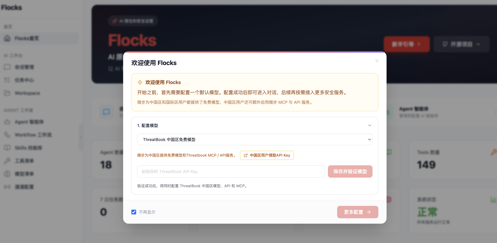

# Quick Start

本页面向第一次接触 Flocks 的用户，目标不是解释所有细节，而是帮助你以最短路径完成三件事：安装、启动、完成首次配置。只要这三步走通，你就可以进入会话、工作流和系统接入等后续能力。

## 安装与快速开始

Flocks 当前有两条主要安装路径：终端安装和 Docker 安装。Windows 用户也可以选择 EXE 安装包完成图形化安装。

#### 系统要求
- Ubuntu ≥20.04 / Debian ≥10
- RHEL/CentOS 系 ≥8
- 最低配置建议为 2 核 4G，推荐优先在本机安装使用。

| 方式 | 适合场景 | 说明 |
| --- | --- | --- |
| 终端安装 | 推荐给大多数用户 | 更适合本地开发、完整交互和后续排障 |
| Windows 安装包 | Windows x64 用户 | 通过安装向导完成安装，当前为 Beta |
| Docker 安装 | 想快速起服务或做环境隔离 | 开箱即用，但 `agent-browser` 的 headed 模式暂不可用 |

### 推荐路径 1：终端安装

如果你希望获得完整的 WebUI、本机浏览器能力和更好的调试体验，优先选择终端安装。

中国大陆环境建议优先使用 Gitee 安装入口：

```bash
curl -fsSL https://gitee.com/flocks/flocks/raw/main/install_zh.sh | bash
```

如果你希望先查看源码，再自己执行安装脚本，可以采用源码安装：

```bash
git clone https://gitee.com/flocks/flocks.git flocks
cd flocks
./scripts/install_zh.sh
```

Windows 环境建议用管理员 PowerShell 执行对应脚本，避免权限和环境变量问题。

### 推荐路径 2：Windows 安装包（EXE，Beta）

如果你使用 Windows x64，可以从 [GitHub Releases](https://github.com/AgentFlocks/flocks/releases) 下载 `FlocksSetup-<tag>.exe` 安装包，并按安装向导完成安装。

安装完成后，可以通过开始菜单或桌面快捷方式启动 Flocks；也可以打开一个新的终端执行：

```powershell
flocks start
```

如果你选择在终端启动，建议安装完成后新开 PowerShell 或命令行窗口，确保新的 `PATH` 等环境变量已经生效。

### 推荐路径 3：Docker 安装

如果你更在意环境隔离或快速部署，可以直接拉取镜像：

```bash
docker pull ghcr.io/agentflocks/flocks:latest
docker run -d \
  --name flocks \
  -e TZ=Asia/Shanghai \
  -p 8000:8000 \
  -p 5173:5173 \
  --shm-size 2gb \
  -v "${HOME}/.flocks:/home/flocks/.flocks" \
  ghcr.io/agentflocks/flocks:latest
```

需要注意的是，Docker 更适合服务化使用，不适合依赖本机交互式浏览器登录的场景。如果你的任务高度依赖网页登录和人工交互，终端安装更合适。

### 安装前的最低依赖

不论采用哪条路径，建议先确认下面这些依赖：

- `uv`
- `Node.js 22+`（`npm` 随 Node.js 一起安装）
- `agent-browser`
- `bun`（可选，用于 TUI 安装）

如果你在中国大陆环境使用，建议提前为 `uv` 配置国内镜像源，这会明显提升安装成功率和依赖下载速度。

## 服务启动与访问

安装完成并不代表服务已经在运行。标准做法是：

```bash
flocks start
flocks status
flocks logs
```

其中：

- `flocks start`：启动后端和 WebUI，首次启动通常会先构建 WebUI
- `flocks status`：查看当前服务状态
- `flocks logs`：查看启动和运行日志
- `flocks restart`：显式全量重启
- `flocks stop`：停止服务

默认访问地址为：

- WebUI：`http://127.0.0.1:5173`
- 后端 API：`http://127.0.0.1:8000`

如果你只是本机使用，直接打开 `http://127.0.0.1:5173` 即可。如果你部署在云主机、虚拟机或局域网机器上，还需要显式修改监听地址和端口暴露策略。

建议按下面的顺序做启动检查：

1. 执行 `flocks status`，确认服务已正常启动
2. 执行 `flocks logs`，确认没有持续报错
3. 浏览器打开 `http://127.0.0.1:5173`
4. 确认页面已加载，而不是空白页或持续报错页
5. 继续完成默认模型配置

如果你在远程机器上部署：

- 默认监听地址通常仍是 `127.0.0.1`
- WebUI 和 API 的对外访问路径要单独确认
- 更推荐优先只对外开放 WebUI，而不是直接裸露 API

## 首次配置



首次进入 WebUI 后，立即进行新手引导任务

1. 国内添加中国区免费模型，国外选择国际区免费模型
2. 点击中国区用户领取API Key
3. 保存验证模型
4. 继续新手引导任务
5. 也可以在模型管理界面配置其他模型api


上图是模型管理页面。这里既能看到模型供应商、模型列表，也能执行“测试连接”“设置默认模型”等关键动作。对第一次使用 Flocks 的用户来说，这一页通常比直接进入对话更重要。

### 第一步：添加模型供应商

如果你使用官方支持的模型服务，直接选择对应供应商即可；如果你使用自建网关、本地模型服务或兼容 OpenAI API 的第三方服务，通常优先选择 `OpenAI Compatible` 这类兼容模式。

### 第二步：添加具体模型

你通常需要填写：

- Base URL 或 API 地址
- API Key
- 模型名称

### 第三步：测试连接

很多“模型明明已经保存，但系统还是不能用”的问题，都出在这里。保存配置只代表信息被写入了系统，不代表调用链路真的可用；测试连接则可以提前暴露地址错误、认证失败和接口不兼容等问题。

### 第四步：设置默认模型

这是首次配置最容易漏掉的一步。你可以把它理解为：

- 已添加模型：只是“系统知道这个模型存在”
- 默认模型：表示“系统接下来优先用它执行任务”

如果没有设置默认模型，首页仍可能提示配置未完成，Agent 也可能表现异常。

### 首次配置完成检查清单

- 至少有一个供应商已配置成功
- 至少有一个模型已保存
- 模型测试已经通过
- 默认模型已经设置
- 首页引导状态已恢复正常

如果以上都没问题，你就可以继续阅读主模块文档，进入会话管理、工作流、智能体和工具接入等功能。
