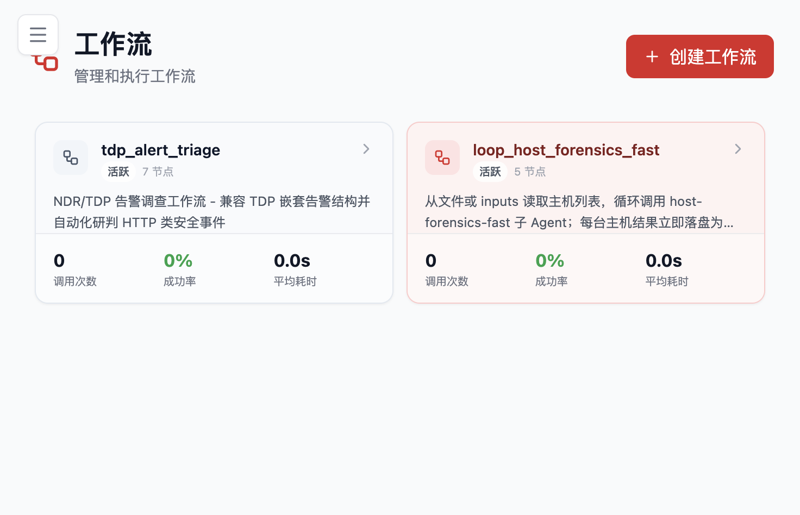

# 场景案例

这一页不做抽象价值描述，只用已经能复用的工作流、任务和接入路径回答一个问题：**Flocks 适合拿来做什么**。

下面 6 个子页是按"专业使用手册"整理的，每页都给出：场景简介 / 输入输出 / 前置条件 / 操作步骤 / 真实案例走读 / 产出示例 / 持续运行 / 边界与常见问题。如果你正在评估产品落地方式，建议**优先看告警研判和主机巡检**这两页，它们是 Flocks 在企业里最先跑起来的两个场景。

## 六个核心场景

### [告警研判](/md/scenarios/alert-triage)

从 TDP / NDR / XDR 等设备抓取告警 → 委派专职分析 Agent 逐条研判 → 结构化 JSON + 通道通知 → 转成每小时运行的定时任务。Flocks 最容易落地、最先产生价值的场景。

> 典型输出：结构化研判结果 · JSON 报告 · 企微 / 钉钉通知

---

### [主机巡检 / 应急取证](/md/scenarios/host-forensics)

主机巡检 Agent 上机，先跑基线，再进入深度调查。**命令白名单 / 黑名单 / 人工逐条确认**机制保证高危操作不误伤。最终产出带完整时间线的入侵报告。

> 典型输出：基线报告 · 入侵时间线 · IoC / 矿池地址 / 持久化手段

---

### [内网安全产品接入](/md/scenarios/network-integration)

把 TDP / NDR / HIDS / EDR / 情报源等设备接进 Flocks。**推荐优先级：API > 日志推送 > 浏览器**。给 Rex 一份 API 文档 → 自动生成工具 + 自动验证 + 自动调试。

> 典型输出：可复用的 API 工具 · MCP 接入 · Tools 目录沉淀

---

### [浏览器自动化与网页登录](/md/scenarios/browser-automation)

当设备没有 API，让 Rex 像分析员一样打开网页、登录、取数。**本机安装** vs **Docker** 的差异决定能不能做交互式登录。浏览器应该是进入桥梁，不是终点——发现的后端接口可以反向固化成稳定 API 工具。

> 典型输出：页面数据抓取 · 后端接口发现 · 从浏览器到 API 的沉淀路径

---

### [威胁情报与 IOC 研判](/md/scenarios/threat-intel)

给 Rex 一个 IP / 域名 / 哈希，并行查 ThreatBook + VT + GreyNoise，交叉比对 + 企业上下文 → 一份带证据的研判结论。可扩展为批量研判和持续跟踪任务。

> 典型输出：IOC 研判结论 · 批量 IOC 表格 · 重点 IOC 持续跟踪

---

### [互联网资产测绘](/md/scenarios/asset-discovery)

给一个域名 / 企业名，多源测绘 + 归类聚合 + CMDB 关联 + 风险打标。配合"资产 diff 定时任务"，新增 / 变化资产自动通知。攻击面管理（ASM）的基础能力。

> 典型输出：资产清单 · 分类视图 · 风险 Top N · 资产变化 diff

---

## 共同的产品逻辑

这 6 个场景看起来差别很大，但在 Flocks 里遵循**同一套范式**：

1. **Rex 理解任务** → 拆步骤、选能力
2. **调度专家 Agent / 工具 / Workflow** → 执行动作
3. **落盘中间数据 + 结构化产出** → 不只是对话里的回答
4. **通道通知 + 定时任务** → 从"做一次"升级为"常态化运营"
5. **把经验沉淀为 Skill** → 下次相似任务直接套

读完上面 6 个子页再横向看一次，会发现它们本质是同一个骨架在不同问题域的投影——这也是把 Flocks 称为 **AI-Native SecOps 平台**、而不是"某一个 AI 功能"的原因。

---

相关：[项目概览](/md/overview) · [快速开始](/md/quick-start) · [主模块介绍](/md/modules) · [通信配置](/md/communication) · [任务中心](/md/modules#任务中心)
