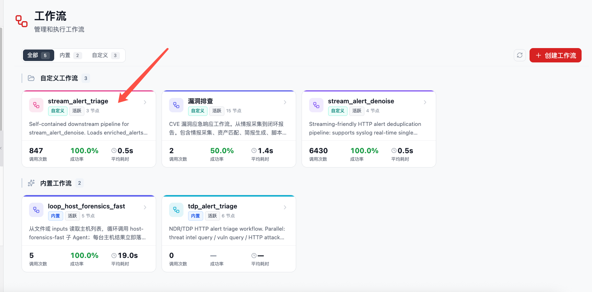
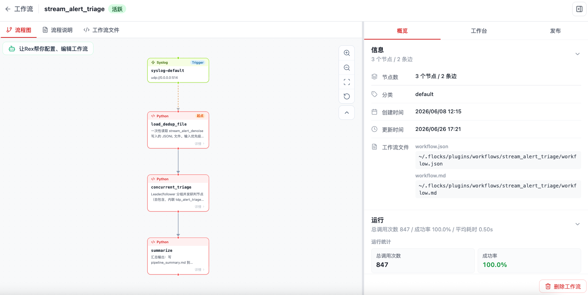
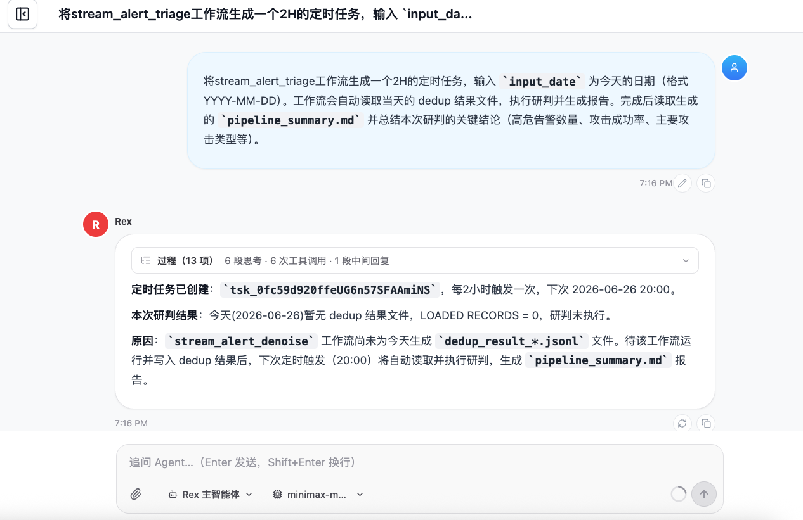
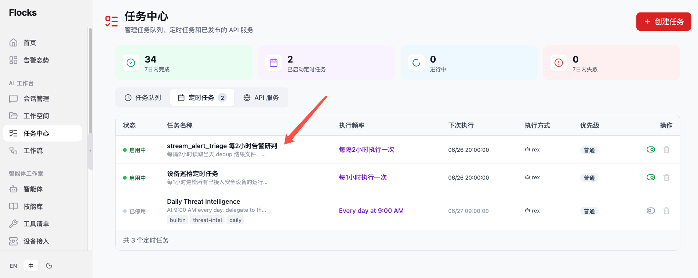
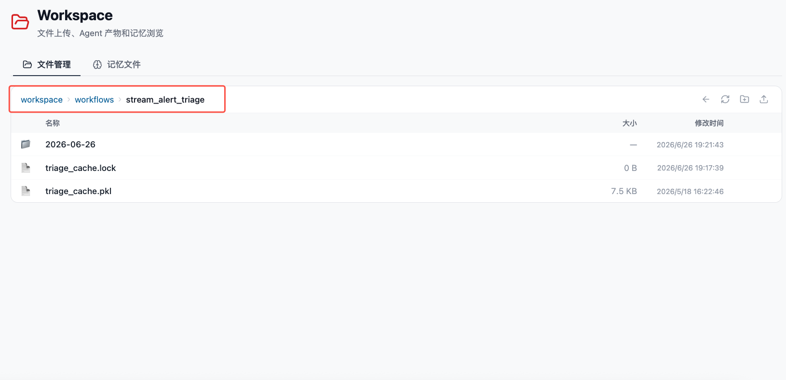

# 批量NDR研判工作流

**批量NDR研判工作流** 是基于 Flocks 内置工作流 `stream_alert_triage` 的持续研判方案。它用于周期性读取实时 NDR 降噪工作流产出的降噪结果，对剩余 HTTP 日志和告警进行批量研判，并生成当天的研判报告。

`stream_alert_triage` 会在工作流页面中展示为自定义或内置工作流卡片。



## 1. 能力定位

实时 NDR 降噪工作流负责持续接收 TDP、SkyEye 等设备推送的 HTTP 流量日志，并过滤重复、低价值或确定性噪声。`stream_alert_triage` 则面向降噪后的剩余日志做进一步研判。

它适合处理：

- 经降噪后仍需要关注的 HTTP 日志和 NDR 告警。
- 按天或按时间窗归档的降噪结果文件。
- 需要周期性输出研判报告的值班、运营和复盘场景。
- 需要结合情报、资产、漏洞和 AI 研判能力的复杂告警。

## 2. 前置条件

使用 `stream_alert_triage` 前，建议先完成：

| 前置项 | 要求 |
| --- | --- |
| 大模型配置 | Flocks 已配置可用的大模型，并设置默认大模型。 |
| 实时 NDR 降噪工作流 | 已配置 [实时 NDR 降噪工作流](/md/scenarios/stream-ndr-alert-denoise)，并能生成当天的降噪结果文件。 |
| 数据目录 | `stream_alert_triage` 可以读取降噪工作流写入的降噪结果文件。 |
| 研判上下文 | 建议已接入威胁情报、资产信息、测绘结果或漏洞信息，便于增强研判质量。 |
| 任务中心 | 需要使用定时任务能力周期性触发工作流。 |

## 3. 核心原理

`stream_alert_triage` 的核心逻辑是：按 `input_date` 定位当天的降噪结果文件，读取降噪后保留下来的日志数据，再结合多类上下文完成批量研判。

研判过程中通常会结合：

- **情报**：IP、域名、URL、文件哈希等 IOC 的外部情报与历史记录。
- **Flocks AI 研判能力**：基于日志字段、请求路径、状态码、规则命中和上下文生成研判结论。
- **测绘**：补充公网资产、服务暴露、域名解析和端口信息。
- **资产漏洞分析**：结合目标资产、组件、漏洞和攻击路径判断风险等级。
- **NDR HTTP 日志字段**：包括源 / 目的 IP、域名、URL、HTTP 方法、状态码、规则名、告警等级和原始日志。

工作流会汇总研判结果，并生成 `pipeline_summary.md` 等报告文件，供会话总结、通道通知或人工复核使用。



## 4. 部署方式

该工作流可以作为内置工作流使用，也可以放置到用户插件目录的工作流目录中：

```text
~/.flocks/plugins/workflows/
└── stream_alert_triage/
    ├── workflow.md
    ├── workflow.json
    └── ...
```

放置完成后，刷新 Flocks，系统会自动扫描 `~/.flocks/plugins/workflows` 下的工作流目录，并在 **工作流** 页面识别和展示。识别后可以进入详情页查看流程图、运行统计和工作流文件。

更多工作流安装和调用方式可参考：[Workflow 工作流](/md/modules/workflow) 与 [调用工作流](/md/modules/workflow-invoke)。

## 5. 开启定时研判

推荐通过 **任务中心 → 定时任务** 周期性调用 `stream_alert_triage`。定时任务会按照设定频率运行工作流，读取经实时 NDR 降噪工作流处理后的剩余日志数据，再生成本轮研判报告。

可以在会话中让 Rex 创建定时任务，任务描述可以写成：

```text
运行 stream_alert_triage 工作流，输入 `input_date` 为今天的日期（格式 YYYY-MM-DD）。工作流会自动读取当天的降噪结果文件，执行研判并生成报告。完成后读取生成的 `pipeline_summary.md` 并总结本次研判的关键结论（高危告警数量、攻击成功率、主要攻击类型等）。
```

推荐频率：**每 2 到 6 小时研判一次**。如果日志量较大，可以缩短到每 2 小时；如果日志量较小，或只需要值班摘要，可以设置为每 4 到 6 小时。



创建完成后，可以在 **任务中心 → 定时任务** 中查看任务状态、执行频率、下次执行时间和启停状态。



## 6. 运行结果

定时任务触发后，工作流会读取 `input_date` 对应日期的降噪结果。如果当天实时 NDR 降噪工作流尚未生成降噪结果文件，研判任务会提示无可处理数据；待降噪工作流写入结果后，下一次定时触发会自动继续研判。

一次成功运行通常会产出：

- 本轮读取的降噪后日志数量。
- 高危告警数量和攻击成功率。
- 主要攻击类型、关键源 IP、目标资产和 URL。
- 结合情报、测绘和漏洞上下文后的风险结论。
- 每条告警的结构化研判字段，包括是否为攻击、攻击是否成功、置信度 / 风险级别、判定结果和 Flocks AI 研判报告。
- `pipeline_summary.md` 研判摘要报告。

研判结果会写入工作空间的工作流目录：

```text
workspace/workflows/stream_alert_triage/
```

其中按日期存放每次研判的产物，常见文件包括缓存文件、锁文件、`pipeline_summary.md` 和其他中间结果。实时 NDR 降噪工作流的降噪结果会写入 `workspace/workflows/stream_alert_denoise/`，`stream_alert_triage` 会读取这些结果继续研判，并把研判报告写回自己的目录。



## 7. 产出示例 JSON

`stream_alert_triage` 会读取 `stream_alert_denoise` 产出的降噪结果，并给每条告警追加研判字段。除了面向人阅读的 Flocks AI 研判报告，结果里也会包含可用于落库、筛选和自动化处置的结构化判定。

核心判定字段可以这样理解：

| 字段 | 说明 |
| --- | --- |
| `attack_verdict` | Flocks AI 的最终判定，常见取值包括 `attack_success`、`attack_failed`、`attack`、`unknown`、`benign`。 |
| `attack_success` | 攻击是否成功，`true` 表示研判为攻击成功。 |
| `risk_level` | 风险 / 置信强度分级，通常为 `High`、`Medium`、`Low`。 |
| `triage_report` | Flocks AI 生成的完整研判报告，包含证据、攻击载荷、响应特征和处置建议。 |
| `triage_status` | 本条告警的研判执行状态，例如 `ok`、`cached`、`reused_from_leader`、`failed`。 |
| `triage_source` | 研判来源，例如新研判、缓存复用或同批次 follower 复用。 |

对于业务系统来说，`attack_verdict` 可以直接作为“判定成功的结果”字段使用；也可以派生出 `is_attack`、`attack_succeeded` 和 `confidence` 等更直观的展示字段。

一次运行后的精简结果可以参考：

```json
{
  "summary_path": "~/.flocks/workspace/outputs/2026-06-26/artifacts/stream_alert_triage_summary.md",
  "top_attack_verdict": "attack_success",
  "top_risk_level": "High",
  "top_report_title": "SQL注入攻击成功，需立即处置",
  "top_triage_report": "# SQL注入攻击研判报告\n\n## 研判结论\n该告警具备明确攻击载荷和响应证据，判定为攻击成功...",
  "triage_stats": {
    "total": 3,
    "unique_dedup_keys": 2,
    "work_units": 2,
    "cache_hit": 0,
    "followers_reused": 1,
    "triaged": 2,
    "triage_failed": 0,
    "verdict_counts": {
      "attack_success": 1,
      "attack_failed": 1
    },
    "elapsed_ms": 18420,
    "output_paths": [
      "~/.flocks/workspace/workflows/stream_alert_triage/2026-06-26/triage_result_001.jsonl"
    ]
  },
  "triage_results": [
    {
      "dedup_key": "b7428a52e96c835c9f72efb555d36772",
      "has_dedup_key": true,
      "threat_name": "SQL注入",
      "sip": "1.2.3.4",
      "dip": "10.0.0.1",
      "is_duplicate": false,
      "triage_source": "triaged",
      "triage_status": "ok",
      "attack_verdict": "attack_success",
      "risk_level": "High",
      "report_title": "SQL注入攻击成功，需立即处置",
      "triage_ms": 9210,
      "triage_error": null
    }
  ]
}
```

如果需要查看单条告警的完整研判结果，可以读取 `enriched_alerts_with_triage` 或 `triage_result_NNN.jsonl`。其中会保留降噪阶段的字段，并追加研判字段：

```json
{
  "id": "AZtRkZkzj",
  "sip": "1.2.3.4",
  "dip": "10.0.0.1",
  "req_http_url": "/admin?id=1' or '1'='1",
  "threat_name": "SQL注入",
  "dedup_key": "b7428a52e96c835c9f72efb555d36772",
  "is_duplicate": false,
  "has_dedup_key": true,
  "triage_source": "triaged",
  "triage_status": "ok",
  "attack_verdict": "attack_success",
  "attack_success": true,
  "risk_level": "High",
  "confidence": "High",
  "is_attack": true,
  "attack_succeeded": true,
  "decision": "attack_success",
  "decision_label": "攻击成功",
  "report_title": "SQL注入攻击成功，需立即处置",
  "triage_report": "# SQL注入攻击研判报告\n\n## 研判结论\n本次请求包含明显 SQL 注入载荷，响应内容存在异常回显，结合情报和 HTTP 响应证据，判定为攻击成功。\n\n## 关键证据\n- 请求路径包含 SQL 注入特征\n- 目标服务返回异常数据库相关响应\n- 源 IP 命中威胁情报记录\n\n## 处置建议\n封禁源 IP，排查目标资产访问日志，并对相关接口进行参数化修复。",
  "triage_ms": 9210
}
```

示例中的 `is_attack`、`attack_succeeded`、`confidence`、`decision` 和 `decision_label` 是面向业务展示的读取口径：其中 `decision` 对应工作流原生的 `attack_verdict`，`attack_succeeded` 对应 `attack_success`，`confidence` 可按 `risk_level` 和报告证据强度归一化展示。

## 8. 上线检查

正式启用前，建议确认：

- Flocks 默认大模型可用，且模型能力满足批量研判需求。
- 实时 NDR 降噪工作流已经接入 TDP、SkyEye 或其他 NDR 日志源。
- 降噪工作流已经产生当天的降噪结果文件。
- `stream_alert_triage` 工作流可以读取降噪结果文件所在目录。
- 定时任务频率合理，避免与日志写入、报告生成或通道通知互相抢占资源。

相关：[告警研判](/md/scenarios/alert-triage) · [实时 NDR 降噪工作流](/md/scenarios/stream-ndr-alert-denoise) · [任务中心](/md/modules/tasks) · [调用工作流](/md/modules/workflow-invoke)
