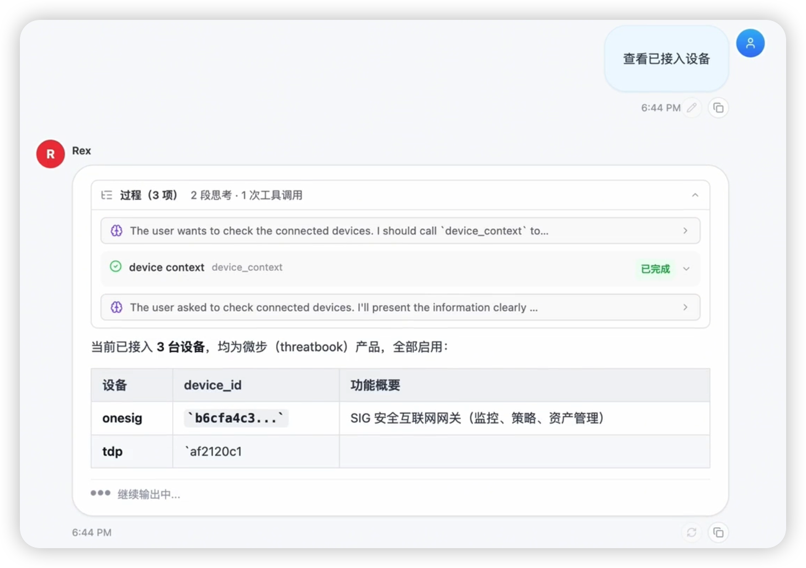
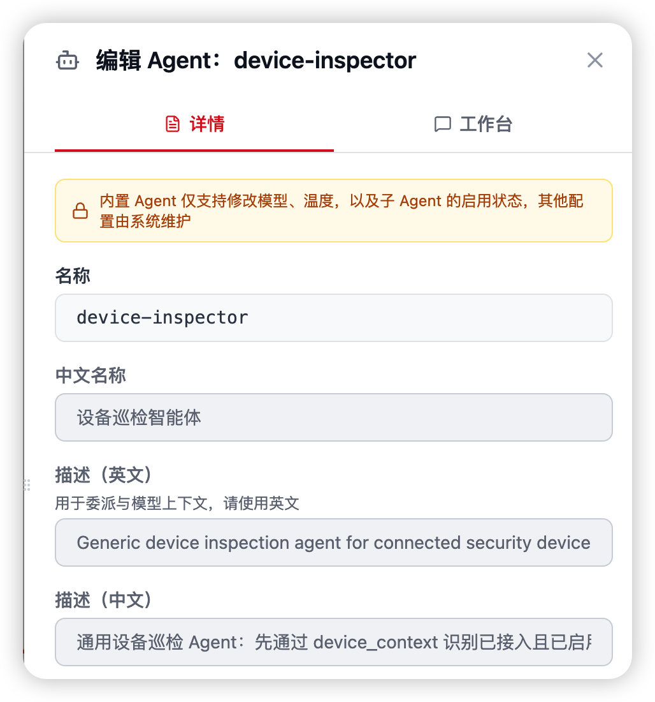
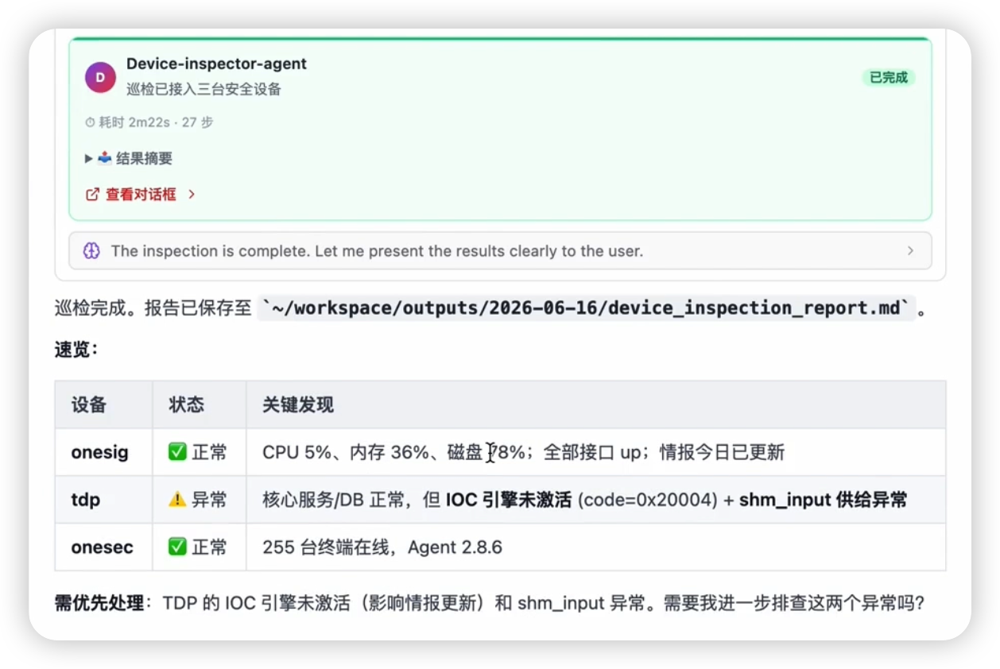

# 设备接入与巡检

设备接入与巡检的核心问题是：先把企业中的 TDP、NDR、HIDS、EDR、防火墙等安全设备接入 Flocks，再周期性确认它们在线、规则库有效、日志未中断且性能无异常。

Flocks 的做法是用 [设备管理](/md/modules/devices) 维护设备清单、API / web2cli 能力和设备 Skill，再由设备巡检 subagent 执行只读巡检；发现异常后立即通过通道外发并保留记录。

## 场景简介

该场景容易与主机巡检混淆，二者边界如下：

| 场景 | 对象 | 关心的问题 |
| --- | --- | --- |
| [主机巡检 / 应急取证](/md/scenarios/host-forensics) | 业务主机（Linux / 少量 Windows） | 有没有被攻陷？有没有挖矿 / webshell？ |
| 设备接入与巡检（本页） | 安全设备自身（NDR / HIDS 管理端 / 防火墙 / 情报源） | 设备有没有接入？是不是还活着？还能不能防？ |

实际交付中，设备巡检是较容易落地的自动化场景之一。由于所有查询均为只读操作，不涉及上机命令和人工弹窗，因此适合做成常态化定时任务。

## 设备接入

接入设备时优先参考 [设备管理](/md/modules/devices)。设备管理对应 WebUI 中的 **数据源与设备** 页面，负责维护设备基础信息、连接状态、API 能力、web2cli 动作和设备 Skill。



典型接入路径：

1. 在 **数据源与设备** 中选择设备类型，例如 TDP、NDR、HIDS、SIEM、防火墙或威胁情报源。
2. 填写 endpoint、Token、AK/SK、Secret 或账号凭证。
3. 执行连接测试，确认网络可达、凭证有效、字段可被工具或 Agent 消费。
4. 按设备条件选择能力：API 完整时优先接 API；只有 Web 控制台时补充 web2cli；巡检方法稳定后沉淀设备 Skill。
5. 绑定任务中心或 Workflow，让巡检流程能够周期运行。

## 巡检输入与输出

### 典型输入

- 一份设备清单（IP / 厂商 / 管理 API 地址 / 认证信息）
- 巡检项清单（在线、规则库版本、日志状态、CPU / 内存 / 带宽 等）
- 一个巡检频率（通常每小时一次）

### 典型输出

- **巡检快照**：每轮的健康度矩阵（设备 × 巡检项）
- **异常清单**：本轮新出现的异常项，带上一次正常时间
- **通道通知**：有异常立即推送企微 / 钉钉 / 飞书
- **巡检台账**：长期留存到 Workspace，便于审计与复盘

## 前置条件

| 依赖项 | 要求 |
| --- | --- |
| 模型 | 默认模型即可；巡检逻辑本身不重推理，模型主要用于"结果总结 + 异常判断"——参考 [模型配置](/md/communication-models) |
| 设备接入 | 安全设备已在 [设备管理](/md/modules/devices) 中完成接入，并具备 API、web2cli 或设备 Skill 能力 |
| 通道 | 企微 / 钉钉 / 飞书任一通道已连通——参考 [通道配置](/md/communication-channels) |
| 任务中心 | 用于驱动每小时定时执行——参考 [任务中心](/md/modules/tasks) |
| 基线阈值 | 建议预先写入 Skill：在线 / 离线判定标准、规则库过期天数、性能阈值 |

## 巡检原理

设备巡检由专门的 subagent 执行。Rex 负责理解目标、选择设备巡检 subagent 并把设备清单、巡检项和输出要求交给它；subagent 在自己的执行循环里调用设备 API、web2cli、文件读写和通道工具，完成取数、判断、汇总和通知。



这个拆分的好处是：Rex 保持统一入口，设备巡检 subagent 专注于设备健康检查，长期复用时只需要维护该 subagent 的工具权限、Prompt、巡检阈值和输出格式。

## 操作步骤（WebUI）

### 步骤 1：准备已接入设备清单与巡检项

在 Workspace 或项目 Skill 里维护一份结构化清单，给巡检 Agent 当"输入"：

```text
devices:
  - name: 核心 NDR
    vendor: ndr-a
    api_base: https://ndr.example.com
    checks: [online, rule_version, log_status, cpu, mem]
  - name: 主站防火墙
    vendor: fw-b
    api_base: https://fw.example.com
    checks: [online, rule_version, log_status, throughput]
```

这份清单也可以来自 [设备管理](/md/modules/devices)、企业 CMDB 或资产管理平台，由 Agent 先调用 API 拉取。

### 步骤 2：起一条会话，跑一次"手工巡检"验证

进入 **对话管理 → + 新建会话**：

> 「按 checklist 把清单里的设备都巡检一遍，每台设备输出：是否在线、规则库版本、最近日志时间、CPU / 内存占用，最后汇总一个健康度表」

先跑一次是为了：

- 验证每台设备的 API 工具是否通
- 检查模型输出结构是否符合预期
- 必要时让 Rex 在同一会话里迭代结构

### 步骤 3：结果结构化 + 异常判定

Rex 会把每台设备的查询结果汇总为一张表，并做异常判定：

- **在线**：API 在时限内返回 → 健康
- **规则库版本**：对比预设的"最老可接受日期"，超过即异常
- **日志状态**：最近一条日志超过阈值时间 → 日志中断
- **性能**：CPU / 内存 / 带宽超过阈值 → 异常

所有原始数据与汇总结果**落盘到 Workspace**（`inspection/YYYY-MM-DD/HH.json`），便于后续对比。

### 步骤 4：异常通道通知

有异常时 Rex 会自动调用通道工具发摘要：

> 「本轮发现 2 台设备异常：核心 NDR 规则库超 30 天未更新；主站防火墙 CPU 持续 95% 以上」

文案模板可以写进 Skill，让通知更可控。

### 步骤 5：转成每小时定时任务

在同一会话里继续对 Rex 说：

> 「把这套巡检过程配成定时任务，每小时跑一次，异常才发企微，正常不打扰」

Rex 会在 [任务中心](/md/modules/tasks) 创建一条任务：

- 启动方式：每小时执行一次
- 任务描述：沿用本次会话的自然语言描述
- `channel`：`wecom` / `dingtalk` / `feishu`
- `session ID`：指定会话
- 静默策略：全部正常时不发，降低通道噪音

## 真实案例走读（政务云场景常态化巡检）

以下为企业级常态化巡检方案的典型执行过程：

| 时间 | 巡检 Agent 动作 | 产出 / 说明 |
| --- | --- | --- |
| T+0:00 | 定时任务触发，Agent 拉取设备清单 | 清单来源可以是 Skill 内置或 CMDB API |
| T+0:01 | 并发向每台设备发起 API 调用 | 在线状态 / 规则库版本 / 日志时间 / 性能指标 |
| T+0:02 | 汇总结果写入 `inspection/2026-03-28/14.json` | 本轮快照落盘 |
| T+0:03 | 与上一轮快照比对，识别新出现的异常项 | 避免重复告警 |
| T+0:03 | 无异常 → 静默；有异常 → 推送企微摘要 | 降低通道噪音 |
| T+0:04 | 巡检台账写入，便于周度复盘 | 可用于 SLA 审计 |
| T+1:00 | 下一轮自动触发，循环 | 7 × 24 运行 |

一次 TDP + OneSec 设备巡检的案例结果通常会拆成两类报告：

- **TDP Inspection**：输出机器数量、关键指标、功能状态、系统运行情况、组件状态、CPU 占用等，标出是否存在服务不可用或资源占用异常。
- **OneSec Inspection**：输出接入设备数量、在线 / 离线状态、威胁行为、威胁事件清单、健康评估和数据采集说明，便于判断设备是否仍在持续产生日志和检测结果。



## 产出示例

一份巡检快照（单轮）的典型结构：

```json
{
  "timestamp": "2026-03-28T14:00:00+08:00",
  "summary": {
    "total": 12,
    "healthy": 10,
    "abnormal": 2
  },
  "devices": [
    {
      "name": "核心 NDR",
      "online": true,
      "rule_version": "2026-02-15",
      "rule_age_days": 41,
      "log_last_ts": "2026-03-28T13:58:12+08:00",
      "cpu": 42,
      "mem": 61,
      "abnormal": ["rule_outdated"]
    },
    {
      "name": "主站防火墙",
      "online": true,
      "cpu": 96,
      "mem": 82,
      "throughput_mbps": 880,
      "abnormal": ["cpu_high"]
    }
  ]
}
```

通道推送文案（示意）：

```text
[设备巡检 14:00] 发现 2 项异常
- 核心 NDR：规则库已 41 天未更新（基线 30 天）
- 主站防火墙：CPU 96%，持续 15 分钟
其余 10 台设备健康，详情见 Workspace inspection/2026-03-28/14.json
```

## 持续运行与定时任务

| 任务形态 | 说明 |
| --- | --- |
| 每小时全量巡检 | 核心用法，建议企业优先落地 |
| 夜间深度巡检 | 每天 02:00 多查一轮：配置 diff、许可证到期、证书到期 |
| 周报聚合 | 每周一 09:00 基于台账生成一周健康度趋势图，推 IM |
| 告警联动 | 某设备异常时，通知附近依赖该设备的业务 Owner，而不只是安全组 |

## 边界与常见问题

| 问题 | 处理 |
| --- | --- |
| 某厂商只给 Web 控制台，没有 API | 在设备管理中补充 web2cli 动作，必要时启用浏览器工具登录后台抓数据；发现稳定的后端接口后再沉淀为 API 工具 |
| 通道噪音大，每小时都在发 | 加静默策略：只在"新异常"或"持续异常超过 N 轮"时发 |
| 设备太多，并发打爆接口 | 工具层加并发上限；或把清单拆两组交错执行 |
| 规则库版本字段厂商不一 | 在每个设备的 Skill 里写一个"标准化适配器"，统一产出 `rule_version` / `rule_age_days` |
| 想让 Agent 自动重启设备 | 不建议。Flocks 只做巡检 + 告警，重启类动作仍由运维侧人工执行 |

---

相关：[场景总览](/md/scenarios) · [设备管理](/md/modules/devices) · [主机巡检 / 应急取证](/md/scenarios/host-forensics) · [任务中心](/md/modules/tasks) · [Skills 技能库](/md/modules/skills) · [通道配置](/md/communication-channels)
