# SOC 工作区场景套件

SOC 工作区场景套件用于一次性安装告警运营所需的页面、工具和工作流。它不是单个 Workflow，而是一个组合能力包：安装后，Flocks 会获得 SOC 工作区页面、SOC 工作区操作工具，以及告警降噪和告警研判两条工作流。

这套能力适合希望快速启用告警运营闭环的团队：先通过降噪工作流筛掉重复和低价值告警，再通过研判工作流输出结构化结论，最后在 SOC 工作区中查看、操作和持续运营。

## 套件组成

| 能力 | 插件 ID | 类型 | 用途 |
| --- | --- | --- | --- |
| SOC 工作区 UI | `soc_ui` | WebUI | 提供 SOC 工作区页面，用于查看告警运营相关结果和状态。 |
| SOC 工作区操作工具 | `soc_workspace_query` | Tool | 供 Rex、Workflow 或其他能力查询和操作 SOC 工作区数据。 |
| 告警降噪工作流 | `stream_alert_denoise` | Workflow | 对实时告警流、HTTP 流量日志或 NDR 告警进行过滤、归并和初步分级。 |
| 告警研判工作流 | `stream_alert_triage` | Workflow | 读取告警或降噪结果，结合情报和上下文生成结构化研判报告。 |

插件广场中展示的套件 ID 通常为 `soc-workspace`。详情页会列出套件内容，便于在安装前确认会写入哪些组件。

## 安装方式一：从会话首页进入告警运营

这种方式适合从业务入口第一次启用 SOC 告警运营能力。用户不需要先了解插件广场，只要在新会话首页点击 **告警运营**。

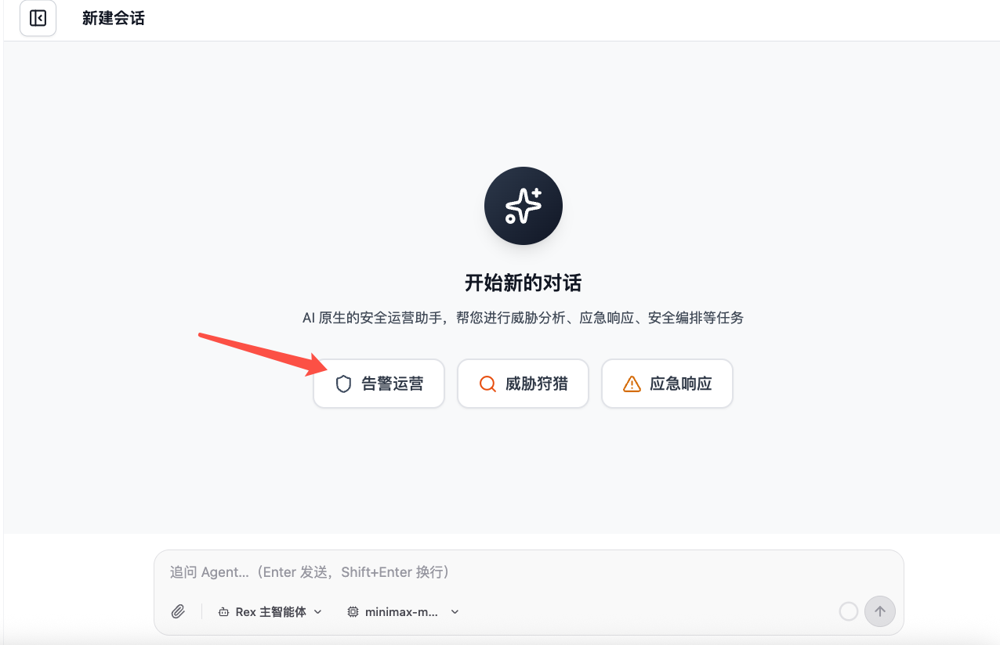

如果 SOC 工作区组件尚未安装，页面会弹出安装确认提示。点击 **确定** 后，Flocks 会开始安装 SOC 工作区场景套件；点击 **取消** 则不会安装。

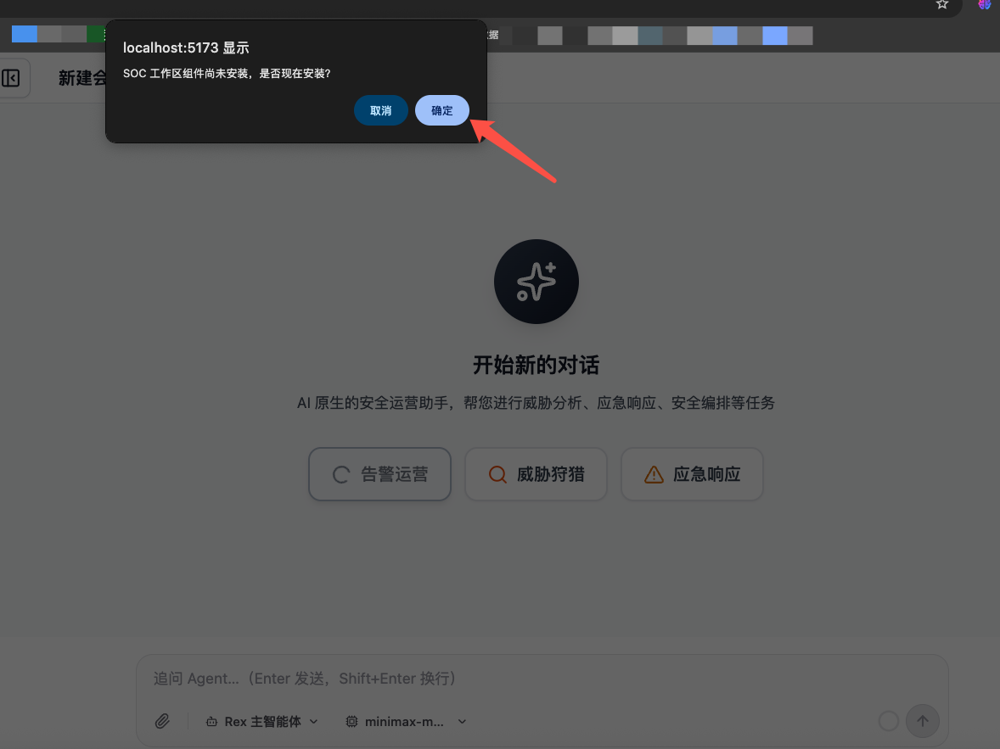

确认安装后，Rex 会进入 Flocks 辅助引导流程，按顺序检查并配置告警运营能力。这个流程会先确认 `soc-workspace` 组件状态，再继续配置降噪工作流 `stream_alert_denoise` 和研判工作流 `stream_alert_triage`。

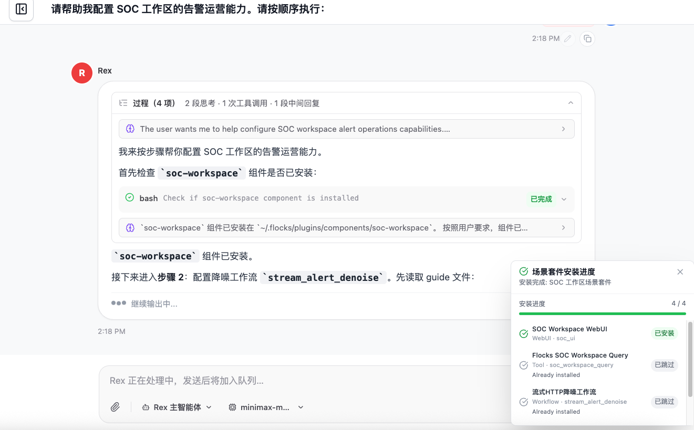

安装进度会展示套件内各组件的处理状态。已经安装的组件会被标记为已跳过或已安装，缺失组件会被安装到本机插件目录并刷新 Flocks 运行时。

## 安装方式二：从插件广场安装场景套件

这种方式适合管理员或平台维护人员主动安装套件。进入 **Agent 工作室 → 插件广场**，在类型筛选中选择 **场景套件**，找到 **SOC 工作区场景套件**。

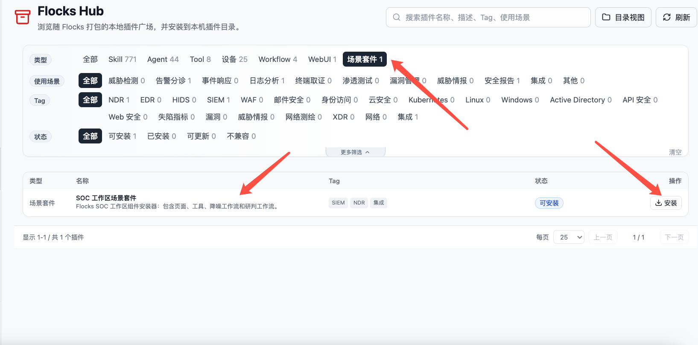

点击插件行可以打开详情页。安装前建议先查看概览和套件内容，确认套件包含 `soc_ui`、`soc_workspace_query`、`stream_alert_denoise` 和 `stream_alert_triage`。

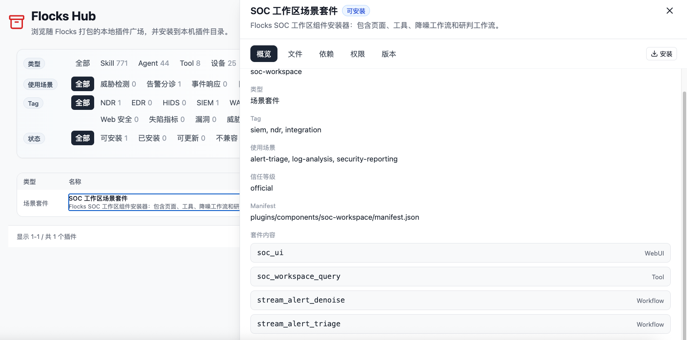

确认无误后点击 **安装**。安装进度会按套件内组件逐项展示；如果某个组件已经存在，会显示为已跳过或已安装。安装完成后，插件广场列表中的状态会变为 **已安装**。

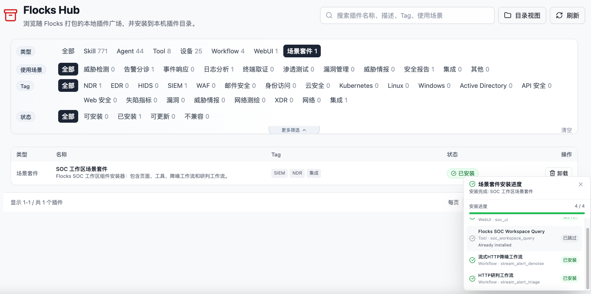

## 子组件能力与配置

SOC 工作区场景套件安装后，核心能力会落在四类组件中：工作区页面负责查看和操作，工作区工具负责让 Rex 在会话里查询数据，两条工作流分别负责降噪和研判。

### SOC 工作区 UI：查看和运营告警

`soc_ui` 安装后，会在左侧导航的 **场景工作区** 下提供 **SOC 工作区**。SOC 工作区以侧边栏展开的形式组织页面，默认包含 **态势**、**SOC 总览**、**告警调查** 和 **自定义页面**。

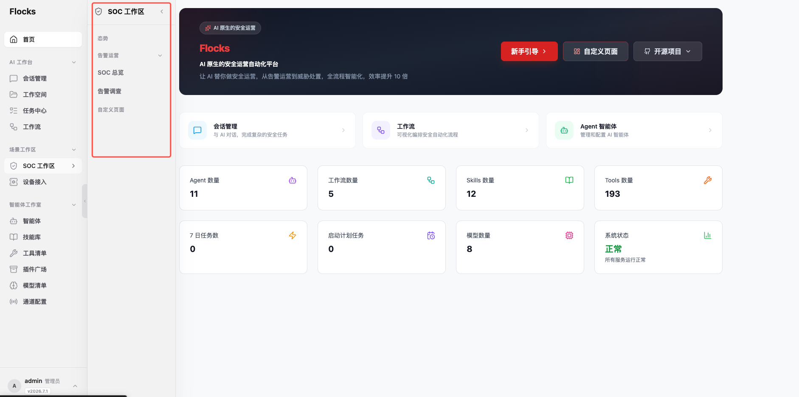

| 页面 | 能力 |
| --- | --- |
| 态势大屏 | 面向值班和汇报展示，聚合智能降噪、智能研判、处置闭环、威胁类型排行和攻击画像等指标。 |
| SOC 总览 | 面向运营分析，按时间范围汇总原始告警、有效告警、攻击源地址、目标地址、HTTP 主机、URL 样本、威胁规则和研判结果。 |
| 告警调查 | 面向分析员检索，支持按数据源、协议类型、流量方向、威胁名称、源地址、目标地址、HTTP Host、URL、规则 ID 等条件查询。 |
| 自定义页面 | 面向团队个性化看板。点击后由 Flocks 辅助引导，用户描述想要的页面和字段，Flocks 会辅助创建工作区页面。 |

态势大屏适合放在 SOC 大屏或值班视图中，用于观察告警降噪、AI 研判和处置闭环整体效果。

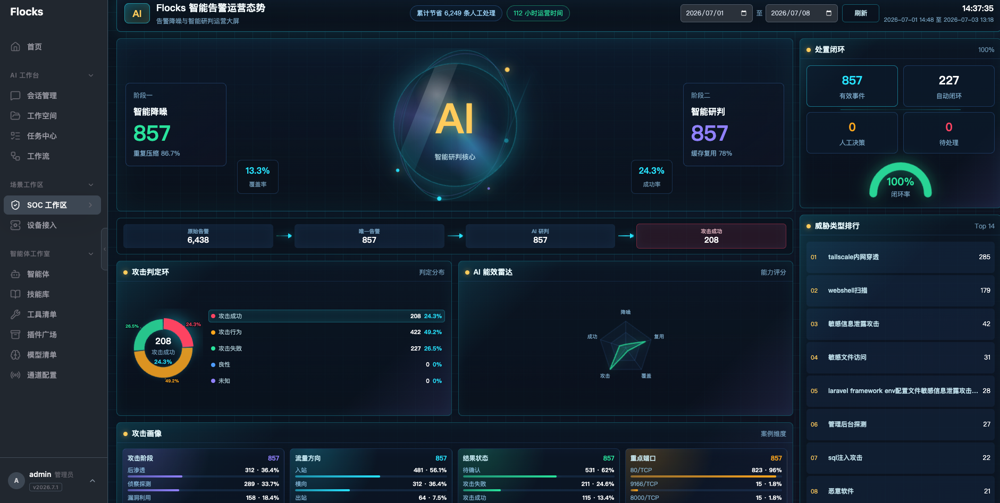

SOC 总览适合回答“最近一段时间告警整体怎么样”。它展示原始告警与有效告警数量、去重率、关键字段覆盖情况、TOP 威胁名称和威胁类型分布，便于快速判断当前告警面。

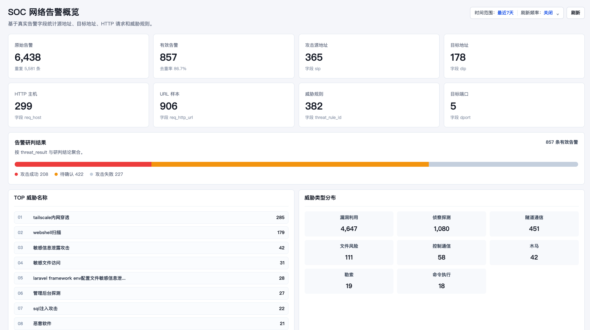

告警调查适合回答“我要查某类告警、某个源地址或某个威胁名称”。上方是筛选条件和趋势图，下方是告警列表。

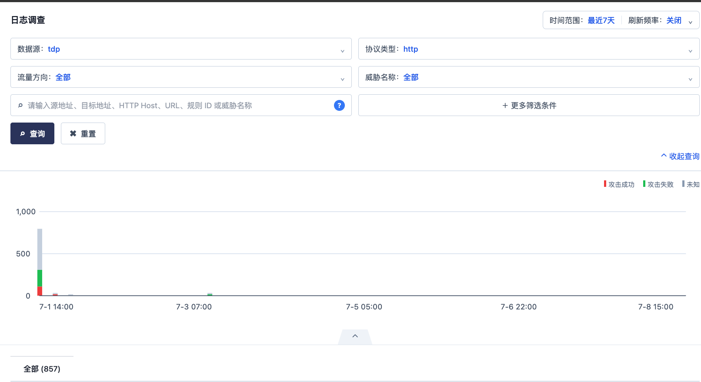

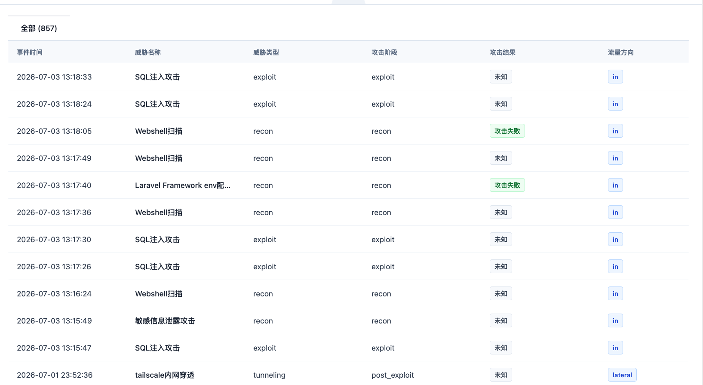

自定义页面适合把团队的固定运营视角沉淀为工作区页面。可以点击 **自定义页面** 进入 Flocks 辅助引导，描述页面需求，例如“做一个按攻击阶段统计成功攻击的页面”或“做一个只看重点资产被攻击情况的页面”。页面生成后，也可以在会话中继续让 Rex 修改 SOC 工作区里的页面，例如调整字段、增加筛选项、改统计口径或补充图表。

### SOC 工作区操作工具：在会话里查询告警状态

`soc_workspace_query` 会把 SOC 工作区数据查询能力暴露给 Rex、Workflow 和其他 Agent。安装后，用户可以直接在会话里用自然语言查询工作区告警状态，不必手动进入页面筛选。

典型问题包括：

```text
SOC 工作区里最近 7 天有哪些告警？
```

```text
帮我查一下最近 7 天 SQL 注入攻击的数量、攻击结果和流量方向。
```

```text
最近 24 小时攻击成功的告警有哪些？按威胁名称汇总。
```

Rex 会调用工作区查询工具，读取 SOC 工作区中的告警、统计和研判结果，再以表格或摘要返回。

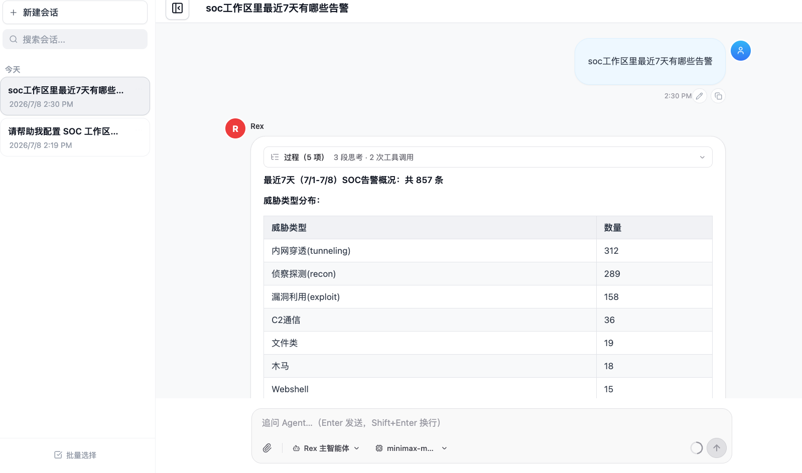

使用这个工具前，需要先确保 SOC 工作区已有数据来源：通常是 `stream_alert_denoise` 持续写入降噪结果，再由 `stream_alert_triage` 补充研判字段。若字段或统计口径需要调整，可以在会话中说明期望口径，让 Rex 基于工作区数据和页面需求继续修改。

### 告警降噪工作流：把原始告警变成有效告警

`stream_alert_denoise` 负责处理原始告警流。它会对 TDP、SkyEye 或其他 NDR / 流量设备推送的 HTTP 流量日志和告警做去重、过滤、归并和初步分级，把高频重复和低价值噪声挡在研判前面。

常见配置项包括：

| 配置项 | 说明 |
| --- | --- |
| 数据来源 | TDP、SkyEye、NDR、XDR 或其他能输出 HTTP 流量日志 / 告警的系统。 |
| 触发方式 | Syslog、Kafka、Webhook 或文件中转；实时接入通常优先使用 Syslog / Kafka。 |
| 字段映射 | 源 IP、目标 IP、URL、HTTP Host、规则名称、告警等级、时间戳、目标端口等字段需要稳定映射。 |
| 降噪规则 | 白名单、重复窗口、静态资源过滤、相似事件聚合和低置信度噪声处理。 |
| 输出位置 | 降噪结果通常写入 `workspace/workflows/stream_alert_denoise/`，供 SOC 工作区和研判工作流读取。 |

安装套件后，可以通过会话中的 Flocks 辅助配置流程继续配置这条工作流。详细说明见 [实时 NDR 降噪工作流](/md/scenarios/stream-ndr-alert-denoise) 和 [告警降噪](/md/scenarios/alert-noise-reduction)。

### 告警研判工作流：给有效告警补充结论

`stream_alert_triage` 负责读取降噪后的有效告警，结合模型、情报、资产、漏洞和上下文字段输出结构化研判结论。它适合按时间窗或定时任务周期运行，把告警从“需要关注”推进到“攻击是否成功、证据是什么、建议怎么处置”。

常见配置项包括：

| 配置项 | 说明 |
| --- | --- |
| 输入数据 | 通常读取 `stream_alert_denoise` 的降噪结果，也可以读取指定日期或时间窗内的有效告警。 |
| 模型配置 | 需要可用的默认大模型；复杂研判建议使用推理能力更强的模型。 |
| 上下文增强 | 可选接入威胁情报、资产信息、漏洞信息和测绘结果，提升研判质量。 |
| 运行方式 | 可在会话中手动触发，也可以在任务中心配置每 2 到 6 小时定时研判。 |
| 输出结果 | 结构化字段、研判报告、攻击成功 / 失败判定、风险等级和工作区展示字段。 |

安装套件后，Flocks 辅助配置流程会继续引导配置研判工作流。详细说明见 [批量NDR研判工作流](/md/scenarios/batch-scheduled-ndr-triage) 和 [告警研判](/md/scenarios/alert-triage)。

## 卸载场景套件

SOC 工作区场景套件也可以从插件广场卸载。进入 **插件广场**，筛选 **场景套件** 或 **已安装**，找到 **SOC 工作区场景套件**，点击 **卸载**。

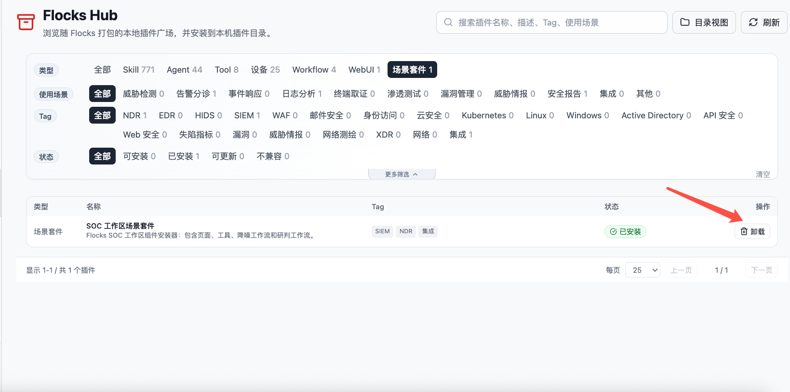

卸载后，Flocks 会移除该套件对应的组件，包括 SOC 工作区 UI、SOC 工作区操作工具、告警降噪工作流和告警研判工作流。卸载前建议确认任务中心、Workflow 发布入口或团队日常流程中没有继续依赖这些组件。

## 安装后验证

安装完成后，可以按以下方式确认套件已经生效：

1. 在插件广场中查看 **SOC 工作区场景套件** 状态为 **已安装**。
2. 在左侧导航中进入 **场景工作区 → SOC 工作区**，确认可以看到态势、SOC 总览、告警调查和自定义页面。
3. 在 Workflow 工作流中确认可以看到 `stream_alert_denoise` 和 `stream_alert_triage`。
4. 在工具清单中确认可以看到 `soc_workspace_query`。
5. 在会话里提问“SOC 工作区里最近 7 天有哪些告警”，确认 Rex 可以查询工作区数据。
6. 回到新建会话首页再次点击 **告警运营**，不再出现未安装提示，并能继续进入告警运营配置或使用流程。

---

相关：[告警降噪](/md/scenarios/alert-noise-reduction) · [实时 NDR 降噪工作流](/md/scenarios/stream-ndr-alert-denoise) · [告警研判](/md/scenarios/alert-triage) · [批量NDR研判工作流](/md/scenarios/batch-scheduled-ndr-triage) · [插件广场](/md/modules/flocks-hub) · [对话管理](/md/modules/sessions) · [Workflow 工作流](/md/modules/workflow)
