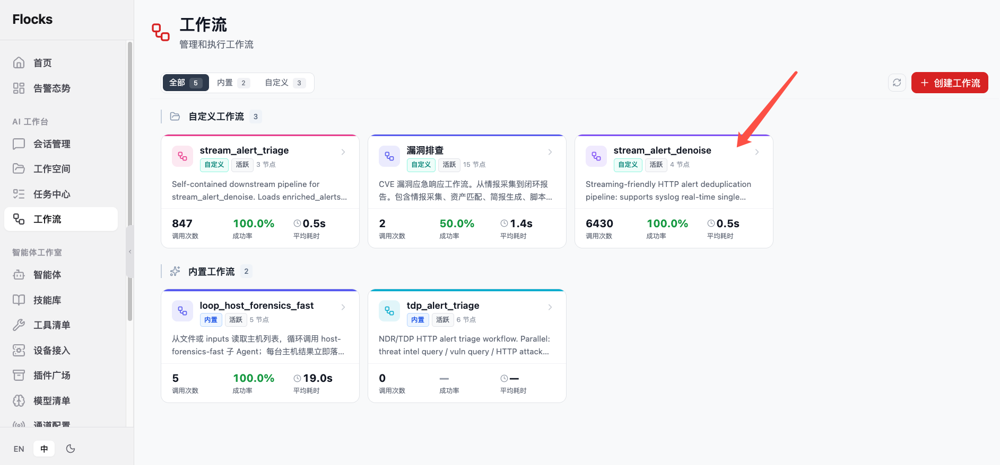
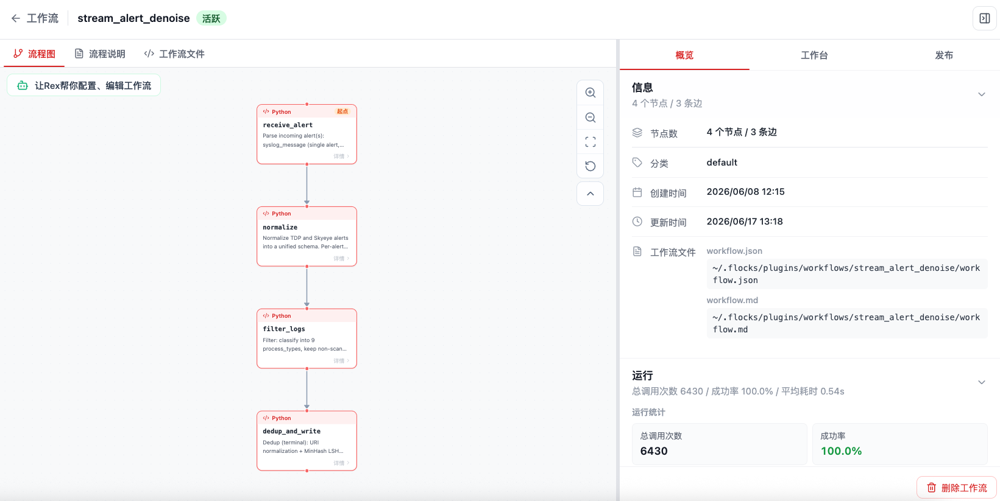
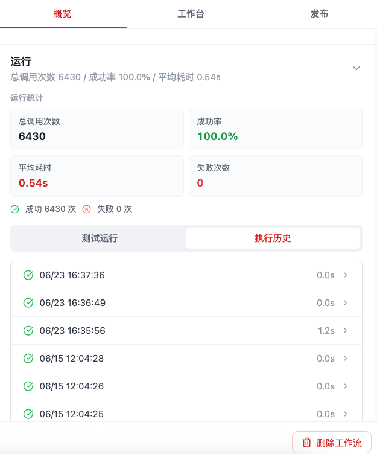
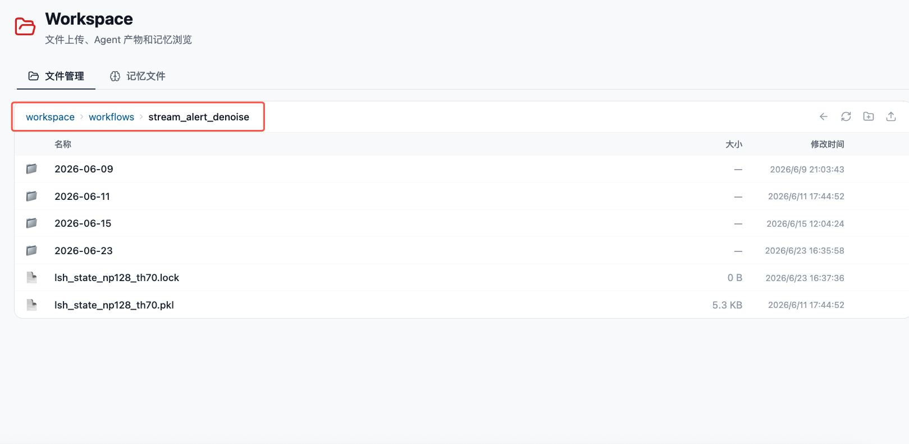

# 实时 NDR 降噪工作流

**实时 NDR 降噪工作流** 是 Flocks 内置的工作流能力，用于对持续到达的 NDR 告警和 HTTP 流量日志进行自动降噪。它适合接入 TDP、SkyEye 等安全设备的数据，把高频、重复、低价值的日志先在工作流层过滤和归并，再把需要关注的告警交给研判、通知或后续处置流程。

该工作流在工作流页面中以 `stream_alert_denoise` 展示。



点击 `stream_alert_denoise` 后，可以进入工作流详情页。左侧展示实时 NDR 降噪的流程图，右侧 **概览** 展示节点数量、工作流文件路径、运行统计和调用历史入口。



## 1. 能力定位

`stream_alert_denoise` 面向的是实时日志和告警，不是单次手工研判。它的目标是在日志进入人工分析或告警研判前，先完成：

- **重复告警去重**：相同攻击特征、相同源 / 目的资产、相同 URL 或相同会话窗口内的重复事件合并。
- **低价值噪声过滤**：过滤健康检查、静态资源访问、已知白名单、测试流量或低置信度重复事件。
- **同类事件归并**：把同一类 HTTP 流量日志或 NDR 告警按时间窗、资产、规则、路径、状态码等维度聚合。
- **优先级初筛**：保留值得进一步研判的高风险事件，并输出摘要供后续告警研判工作流或通道通知使用。

## 2. 数据来源

当前实时 NDR 降噪工作流支持 **HTTP 流量日志** 的降噪处理。常见数据来源包括：

| 数据来源 | 接入方式 | 说明 |
| --- | --- | --- |
| TDP | 设备日志推送、Syslog、Kafka 或 Webhook | 适合接入 TDP 产生的 HTTP 访问日志、告警日志或安全事件。 |
| SkyEye | 设备日志推送、Syslog、Kafka 或 Webhook | 适合接入 SkyEye 侧的 NDR 流量日志与告警事件。 |
| 其他 NDR / 流量设备 | Syslog、Kafka、Webhook 或文件中转 | 只要能转换为工作流 inputs，就可以复用降噪逻辑。 |

接入前建议先确认设备侧字段，包括源 IP、目的 IP、域名、URL、HTTP 方法、状态码、规则名称、告警等级、时间戳、设备 ID 和原始日志内容。字段越稳定，降噪规则越容易复用。

## 3. 降噪方式

实时 NDR 降噪工作流采用 **固定规则 + 机器学习算法** 的组合方式。

固定规则适合处理明确、可解释、可长期维护的噪声：

- 白名单资产、白名单域名、白名单 URL 路径。
- 静态资源、探活请求、已知测试流量。
- 相同 `dedup_key`、相同五元组、相同规则命中在短时间窗口内的重复事件。
- 明确低风险的状态码、路径模式或设备规则。

机器学习算法适合处理规则难以穷举的重复和相似噪声：

- 按日志文本、URL、主机、路径、规则名称等特征聚类相似事件。
- 根据历史频率和行为基线识别突增、周期性噪声或长期重复事件。
- 对降噪结果给出置信度，保留低置信度事件供后续人工复核。

实践中建议先用固定规则处理确定性噪声，再用机器学习算法处理相似聚合和动态变化的噪声，最后把高风险或低置信度事件交给告警研判工作流继续分析。

## 4. 部署方式

该工作流可以作为内置工作流使用，也可以放置到用户插件目录的工作流目录中：

```text
~/.flocks/plugins/workflows/
└── stream_alert_denoise/
    ├── workflow.md
    ├── workflow.json
    └── ...
```

放置完成后，刷新 Flocks，系统会自动扫描 `~/.flocks/plugins/workflows` 下的工作流目录，并在 **工作流** 页面识别和展示。识别后可以进入详情页查看流程图、发布 Syslog / Kafka / Webhook 触发器，或让 Rex 辅助配置接入参数。

更多工作流安装和调用方式可参考：[Workflow 工作流](/md/modules/workflow) 与 [调用工作流](/md/modules/workflow-invoke)。

## 5. 开启 Syslog 调用工作流

实时 NDR 降噪工作流常见的上线方式，是把工作流发布为 **Syslog 接入**。开启后，Flocks 会在配置的 Host 和 Port 上监听 Syslog 数据；当 TDP、SkyEye 或其他日志平台把 HTTP 流量日志推送到该端口时，Flocks 会获取对应端口上的 Syslog 数据，并主动触发 `stream_alert_denoise` 工作流执行。

典型流程：

1. 进入 `stream_alert_denoise` 工作流详情页。
2. 切换到右侧 **发布** 子页面，选择 **Syslog 接入**。
3. 配置监听协议、Host、Port、日志格式和写入工作流 inputs 的字段名。
4. 在 TDP、SkyEye 或日志平台中，把 Syslog 发送目标配置为 Flocks 服务器的监听地址和端口。以 TDP 为例，可参考 [TDP 配置 Syslog 输出](/md/modules/workflow-invoke#_4-1-以-tdp-为例配置-syslog-输出)。
5. 设备日志到达后，Flocks 自动触发工作流进行降噪处理。

可以使用 Flocks 辅助完成配置，也可以手动填写 Syslog 参数：

- [Flocks 辅助配置 Syslog](/md/modules/workflow-invoke#_1-1-flocks-辅助配置)：适合让 Rex 通过问答确认协议、格式、监听地址、端口、输入字段和样例日志。
- [Syslog 手动配置参数](/md/modules/workflow-invoke#_4-获取-syslog-数据自动调用工作流)：适合已经明确协议、端口和字段映射时直接配置。

Syslog 配置成功并开始接收设备数据后，每次由 Syslog 数据触发的工作流运行都会自动计入调用次数。可以在工作流详情页的 **概览** 中查看总调用次数、成功率、平均耗时、失败次数，以及每一次执行历史；点击某条历史记录可以进一步排查单次运行结果。



实时 NDR 降噪工作流会把降噪结果写入工作空间的工作流目录：

```text
workspace/workflows/stream_alert_denoise/
```

该目录会按日期保存降噪结果和中间状态文件。后续 [批量NDR研判工作流](/md/scenarios/batch-scheduled-ndr-triage) 会读取这里的降噪结果，并继续生成研判报告。



## 6. 产出示例 JSON

`stream_alert_denoise` 的运行结果会同时返回结构化字段，并把首次出现的降噪结果追加写入 `dedup_result_NNN.jsonl`。JSONL 文件第一行是文件头，后续每一行是一条增强后的告警。

一次 Syslog 触发后的返回结果可以参考：

```json
{
  "dedup_summary": "stream_alert_denoise done: raw=1 -> normalized=1 -> filtered=1 -> enriched=1, unique=1 (compression 0.0%)",
  "input_mode": "syslog",
  "dedup_key": "b7428a52e96c835c9f72efb555d36772",
  "is_duplicate": false,
  "stats": {
    "raw_count": 1,
    "normalized_count": 1,
    "after_filter_count": 1,
    "after_dedup_count": 1,
    "unique_key_count": 1,
    "dedup_removed_count": 0,
    "dedup_ratio": 0.0,
    "dedup_state_persisted": true,
    "output_paths": [
      "~/.flocks/workspace/workflows/stream_alert_denoise/2026-06-11/dedup_result_001.jsonl"
    ]
  },
  "enriched_alerts": [
    {
      "id": "AZtRkZkzj",
      "sip": "1.2.3.4",
      "dip": "10.0.0.1",
      "net_type": "http",
      "req_http_url": "/admin",
      "threat_name": "SQL注入",
      "threat_confidence": "none",
      "_source_type": "tdp",
      "_process_type": "alert_not_scan_http_direction_in",
      "_threat_type": "SQL注入",
      "_lsh_cluster_id": 0,
      "dedup_key": "b7428a52e96c835c9f72efb555d36772",
      "is_duplicate": false
    }
  ],
  "output_paths": [
    "~/.flocks/workspace/workflows/stream_alert_denoise/2026-06-11/dedup_result_001.jsonl"
  ]
}
```

其中 `is_duplicate=false` 表示这条告警是首次出现，会写入结果文件；如果后续收到相同或高度相似的告警，工作流会返回相同或相近的 `dedup_key`，并通过 `is_duplicate=true` 标记为历史重复，从而避免重复进入下游研判。

## 7. 机器部署需求

告警降噪通常需要部署在服务器上，不建议部署在个人电脑上。原因是 Syslog、设备回调或日志推送类数据需要由安全设备主动发送到 Flocks 所在机器，个人电脑通常不具备稳定的固定地址、长期在线能力和网络可达性。

推荐服务器规格：

| 项目 | 建议配置 |
| --- | --- |
| 部署形态 | 云主机或内网虚拟机均可 |
| CPU / 内存 | 8 核 32 GB |
| 磁盘 | 500 GB，建议预留日志与中间结果空间 |
| 操作系统 | CentOS、Ubuntu 或 Rocky Linux |
| 运行方式 | 长期在线，适合作为日志接收与任务执行节点 |

## 8. 上线检查

正式接入设备数据前，建议先完成下面检查：

- Flocks 所在服务器可以被 TDP、SkyEye 或日志平台访问。
- Syslog、Kafka 或 Webhook 的端口、协议和防火墙策略已经放通。
- 已准备一批真实 HTTP 流量日志样例，用于验证字段映射和降噪效果。
- 已明确降噪后的输出去向，例如告警研判工作流、通道通知、文件落盘或下游系统。
- 已规划运行日志、失败重试、磁盘容量和中间结果保留策略。

相关：[告警降噪](/md/scenarios/alert-noise-reduction) · [TDP 接入](/md/modules/devices/tdp-integration) · [SkyEye 接入](/md/modules/devices/skyeye-integration) · [调用工作流](/md/modules/workflow-invoke)
